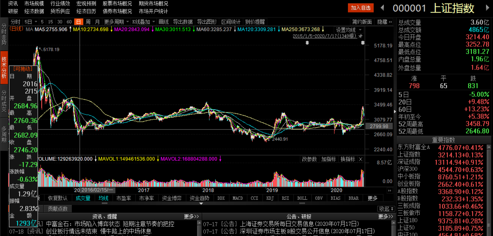
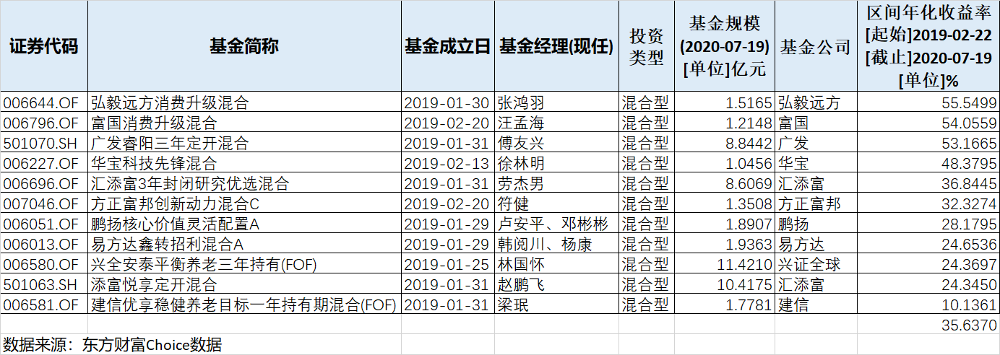
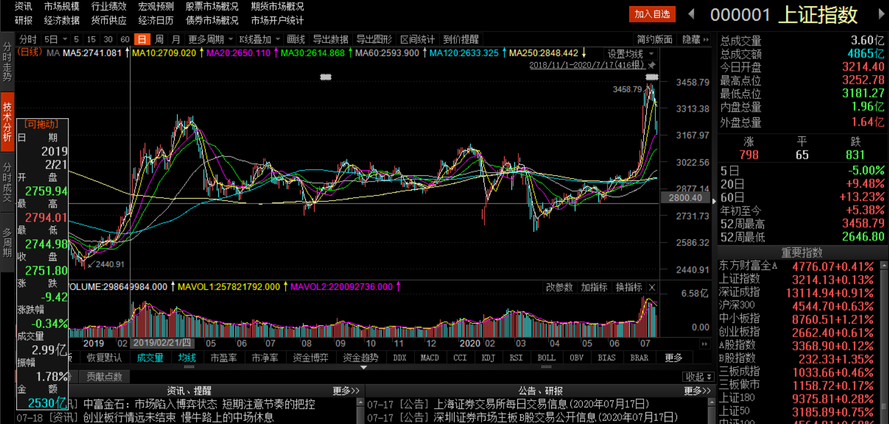
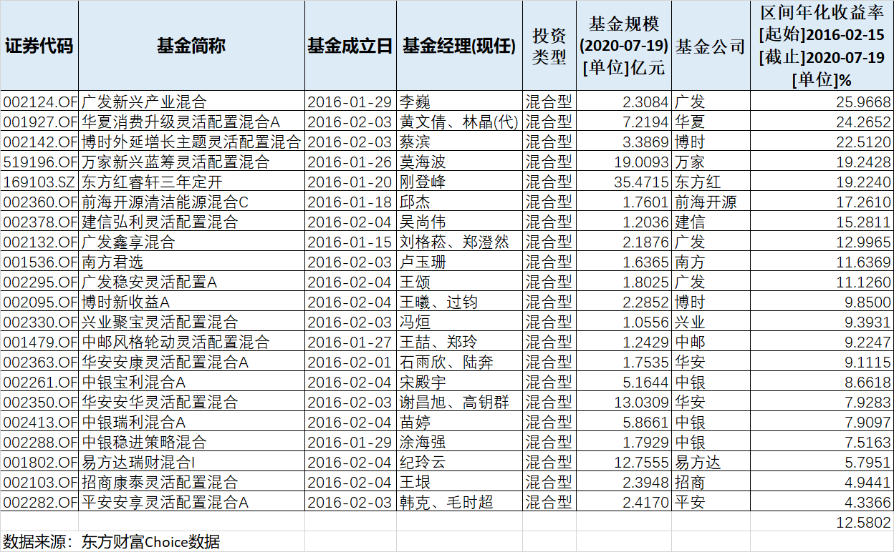

### 2800点以下买基金能赚钱么？

本文的题目其实是一个同事向我提的疑问，我当时的回复是：2800点？那肯定能赚钱啊，就是赚多赚少的问题！

**股市价格的涨跌，背后其实就是资产定价的变化**，因此股市指数的点位能在一定程度上反映经济体的发展水平。

往远了说，我们国家自改革开放后不断开放与发展，最真切的感受就是我们这代人的日子比父母辈好过不是一点点，很明显是质的飞跃；往近了说，2015年股灾之后我们国家依然飞速发展，各行各业都有了日新月异的变化，国家对出口、地产、消费三辆马车的定位也有了新的均衡考量，‘一带一路’、‘自贸区、自贸港’、‘雄安新区’、‘粤港澳大湾区’等众多国家战略层出不穷。

往大了说，我们国家的航天航空一年一小步、三年一大步，比如前不久的北斗卫星最后一颗组网也发射完毕；往小了说，村里家家户户开上了小轿车、小城镇去大城市的高铁又体现了中国速度、大型城市密密麻麻的地铁网络延展了市区的半径。简单概况就是：科技改变生活，城市让生活更美好！

所以中国经济是一步一个脚印的往前走，而A股的指数在2015年后是少有波澜，甚至偶尔还跌几下。**这一不和谐的步调终究会被收敛**，要么经济调头下滑、要么股市涨上来，我相信中国这个蓬勃发展的经济体肯定是越来越好的，所以中国股市也是早晚会补涨上来的！

还有一个角度就是，为什么2015年股灾后大盘低于2800点的日子极少？说明每次低于2800点的时候很多人认为股价便宜了，就去抄底买入。股市的点位受很多复杂因素所左右，股价是一个多方合力的结果，所以绝大多数的人认为低于2800点的中国股市资产是具有较高性价比的，是值得持有的一类资产，而借基金入市是广大投资人比较合适的方式之一。

听过我的回答，可以看到他眼睛里仍是留有质疑的，所以我就拉了下面这张图给他看。这图是2015年1月5日到2020年7月17日的上证指数的日线，我拉取的横线是2799.98点，也就是说这5年半过去了，大盘在2800点下方的日子屈指可数，所以很好的证明了**在2800点下方通过买入基金参与股市是很难亏钱的**，也就是说赚钱是极大概率的事情，就是看能赚多少了！

当然上面说的是粗略的观感，如果我们要给出严谨的结论就得精确的回测下历史数据，看看历史数据能否精准地支撑我们的结论呢？回测的角度和方法有很多，我们这次选的是：**在2800点下方成立的基金运营至今的年化收益是多少？**

对于数据的筛选我稍微讲几点：

1、只选择混合基金。指数基金肯定是能跑赢的，因为上图说了：低于2800点的时间点极少，指数跑赢下指数基金肯定也是能盈利的；债券基金因为主要投资的是债券，所以就不在本文的讨论范围内；货币基金就更不用说了。

2、因为新基金成立后有一段时间的建仓期，所以我们选取的基金成立日都是2800点临界日期的前一个月至该日。

3、选取基金规模大于1亿的。规模过小的基金存在很多不稳定性（过多的超额收益或极差的业绩），也不具备很好的参考价值。

4、主要探讨2019年2月那一次至今的数据。近五年半低于2800点的有三次：2016年2月15日附近、2019年2月22日附近、2020年4月3日附近。今年这一次时间距离太近，所以数据不足以得出什么有效的结论；2016年2月15日那次因为建仓期过短，但我们还是会把这次作为辅助佐证。

经过上面4点的刷选，我们得到了如下的表格数据：

去年初那次的突破2800点在2019年2月22日，所以我们选取了1月22日~2月22日成立的混合基金，观察它们这一年半来的年化收益率数据。最优秀的是弘毅远方消费升级混合（006644）55.55%，最差的是建信优享稳健养老目标一年持有期混合（006581）10.14%，算数平均值为35.64%，这些数据是不是让你眼前一亮？

然后我们再结合上面这幅2018年11月1日到2020年7月17日的上证指数日线图看前面的表格。最新的大盘相对于2800点的涨幅还不足15%，而我们在那段时间成立的混合基金平均收益已经超过了35%，我认为这个是很优秀的收益表现了，把借基金入市的优势展现的很充分了。

我们还发现涨幅靠前的有消费、医药、科技等强势板块，这些板块的配置使得对应基金的超额收益越发明显，即便是最后一名的FOF基金年化收益也跟上了上证指数的涨幅。也就是说你在2800点买入混合基金，就算再差也能混个及格追平上证指数，要知道大部分散户连指数都跑不赢！不瞒大家说，问我开头问题的这位同事就是这类散户！

接着我们再看下2016年那一拨的数据：

与上面的类似，临界日期为2016年2月15日，所以考虑建仓时间，我们选取了1月15日~2月15日期间成立的基金，筛选条件也和2019年初的一样，最后年化收益如上图：最佳是广发新兴产业混合（002124）业绩年化25.97%，最差的平安安享灵活配置混合A（00228）年化收益为4.34%，算数平均年化收益为12.58%，但是这波距今4年半，而且中间很长时间大盘处于横盘，所以业绩也算还不错了。

> 小结

通过直观的感受我们很容易得知：在2800点下方买基金大概率是赚钱的；经过相对严谨的历史回测，我们可以初步得出结论：**在上证指数2800点下方买入混合基金，持有约1.5年或4.5年后，平均年化收益率分别是35.64%和12.58%，即赚钱的概率为100%！**

