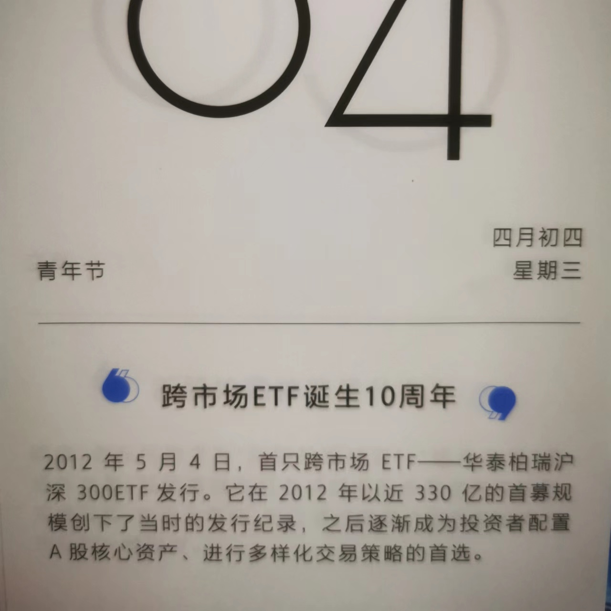
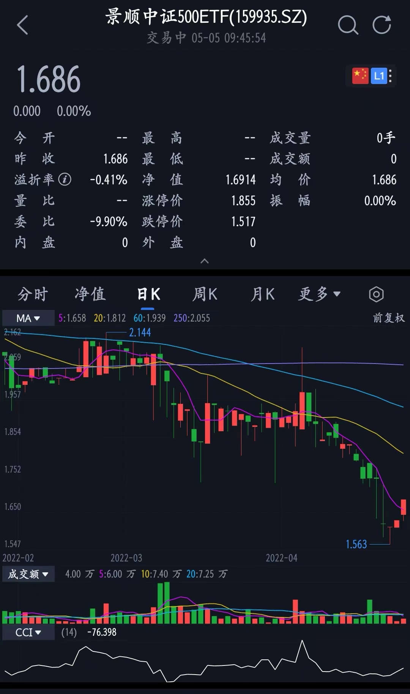
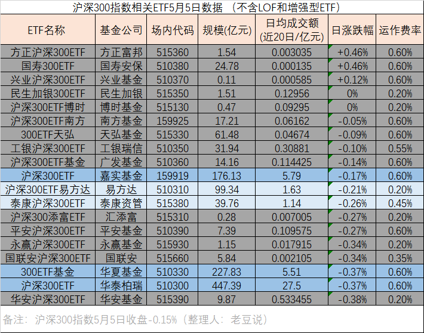
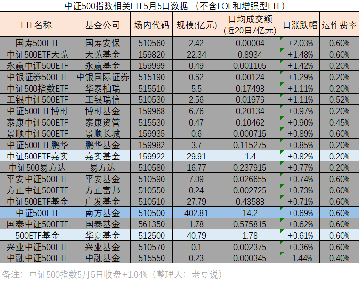

### 宽基ETF是不是也能来个供给侧改革？

昨天撕日历的时候发现国内跨市场ETF已经10周年了，首只跨市场ETF是华泰柏瑞的沪深300ETF。沪深300指数作为中国股市的晴雨表，首只沪深300ETF发行规模超300亿也是不太意外，即便那是2012年的300亿。

为什么会写这篇文章呢？我昨天无意间点到了景顺长城中证500ETF的行情页，发现在开盘15分钟后成交额依然为0元，而且最近20日日均成交额只有7.25万（对！你没看错单位，就是万元）

我早知道ETF头部效应很明显，但是主流宽基ETF这么夸张的流动性还是有点惊讶到了我，而且我没记错的话景顺长城去年底还发了中证500的增强型ETF。伴随着好奇这是否为个例，我就去查了下沪深300和中证500的所有ETF数据（不含增强型和LOF），先把图贴出来：

**1、低费率不一定能做大规模。**低费率是基民喜闻乐见的事，毕竟省下的就是赚到的，但这东西更多的是锦上添花，你会发现所有宽基ETF的第一名都不会主动降费。不仅是上图中华泰柏瑞的沪深300还是南方基金的中证500，典型的还有易方达的创业板指ETF。要知道宽基ETF最大的交易方还是机构投资者，他们对于流动性的要求是较为苛刻的，而对费率又是不那么敏感的。再加上马太效应，越是流动性好后期参与的人越多，那么产品的流动性会进一步得到加强。

**2、沪深300比中证300更受欢迎。**上面两个表格很明显地看出沪深300相关产品的规模和流动性都要大得多，除了华泰柏瑞的遥遥领先，沪深300小组内还有嘉实和华夏两家做到了日均成交额超5亿元，我觉得到了这个体量就可作为较好的替代品了。而反观中证500指数相关产品，除了南方基金一枝独秀外，也只有华夏和嘉实勉强达到了日均1亿元的及格线。这里也看出作为几家老牌基金公司，在宽基ETF这块还是具备很强的先发优势的，至少你看沪深300和中证300流动性好的就是这几家：华泰柏瑞、南方基金、华夏基金、嘉实基金。

**3、沪市产品要强于深市。**看市场方面，沪深300只有嘉实1只是深市的产品，其余全部为上交所基金。当然这个也是历史遗留问题啦，主要是因为早期上交所对于跨市场ETF的交易规则更高效、友好。中证500这方面稍微好一点，但是你仔细看就会发现大部分深交所的中证500ETF都是近两年新发的产品，也是在深交所修改了跨市场交易规则后。所以规则制度的优势还是挺重要的，又好比说科创板搞了注册制，那么创业板也很快跟上了，且双双实现了20CM。

**4、规模大不一定都流动性好。**以前我也说过，观察流动性指标要优先于规模指标，因为有些特殊原因导致规模很大，但日常的交易流动性不足。就结合上面两张表举几个例子吧：国寿300ETF规模24亿多、但日均交易不到2万，300ETF天弘规模60多亿、但日均交易不到500万。沪深300里类似的还有沪深300ETF南方、工银沪深300ETF、沪深300ETF基金等；中证500里类似的还有中证500ETF天弘、中证500易方达、中证500ETF基金等。以天弘的两个产品为例，它就是先有的场外基金，然后场内ETF申请下来后场外的就转型成联接基金了，而天弘的场外基金本来规模就做得很好，所以一下子就把对应的ETF撑大了，但是其在场内交易这块还是略有薄弱。

**5、ETF名字里强调基金公司规则挺好。**去年沪深两个交易所都规范了基金公司相关ETF命名规范，其中一条就是尽量带上自家公司的名字，所以现在很多产品看名字大家就能知道是哪家基金公司的了。同类ETF最早只是抢个好记的代码，后来发展到产品简称也要足够醒目（甚至近两年还发生了改ETF名字来蹭同类顶流产品的热度），越来越卷后交易所干脆说大家都带上自己家的名字，这样就谁也别占谁的便宜。

**6、要是能对同质ETF定期淘汰退市也蛮好。**看着这两个最牛逼的宽基指数都有那么多“僵尸”一样的产品存在，我内心还是有点感伤的。虽然我很鼓励百家争鸣，但是很多基金公司资源不足也是客观事实，如果运行了一段时间规模一直上不去那么主动清退也是利大于弊的一件事。这不仅是让基民能避免消耗挑选的精力，更多的也是对基金公司的保护，硬撑着一个僵尸产品，其实也是在消耗基金公司的资源。我随便说个设想哈：比如在每年初对上一年年日均交易额在同类指数排名末尾20%的产品直接清退（或者按期末规模排名也行）。

最后讲个选基实用指南：买宽基ETF选区间日均交易额至少1亿元的，流动性就是ETF的生命指标。