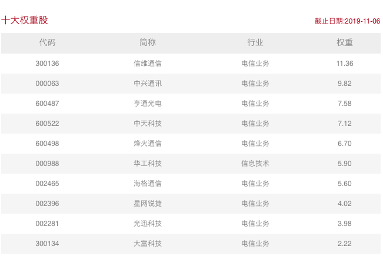

### 一个邮电院校学生眼中的5G生活

5G应用已经悄悄地来到了我们的身边，特别是华为事件后经过媒体的进一步传播，我爸妈都知道了5G网络。前段时间我老丈人还问我：**什么是5G技术？能给我们百姓生活、生产带来什么便利？为什么5G可以做到这些？**

我是邮电院校毕业的，当年我花了很多的时间向爷爷奶奶辈们解释：我学得不是邮递员专业，出来了也不会去邮局工作。再后来我就放弃了类似的解释，比如亲戚以为我们学计算机的就是修电脑，电脑有个啥小毛小病都要让我用QQ远程解决下。我为什么不解释呢？因为有这解释的功夫我也许已经帮他们处理好了。就这样我在大学期间从0开始学会了：装系统、刻录光盘、优化电脑卡顿、陪着去电脑城买电子产品等一系列技能。

我以为我毕业了就不再受此‘困扰’，然而老丈人以为我邮电学校毕业的就该能解释清楚什么是4G，什么是5G？4G的时候我已经被问过一次了，这次我已经吸取经验提前准备了一点5G知识，同时5G的投资也需要正确的认知这一新事物。5G火了以后网上讲解剖析5G技术的文章铺天盖地，但我还是想尽可能通俗的和大家分享下我所了解的5G技术及相关应用。

4G也好、5G也罢，此处我们都理解为是**移动通信技术的代别**，我们通信技术的发展就是在利用**复频技术和扩频技术**来提升通信传输效率。我上大学那会3G概念刚在国内普及，我虽然学的是计算机专业，但我同时辅修了学校经管院的工商管理专业。我们因为是邮电院校，所以经管院的学生除了要学习微观经济学和宏观经济学，还有一门很有特色的‘通信经济学’，我最初的3G知识就通过这门课程获得的。

3G技术我们国家引入的比较晚，但欧美早就商用了。美国的是CDMA2000、欧洲的是WCDMA、中国自主研发的是TD-SCDMA，三张牌照当时分别发给了刚重组后的三大运营商，分发情况如下:

- 中国电信：**CDMA2000**（中国电信自此有了正式的移动业务，这个安排也是国家希望三家运营商都能全业务运营）

- 中国移动：**TD-SCDMA**（三张最差的牌照给了当时如日中天的中国移动，宽带业务分配到的也是相对最弱的铁通，显然国家也在均衡三大运营商的实力，所以移动对这个事情一直愤愤不平，对3G的商用不是很上心，转手把更多的精力用在了研发4G技术的商用上）

- 中国联通：**WCDMA**（中国联通受到眷顾给了最好的牌照，把网通也合并给了新联通，但是在3G时代联通依然没啥起色，我们常吐槽它就是一个扶不起的阿斗）

在3G时代三家运营商的技术标准不一样，所以设备也是不通用的，大家应该有印象：用移动的3G还要必须用移动专属的手机，到了将近4G的时代才慢慢有了全网通这一解决方案。4G可以简单的理解成是对3G技术的一种升级，通过使用新技术使得传输速率更快、信号更稳定，从而提升通信质量。我们的5G则是又一突破，使得一些特殊的应用场景也得到满足，比如高速移动的通信、高密度流量的通信等等。

再举几个直观数据吧，当下的5G速度是4G的10~20倍，不久可以达到100倍左右。如果结合后期技术升级，理论上可以达到4G速度的800倍左右，这个就要看后续技术什么时候能够商用了。我们国家最近也开始启动了6G的研发，这也看得出国家对于移动通信技术升级的重视程度，新技术的**超前研发、标准制定、产品化能力**等都是很重要的。

大部分认为5G比4G多一G，速度快是最直接的感受，那么每一次移动通信技术升级的背后是什么呢？是应用场景的改变，**新技术只有大范围的运用才有进一步升级的前景**。让我们回到过去：

- 1G 大哥大时代：模拟信号不稳定、移动设备臃肿，那是摩托罗拉的时代。你听听这名字就很有年代感，很有暴发户的画面感。

- 2G 功能机时代：手机变得很小，还可以发短信了，信号也是数字编码了更稳定，黑白机的年代；后来慢慢发展有了一个2.5G时代的概念，手机也出现了早期的智能机，诺基亚的塞班系统，索尼爱立信也有类似的系统，大家可以在手机上装应用了。手机QQ也应运而生，手机上网成为了可能，因为网速的限制我们程序员需要对页面和服务做很多优化，为的就是在有限的网速下给用户尽可能流畅的上网体验。

- 3G 安卓机、iphone时代：感谢乔布斯发明了iPhone让3G网络有了更大的价值，也感谢谷歌让安卓机惠及普通百姓。3G时代大家已经不能满足于上网浏览网页了，有些简单的游戏开始普及，比如对于延时要求不高的卡牌类游戏：“我叫MT”系列游戏，再比如只需在比赛结束后稍微通信下同步比赛结果的塔防类游戏。

- 4G 现在：4G经过几年的商用，套餐越来越便宜，4G速度使得王者荣耀这种对网速要求很高的游戏成为了现象级产品；大家可以在高铁上和家人视频通话，在地铁上可以使用流量进行电影、电视剧的在线观看了；继而抖音、快手这种短视频软件、直播软件都进一步的野蛮生长。

不知道大家有没发现：**网速的升级、信号的稳定带动了我们传输内容的升级，同时也催生出了很多新的行业，甚至改变了我们的生活方式。**那么5G的速度能给大家带来什么样的改变呢？

**万物互联**

5G不仅给我们娱乐的方式带来了新的升级，更多的是对生产力的提升。有了5G自动驾驶才能真正上路，因为需要在移动环境下稳定的急速响应周围的环境变化。比较初级的可以是现在已经实现了的自动泊车，这是一个低速相对安全的环境下自动驾驶。5G甚至会像3G一样颠覆我们的终端设备，我们或许不再需要手机，因为手机可能会限制我们的应用升级，可穿戴就是一个新的方向。

5G对工业生产效率的提升也是大有可期。自动化的生产线现在大部分是铺设光纤，但这个对于部分移动环节比较麻烦，而常见的WiFi的延时卡顿会影响自动化生产线的效率。5G就能很好的解决这一痛点，不但可以使得每一个生产环节协调更高效，还能降低铺设成本。

现在再看下我国的5G现在处于一个怎么样的水平？中日韩美是第一梯队、欧洲属于第二梯队，**美国可以排斥华为的产品，但是无法排次华为的标准，**所以在专利标准这一块大家各国只能互联互通。我们真正的优势在于5G技术产品化的能力，这个离不开华为、中兴、中移动研究院、大唐等企业的不懈努力，我们的产品化能力要超前了约半年的水平，不仅仅是无线侧，在核心网这方面也是如此。而且由于欧洲现在处于第二梯队，那么我们的产品与技术还能输出给欧洲国家，这个也是大有可期（毕竟我们的产品物美价廉）。

讲到这我脑子里突然蹦出一句话：**5G技术让生活更美好**。那么作为投资者我们如何在这个风口上分一杯羹、喝一口汤呢？

我刚一再强调我们的产品化能力领先世界，这个不仅仅是头部公司的研发，还有众多相关企业的协同生产。对于大部分的门外汉如何便捷的投资5G行业是个比较棘手的问题，我们不知道这个企业是不是真的与5G有关？5G业务占公司营收的比重是多少？公司在5G行业内是否具有较好的议价权或是否有一定的护城河？

好在华夏基金给我们提供了一个便利的指数化投资工具5GETF（515050），一键组合式买入5G行业，过几天11月11日还会推出联接基金（A类008086、C类008087）

最后老规矩贴下中证5G通信主题指数的前十大权重股：

