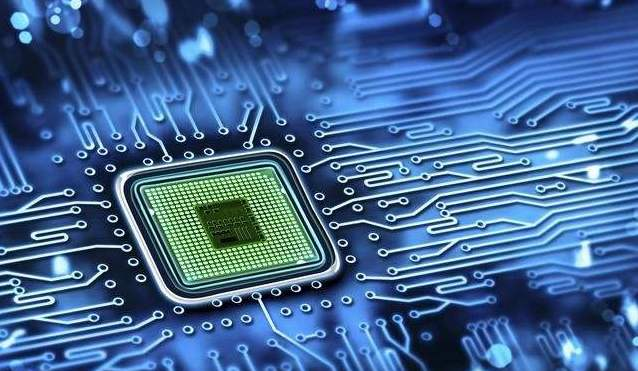
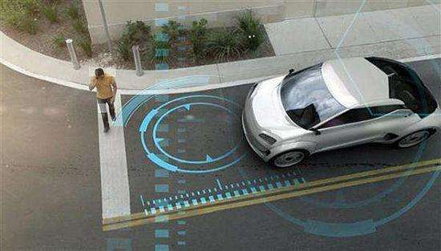
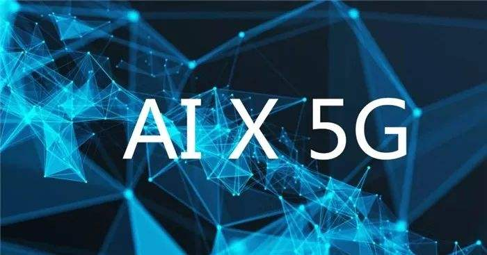

### AI + 5G 智能连接世界

电脑现在已经普通的不能再普通了，而更小巧的智能手机也是人手一部。其实计算机远不止这些，任何具备运算芯片组件、能够通信传输的器件都可以称做现代计算机，**运算和通信就是计算机两个极其重要的特质**，下面豆哥就给大家讲讲其实也没那么神秘的计算机世界。

一台电脑给我们最大的帮助就是可以运算，这就牵涉到存储器、运算器、控制器，最典型代表就是CPU。大家都熟知的就是英特尔公司出的芯片，我们买电脑的时候会看到配置写着什么i5、i7,这个就是计算机CPU的型号，更早的还有迅驰、奔腾、酷睿等系列处理器。我记得小时候电视里常放英特尔的广告，一群穿着奇怪衣服的人在演绎着些什么，让人记忆犹新的是最后的那句：**噔 噔噔噔噔！**（又是一个暴露年龄的广告）

当我们通过鼠标、键盘（输入设备）给电脑以指令后，经过计算机CPU的运算最终通过显示器（输出设备）展示给我们，如果有音频还会通过音响传递给我们。现在智能手机时代，输入设备和输出设备都是那块可触摸的屏幕，当然也有高端平板有用触控笔作为输入设备，我们把耳机插入耳机孔也就成了输出设备，CPU大佬也从英特尔(X86架构)变成了高通(ARM架构)。这就是我们的最基础的计算机体系，即使我们的鼠标键盘在不断变化、显示器音响在不断升级、CPU也一代比一代强劲，但这个体系依然这样。

其实我们的计算机体系是不包含网络通信的，但真正让计算机遍及全球的正是互联网的发展。我记得小时候学校机房都是单机无网络的，鼠标下面的滚珠经常被我们扣下来玩。上了初中才知道原来还有网吧这么个高级的东西，才知道可以通过网络和网友聊QQ，那时候摄像头都是外接的，可以接上摄像头带上耳机就能语音视频了。如今一个手机就能便捷完成的事情，就在十几年前还需要借助这一堆臃肿的设备器械。

大家有没发现，我们的计算机什么指令都要我们自己去输入，任何流程策略都要我们帮计算机提前规划好。随着科技的发展，我们人类已经开始觉得这有点不够先进了。要是计算机能和人一样具有 **‘主观能动性’** 就好，要是一台新的计算机和小孩一样能够 **‘自我学习’** 就好了，这就有了AI人工智能的愿景。

人工智能的终极目标是使得我们与计算机之间的交互如同人与人之间的沟通一样便利，当计算机理解了我们的需求之后能运用其强大且精准的计算能力给我们以满意的结果。讲了那么多，可能有些朋友还是觉得有点空洞，我就以一个实际的应用再展开说下：**无人驾驶**。

由计算机操纵的无人驾驶就算是人工智能的一个应用。车身肯定装有各种车载传感设备，车行驶在路况复杂的道路上，可能随时会出现紧急情况。比如一只猫从隔离栏的绿化带钻出来，当影像传感器发现后，如何识别这是一个猫？怎么结合周边其他的道路信息后，进行快速的决策后再操控车子制动或避让？整个传输通信过程必须是**高效精准**，这势必要求网络低延时，所以5G时代无人驾驶才能真的发挥应用场景。

再比如对于经常出行的路线能否记忆沿途的情况，我们自己开车的时候对于熟悉的路线会忽略导航，遇到突发路况时我们会选择一条可能计算机不会考虑的小路。因为我们能发挥人的‘主观能动性’，继而做出更有效的决策，这种决策比机器的计算更符合我们的思维方式，也更智能。

人工智能是计算机的更高一层境界，但是它依然离不开**运算和通信**两大特性。所有的车载传感系统就是输入设备，告知计算机进行运算得出操作结果，继而使得车辆避开障碍物顺利到达目的地，整个过程又无时无刻不伴随着通信。

其实简易版的无人驾驶已经渐渐步入了我们的生活，比如高速公路的智能巡航，又比如自动泊车系统。随着这些简单路况或低速场景的广泛应用，技术的迭代升级必然加快，那么真正的无人驾驶很快就会来到我们的身边。**人类对科幻片的追求就是我们对未来科技孜孜不倦的探索。**

人工智能其实是一个很宏大的话题，涉及的学科和产业也极其繁杂。但有些技术已经有了比较成熟的解决方案了，比如：语言识别、图像识别、自然语言处理等。国内也有了一批好的企业涌现出来，比如：海康威视、科大讯飞、浪潮信息、中科曙光。

我认为AI和5G正好就是未来的运算和通讯，而华夏基金的李俊先生这套组合拳打的还是不错的，分别发行了5GETF（交易：515050）和AI智能ETF（认购：515073）。现在回头再看华夏基金今年高密度的发行ETF，也看得出是有一些规划的，比如创蓝筹ETF配合创成长ETF（创业板Smart Beta双子星），又比如银行ETF、证券ETF配合地产ETF（金融地产）。

如果你认同5G的投资逻辑，那么AI智能ETF是一个很好的伴侣，好比咖啡要加奶。高效的运算和通讯给我们生活带来了无尽便利，生产力的高速提升让：‘科技让生活更美好’不再只是一句口号。

