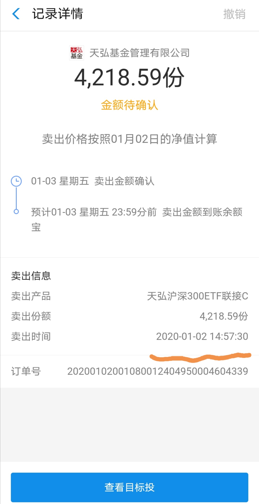
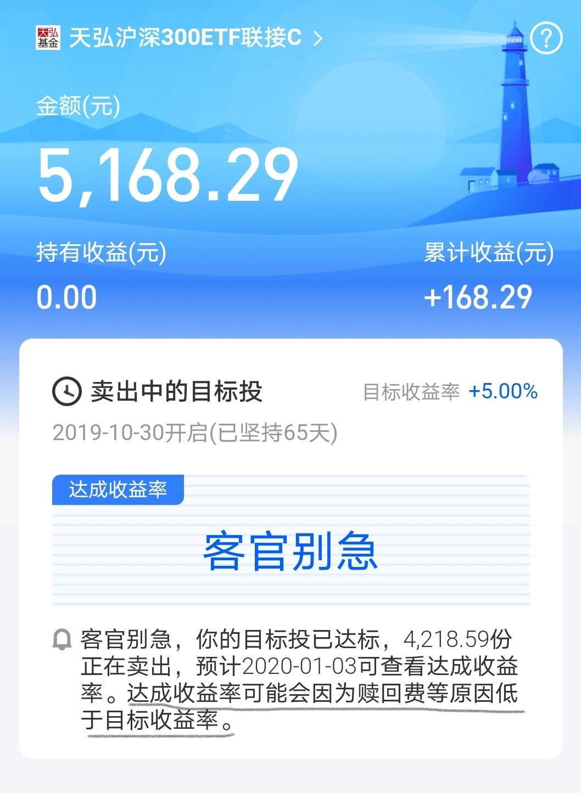
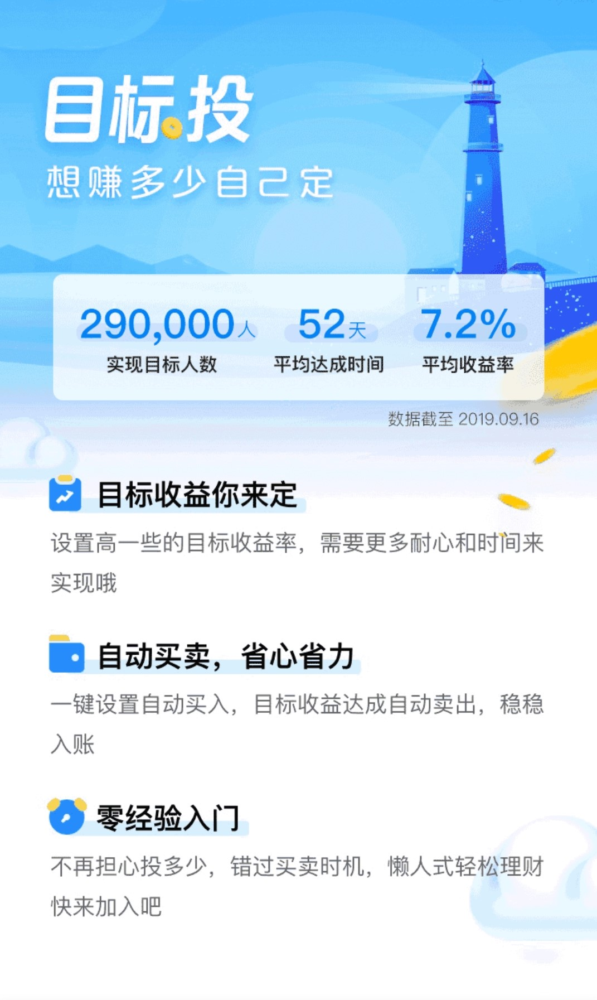
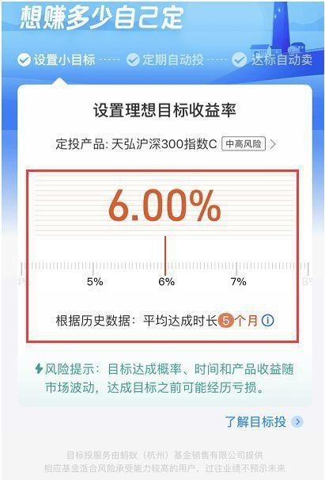
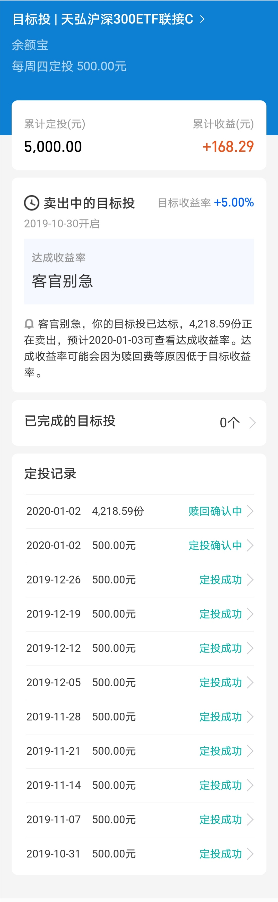

### 懒人理财神器体验报告

支付宝里的蚂蚁基金很久前就出了一个叫【目标投】的定投工具，我当时看过了它的操作规则后也不以为意。因为我想着这个目标投就是最机械的定投，然后到了用户设定的收益率了就自动卖出，没什么大不了的。由于是和天弘基金合作的，只能选择天弘沪深300联接C作为投资标的，这不但限制了我们选择其他投资产品的权利，而且给的这个也不是业界最低费率的沪深300指数。

可是偶尔有小白粉丝来问起我关于这个目标投，一个两个还好，后面人一多我就又重新去看了下这个工具，最后决定自己体验下这个产品。2019年10月30日开启的，我设定了每周四买入500元，目标收益为5%，今天正好是第一次达成目标自动卖出（历时65天）。下面我说说整个过程的几个感受吧：

1、每天收盘前三分钟会根据当天沪深300指数的涨跌幅，去预估今日收盘价能否达到设定的目标收益率，如果达到就会在最后几分钟内申请全部赎回，我今日的自动赎回就是14点57分30秒，我觉得这个体验很不错。

2、因为是C类基金，持有大于等于7天后就免赎回费。我今天正好是满足7天，所以不确定对于未达到最低7天持有的份额是否也一并卖出，因为小于7天是有1.5%的惩罚性赎回费的。但我从一个细节推测应该是一刀切全部卖出的，详见下图划线部分。

3、完成一轮所消耗的时间比我预期的要短，虽然一次不一定能说明什么，但是和支付宝宣传的基本吻合。

4、目标收益最低是4%，然后只能选整数作为目标收益，选择的时候会告知你历史数据完成该目标大约需要多久。

这是一个全自动的工具，所以我平时都不怎么去看，要不是今天@青春的泥沼 说对于小白定投沪深300指数基金就够了，我才想起来。打开一看正好满足了赎回条件，觉得真的很适合99%的小白用户，即便其工具本身还有一些问题和局限性，但不妨碍它成为一个很好的懒人理财神器。

最后贴上完整的目标投清单：

本来写到这就结束了，我也该下班回家了。但是在排版的时候我又想**为什么别的平台没出这个类似的工具呢？**因为这个不存在什么技术上的难题，而且既然支付宝已经运行那么久，也说明不存在合规的问题。

那目标投怎么就成为“孤品”了呢？我的观点是：**目标投这种帮助用户及时止盈的工具，是和基金公司想募集更大规模这条生命线所冲突的**。

如今定投理念已经烂大街了，因为定投可以让基金公司有一个稳定的买入来源，就像进水口一直开着。但你发现没？基金公司很少有会告诉你该卖出了，不会的！因为这关乎基金公司的生命线。所以想到这我对支付宝、对蚂蚁金服、对天弘基金肃然起敬，这种自我革命的精神值得我们赞扬。希望会有越来越多的平台和渠道开发类似的工具产品，使得标的更丰富、功能更完善。

*小结*：

- 如果你对投资一窍不通，且没有时间去关注和打理闲钱。那么设定个5~6%的目标投是个不错的选择，胜过银行理财，胜过年金险等所有理财型保险。