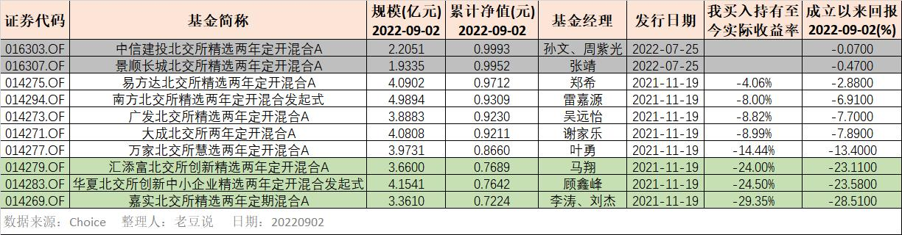

### 一个让人爱不起来的交易所

北交所已成立一周年了，9月2日官宣将发布“北证50”指数（899050），该指数选取北交所规模和流动性最好的50只成分股（每季度调整一次）。

发布北证50指数的意图也很明显，就是想摸着科创板的石头过河，赶紧把北交所的流动性问题缓解下。但就我个人这一年下来的感受，北交所很难让人喜欢起来，主要是身边真没听说什么人从北交所里面赚到钱。

北交所成立之初就是给“专精特新”企业融资的，我们抛开企业质量，单单这交易所的交易体验就能劝退很多普通投资者。开户门槛就不说了，反正基本沿用了之前新三板精选层的标准，这种“投资者适当性”的门槛我也表示理解。

但进入券商软件后北交所的所有操作都在单独一个菜单系统内，你会发现不仅交易佣金比沪深两市贵很多，而且打新股也没啥肉汤可言。当然最关键的还是流动性不行，一个没有散户积极参与的交易所市场在中国股民面前是没啥吸引力的。

或许有人说这北交所一开始就不是打算给你们小散玩的，那我们再来看看机构参与的八只北交所两年定开基金们成立大半年来的业绩吧（2021年11月19日发行，易方达、南方、广发、大成、万家、汇添富、华夏、嘉实），话不多说直接上图：

1、除刚说到的八家外，今年也有中信建投和景顺长城发了相关基金产品，一来是发行时间太近，二来我也没再买后续的这两只，所以本文不做讨论（置灰）。另外解释下图表中我买入的实际持有收益率为什么要比软件直接拉取得更低？因为实际买入的时候是需要支付认购等费用的。

2、表中很直白地看到八家北交所产品清一色的负收益，像汇添富基金、华夏基金和嘉实基金这三只垫底的，从成立开始就一路下跌。都说这一年买医药基金的朋友们心里苦，我看这买了北交所也好不到哪去嘛。

3、相对业绩最好的是易方达基金，是我平时偶尔观察中为数不多还有较长时间正收益的产品，不得不说综合实力易方达还是很靠谱的。（附业绩排序：易方达 > 南方 > 广发 > 大成 > 万家 > 汇添富 > 华夏 > 嘉实）

4、不知道是不是巧合？最好的四家基金公司都是广东省的、中间的两家是上海的、最差的两家是北京的（但愿只是巧合，而非地域投研氛围差异）。顺便再次吐槽下汇添富、华夏、嘉实基金，你们是如何做到一年未满就跌去了近1/4的？这种业绩的基金经理还留着等过年吗？

5、垫底的三家里面除了汇添富的马翔从业年限稍微久一点（信息显示为2座金牛奖得主），华夏的顾鑫峰和嘉实的李涛、刘杰都是新兵蛋子，不知道这算不算两家基金公司对北交所产品也不是那么重视。

6、若非要讲一个不那么坏的消息就是，当初成立这八只基金旨在增加北交所的流动性，但他们也知道北交所流动性很差。有多差呢？即便一年过去了，近一个月北交所日均成交额仍未能超9亿元。所以当时募集规模都做了限制，这也算是垫底的那三家基金公司做得唯一“仁慈”的一件事了。

- - - - 赶紧来一条分割线 - - - -

时间有限，我只粗略地看了下这8只产品的北交所成分股含量、基金经理风格水平、权益资产占比、行业布局等信息，都没办法很好地解释业绩上的排序。或许真就是北交所的质地不行吧，你看看贝特瑞、吉林碳谷、连城数控、长虹能源这些个北交所权重股各家都配置了。北交所里东西就这么些个，巧妇也难为无米之炊啊，何况垫底的这几个基金经理看着也不像是什么巧妇。

虽然我依旧不是很看好当下的北交所，说穿了我们沪深两市都还那么多无人问津的个股呢，对你北交所实在提不起兴趣。但也不反感你搞什么北证50指数和两融，你发育你的，等啥时候有赚钱效应了，大家自然会再来看你的。

