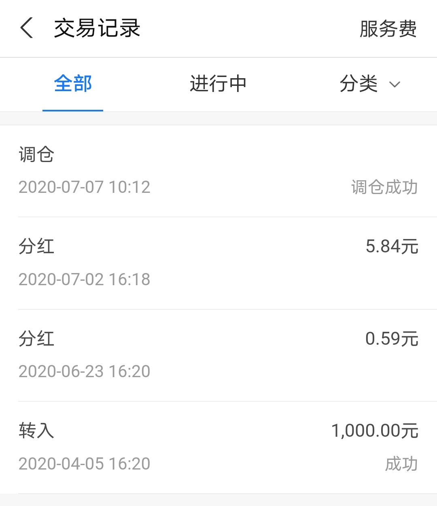

### 先锋“帮你投”的第一次调仓

4月初支某宝的理财菜单里多了一个【帮你投】，当时也正处投顾服务热火朝天的时候，大厂出的新鲜玩意我怎么可能错过，所以就重在参与的买了1000元，当时我还吐槽很多大V只买了800元（因为该产品是800元起卖）。

我是4月5日傍晚买的，平时很少去看它，这次的季度调仓，让我决定写一写这近一百天的使用体验。我想分两个部分写：**一个是客观的描述下‘帮你投’整个服务内容；第二个是我个人对‘目标投’这个产品的一些想法和建议。**

> ‘帮你投’能给我们带来什么？

1、首先是大家最关心的投资业绩，截止7月10日收盘，账户显示累积收益193.37元，也就是盈利19.337%，但奇怪的是账户总金额才1185.95元，显然是对不上的。

抱着这个疑问我点开了交易记录的明细，原来账户在6月23日分红0.59元、7月2日分红5.84元（均为基金本身分红而非投顾组合分红），但是我按下了计算器发现还是不对：1000+193.37-1185.95-0.59-5.84=0.99元。我重新核算一遍确实少了0.99元，我相信支某宝不会犯这种金钱层面的低级错误，那这少的钱去哪了？

找了一会，我看到交易明细页面的右上角有‘服务费’，点开后我看到了‘投顾服务费’页面，终于看到了这个熟悉的0.99元为‘已付服务费’，该页面还有很多关于投顾费详尽的解释。比如：**投顾费按日计算、先锋领航的投顾费是0.5%/年、投顾费按季度提取。**‘已付服务费’和‘所有服务费’都是可以点开查看明细的，可以分别看到以季度为单位的账单和每日账单。（分别见下面2张图）

2、因为这个‘帮你投’是根据每个人平时在支某宝的投资风格来推荐策略配比的，给我推荐的策略是‘锐意进取’策略（等级为中高风险）。股票类基金80%仓位，其中指数基金和增强与主动基金各40%；固收类基金20%仓位，其中利率债15%、信用债5%，更详尽的策略参数见下图：

点击右上角的‘交易规则’会看到交易规则的说明页面，包含转入规则、转出规则、调仓规则、服务费。总的来说与普通单只基金的交易没什么区别，就额外多了一个投顾服务费，但可以全自动调仓（每季度一次，偶有临时调仓）。

3、投顾服务会经常推送一些‘服务笔记’，我看了下每周大约3~5篇。主要有如下几类：

- **每周市场播报**：每周大盘回顾（沪深300、中证500、国债指数）、本周大事件、一周点评。

- **理财面面观**：通俗易懂、循序渐进的给投资人讲解理财的一些理念和策略。

- **帮你投小助理**：当6月底和7月初持仓的债券基金分红后，就有了相关的推送，最近这一期着重讲了分红和服务费，我觉得这方面的耐心细致的讲解还是很不错的（能很好的给小白用户解惑）。

- **季度资产报告**：这个我觉得每个季度查看下很有必要，很明确的告知了你本季度的盈亏情况，最新的持仓情况，还会有‘专家’对市场行情的一些回顾和展望。

- **优选基金名单**：这个板块我觉得挺有意义的，这些基金就是先锋领航选出来的基金池，大家如果不知道买啥就从里面自己选一些也是可以的，至少没什么大坑。再一个我要说的是，你仔细观察会发现股票基金里面除了几个主动混合基金外，都是主流宽基：沪深300、中证500、恒生指数。**并没有出现最近几年很火的Smart Beta基金和行业主题基金**，所以最基础的三板斧也是可以秀出花来的。

- **账户调仓报告**：每次调仓后都会生成一张调仓报告，我的这次是季度常规调仓，我看了后操作大致是：减了约15%的沪深300、减了5%的中证500，权益类主要新开仓了易方达中小盘和中欧新趋势各约9%，固收类是清仓了货币基金和纯债基金，换成了广发的双债添利，同时华夏亚债也加了约4%的样子。可以看出先锋领航对后市的一些看法：**添加了优质的主动基金，我的理解是后市可能情况更多变，适度加仓主动基金可以获得更多的超额收益，纯债和货币基金这类现金资产表示继续看空，但对海外债、信用债相对更乐观一点，总体的债股比依然是20%比80%。**

- **其他**：剩下是一些非固定的栏目推送，主要是一些操作上的解释和宣导，遇到极端行情也会发一些投资官的信来安抚投资人。

> 我对‘帮你投’的几点感受。

1、首先要申明的是我上面的描述只是针对于我本人的‘帮你投’，因为每个人的持仓标的和持仓比例都是不尽相同的。所以同理，我下面的一些感受和建议也是只基于我自己账户的一些体验。

2、**已扣除的服务费不该还计入账户的累计收益中**，虽然对于组合来说这算是收益的一部分，但这个类似基金的管理费，基金公司的净值都是扣除了管理费的。支某宝的小白用户极多，这多少有点夸大收益的嫌疑，我觉得不妥！

3、货币基金类目居然错别字写成了债券基金，**这种低级错误真的是丢支某宝和先锋领航的脸！**

> 小结

总得来说‘帮你投’业绩还是中规中矩的，整个过程也不用操心这个确实蛮好，对于小白用户我觉得可以适当配置一点。这让我想到了年初写过的支某宝的‘目标投’，小白投资者若两者搭配可能更好。

‘帮你投’是第一款中美混血的投顾产品，国内的华夏、中欧、南方等也都相继推出了自己的投顾产品。这种新型的投资服务模式我内心还是挺有期待的，**希望能给投资者们多提供一种选择，而不是换个方式卖基金给投资者。**

