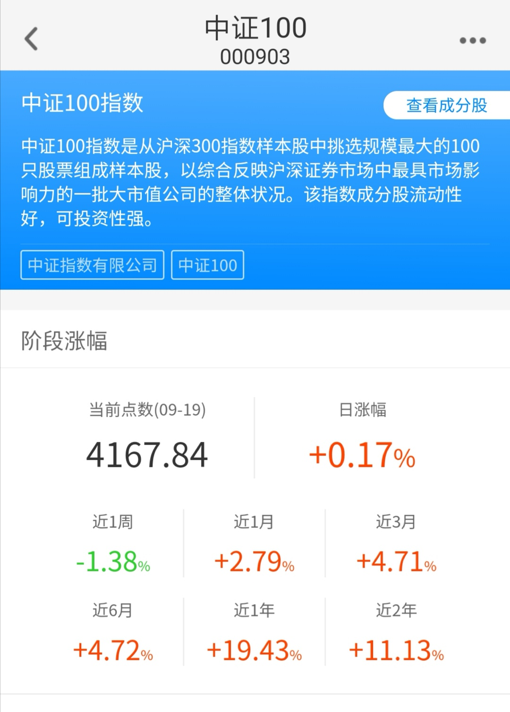

### 一只稳定的增强基金

之前我在《选择沪深 300 其实是一种无奈》一文中写过核心资产--中证100指数基金。

中证 100 指数：由沪深 300 指数成份股中规模最大的 100 只股票组成，综合反映中国 A 股市场中最具市场影响力的一批超大市值公司的股票价格表现。

从定义我们就知道中证 100 是沪深 300 的子集，是沪深 300 的前 100 成分股的集合。两者前十大成股份的比较也看得出中证 100 的成分股占比更加集中，更突显了核心二字。

在中国改革开放进程中涌现出了那么多优秀的企业，作为普通百姓如何分享这一改革红利成了大家所关心的话题。买入中证100指数基金就是一个不错的选择，耐心持有便可共享中国崛起的福利。聪明的你可以选择优秀的中证 100 指数基金来投资中国，得以获取更丰厚的收益。

当时对增强型中证100指数基金的推荐就是宝盈中证 100 指数增强 A （213010)。

推荐理由：规模适中，费用合理，增强效果明显且稳定。

那今天我们就单独聊一聊这个宝盈中证100指数增强基金，给它来一个简单的测评吧。既然是增强基金的测评，我们也就不整那些虚的了，对于一个成立近10年的老牌基金，直接上数据就是最大的硬气，也是对基金本身最大的认可。

截止今年9月18日，所有中证100指数基金近一年的收益排行，宝盈中证100指数增强稳居第一名。远远超过指数本身的收益9.65%，一年的超额收益有那么多，确实是非常吓人的业绩。

然后你进一步查下近2年、近3年、近5年的数据，宝盈中证100指数增强基金都是遥遥领先的，这就是我前面说的增效明显且稳定，一只基金持续的增强是很不容易的。

一只增强基金有那么好的收益，是不是有啥特殊奥秘才这样？

我们看到它的最新规模是2.36亿，这个在中证100的指数里算是前几名的。一个适度的规模会有更多有效的增强策略，从而增强效果也会更优秀。

基金费率：0.12%的申购费 0.75%管理费 0.15%托管费，这是增强型指数基金里很便宜的基金了，便宜的都有点看不出是个增强基金。要知道这是一个成立了近10年的老基金，10年前这个费率是相当有诚意的。

优秀的基金团队、适度的基金规模、诚意满满的低费用。

给宝盈中证100指数基金持续稳定的增强加了一层保障，结合上核心资产优势加持，我相信宝盈中证100增强指数基金会在将来也会再创辉煌。

