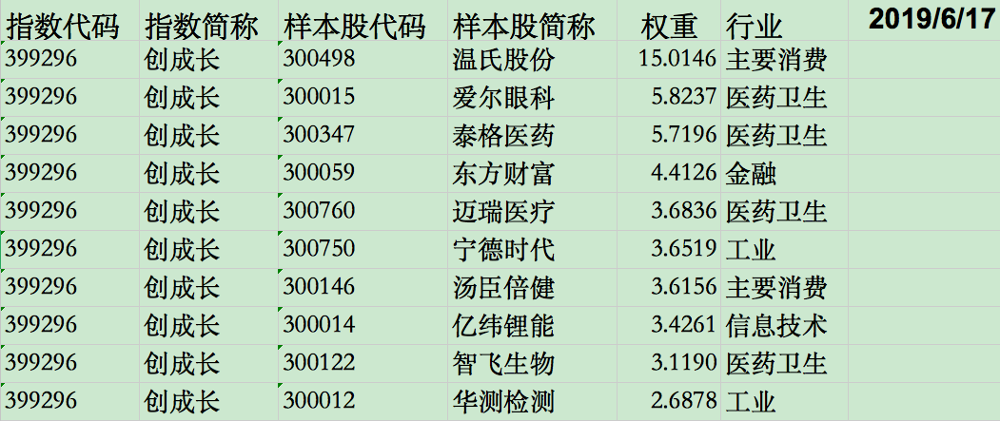
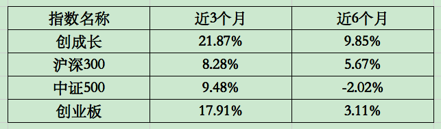

### 跑赢创业板好像也没那么难

Smart Beta基金最近两年可谓是炙手可热，简称：SB基金。因为Smart Beta策略的**纪律性更强、策略更透明、风格更稳定、费率更低廉**等优势，所以大有赶超主动型基金的意味。

但我们发现之前的那么多Smart Beta基金都是基于沪深300、中证500、中证800或者就是整个A股市场，就是没有单独基于创业板的Smart Beta基金。好在华夏基金在今年6月份先后上市了创蓝筹（159966）和创成长（159967），我们今天就先说道说道这创成长：华夏创业板动量成长ETF。

先看下创成长所跟踪的指数（**创业板动量成长指数【399296】**）：为反映创业板中成长能力良好、动量效应显著的上市公司整体运行情况，向市场提供更丰富的指数化投资标的，编制创业板动量成长指数。

该指数由深圳证券信息有限公司负责设计与管理，华夏基金和锐联财智提供研究支持。所以我们就可以理解成这是华夏基金订制的一个指数，有个明显的优势就是选股因子更强劲，至少我觉得基金公司肯定比指数公司更懂什么是有效因子。

那我们就来看下这个指数的样本区间是如何选取的：

1）在创业板上市交易的 A 股

2）有一定上市交易日期，一般为半年

3）公司最近一年无重大违规、财务报告无重大问题

4）公司最近一年经营无异常、无重大亏损

5）一段时间内股价无异常波动

我们都知道创业板的活力是最强劲的，但同时也意味着雷会更多、更吓人。这也是我对创业板指数一直耿耿于怀的原因：在七百多家创业板企业里按市值权重选100强，这种在中小盘板块里选前13%左右的成分股组成指数，我觉得还不能很好地体现**指数选优**的特性。

甚至我觉得创50指数都要比创业板指数更精炼、更符合头部优势这一规律。但是创50的筛选也基本上就是把最大的50家放在了一起，没有选优的感觉，更别说Smart Beta特性了。然后再反过来看上面5条初筛规则是不是很兴奋，特别是第3和第4条基本上可以过滤大部分雷股了，这一点对广大的散户来说很重要。

但是如果创成长指数也就这点本事，我也就没必要写这篇文章了，且看创成长是如何体现动量成长这一属性：

1、对前面筛选的成分股按流通市值取前30%的股票。

2、再对选出的股票依据**两维度**（成长、动量），**六指标**（收入增长、利润增长、息税前利润增长；52周新高、12M-1M动量、12M-1M超额收益动量）进行综合打分。

3、最后各股票以流通市值权重为基础，根据各因子得分进行倾斜加权，选取前50只股票。

当然这些严密的筛选对于一个Smart Beta基金来说也是比较正常的，我们怎么能因为大家都有的东西就骄傲呢。普通指数都是一年或半年调整一次成分股，创成长最有特色的就是每个季度调整一次（每年3、6、9、12月第二个星期五的下一交易日）。这一特点是为了应对创业板的千变万化，每季度末可以及时调整成分，使得指数一直保持强劲的动量成长，也自然就会以最快的速度清除掉爆雷股、垃圾股。

当年的乐视网作为创业板的权重，在企业出现问题后也不能第一时间剔除创业板指数，这个也是无形中对指数投资人的一种伤害。所以作为中国最活跃的、波动最大的板块，创业板动量成长指数一个季度调整一次**很合理，也很优秀**。

说了那么多筛选规则，接下来我们直接看下十大权重股吧（截止2019年6月17日）：

是不是这10只股票都是看着很舒服啊？这就是层层筛选出来的优质成分股。所以在这些优秀股票集合的带动下，创成长指数的业绩是很优秀的（截止9月12日）：

上图的数据很明显地看到了创成长**超额收益的能力**以及**跑赢大盘的实力**。我觉得如果你喜欢创业板块的话，那么创成长ETF是一个不错的选择，**优中选优才能赢得更稳**。