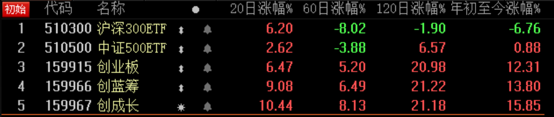
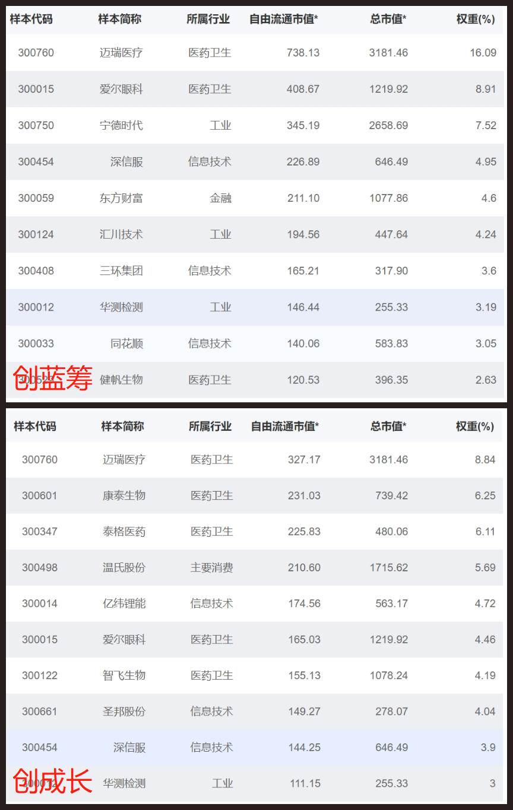

### 左手倚天、右手屠龙，它已不是从前那个少年

#雪球ETF粉丝节#

雪球一直是推广ETF的热门平台，这次搞ETF粉丝节也得到了大家的积极响应。ETF作为我非常喜欢的一类投资产品，我肯定要参与下这个活动的。正好也是一季度刚过去，国内和全球经济都出现了众多‘活久见’的极端行情。

可能是因为工作的关系，我比较关注科技；又因为我是一个吃货，所以对消费板块也很在意。人总是喜欢多说一些自己看好的板块，看我以往的帖子就知道这两块是占比最多的。这次ETF粉丝节很多人写了中概互联和消费类指数基金，这俩我都是很看好，自己平时也常提及。既然大家都写得那么详尽了，我就换个方向写写吧。

复盘了刚过去的一季度，一个熟悉的板块再次映入了我的眼帘：**创业板**。

> 今年业绩如何？

今年以来创业板收益+12.31%，业绩碾压同期的沪深300(-6.76%)和中证500(+0.88%)。既然今天聊的是ETF，且为了避免各种业绩比较的猫腻，我直接选取了对应指数流动性最大的ETF，数据日期为2020年4月17日收盘价，数据源为choice。话不多说，直接上图：

细心的朋友也看到了，上图中还有两个熟悉的面孔：创蓝筹和创成长。去年9月中旬和12月下旬我分别介绍了这两只指数基金，这两只基金没让我失望，在我发文后表现令人满意。当时的文章链接：

- [跑赢创业板好像也没那么难](financing/ccz-profile)

- [跑赢创业板好像也没那么难（2）](financing/clc-profile)

我们可以在图表中清晰的看到创蓝筹和创成长在今年以来超过了创业板的增幅，不仅如此我们还可以看到近20日、60日、120日的数据都是超额跑赢了创业板。大家可看清了，我们没拿创业板指数去比较，这个太欺负人了，我们拿的是实打实的指数ETF去比业绩。这也如我之前说的：双创基金漂亮的不像实力派，同时也映衬了去年我写的标题 -- 跑赢创业板好像也没那么难。

> 为何如此优秀？

业绩优异的原因我觉得应该从两方面讲：一个是整个创业板为什么领先沪深300和中证500？另一个是为什么创蓝筹和创成长能跑赢普通的创业板指？

- **创业板**：业绩的变动叠加市场风格的变化。

2018年底~2019年初，创业板的很多企业大量计提商誉，洗过澡后显得轻装上阵。而沪深300其实前两年涨幅不错，所以市场也有轮动的意愿，外加创业板的业绩也确实还可以，在去年底、今年初科技板块行情的推动下就更甚了。这也是为什么中证500同样近半年表现优于沪深300，但是中证500头部权重不够集中，所以没能像创业板这样取得更好的成绩。

市场风格方面，2010年开始经济持续下滑，但2013年成长股就走出结构性行情，2016年经济又开始复苏，价值股走出独立行情，同时成长股熄火，这持续了近4年跨度很长，去年3季度终于又轮到成长风格了，只是不知道这次会走多久？

- **创蓝筹、创成长**：聪明的Smart Beta增益添彩。

创蓝筹（159966）和创成长（159967）是第一批基于创业板的Smart Beta基金。创蓝筹全称：创业板低波蓝筹指数【399295】，创成长全称：创业板动量成长指数【399296】，均由深圳证券信息有限公司负责设计与管理，华夏基金和锐联财智提供研究支持。

更具体的指数介绍可以去我上面链接的旧文查看，我就不再累述。我觉得这两个指数有着更为科学的编制规则，数量适中的成份股，以及少有了每季度调整一次成份。这一切都使得跑赢创业板成为一件大概率的事情，叠加近半年创业板整体强势，那就是如虎添翼了。

> 未来是否可期？

对于买基金，我们经常会遇到刚火的基金一买就跌，所以很多朋友会问：创蓝筹和创成长后市还能延续这样的增长吗？

同样这个问题还是要拆解为两方面回答：一是创业板后市会如何？二是创蓝筹和创成长能否继续跑赢创业板？

- **创业板**：创业板中短期业绩不会大变，市场风格的转变也不是短期事件。

如上一段说的，创业板经过了前几年的商誉洗澡，现在的业绩整体看还是趋于好转的。何况现在国家很多科技信息产业要求独立自主，受益最明显的肯定是创业板。外加科创板注册制已经平稳实行，创业板的注册制也已提上日程，包括之前一直在提的要放宽对创业板再融资的门槛，众多政策的推行对创业板肯定是利大于弊。

另一方面是说市场风格，从价值转向了成长。大家要知道这种市场风格的转向不是心血来潮，而是市场各方合力的结果。这种趋势不是短期内突然变化的，且一旦风格明确切换了，大概率都是需要持续一段时间的，少则半年，多则2~3年也是有可能的。所以大家不必太过紧张，而且我也说了风格变化不会一蹴而就的，因此就算真到了那一天我们也是有足够的时间根据风格的切换再调仓。

其实心慌的小伙伴主要是担心创业板现在的估值不算低，确实相对于沪深300和中证500来说创业板的估值算不得低。但从创业板的成份股角度考虑，很多都不是传统的用单一的PB、PE就能估值的企业。再说了我们A股的大行情何时讲过估值，A股要牛起来的时候，还会管你估值不估值？估值只是安全垫，大行情都是靠大资金、大事件推动的。

- **创蓝筹、创成长**：Smart Beta的定义就注定了大概率会继续跑赢创业板。

首先在Smart Beta的加持之下，创蓝筹和创成长自上市以来长期跑赢创业板，这是真真切切的业绩。然后再给大家看下最新（2020年3月31日）的十大权重股，你仔细看着这几个浓眉大眼的，是不是很舒适，心里是不是不再慌了。

> 小结

其实创业板经历了十多年的发展已经渐渐淡化‘创业’二字，创业板里也涌现出了很多优秀的企业。总得来说创业板是一个颇具活力，富有机会的板块，只要我们认真筛选肯定能获得不错的收益，如果你不是很擅长选股，那么创蓝筹和创成长会是你不错的选择。