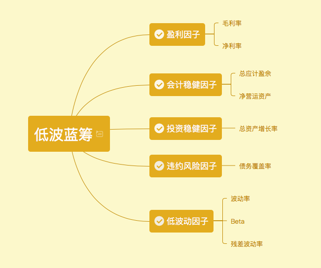
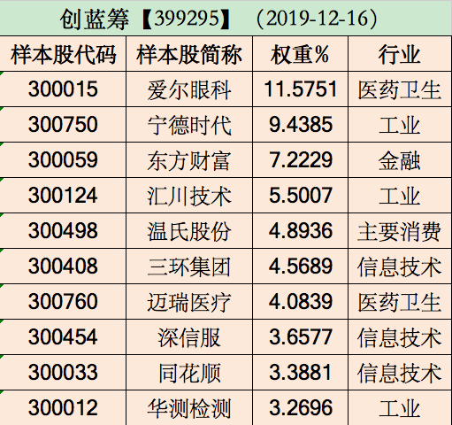

### 跑赢创业板好像也没那么难（2）

9月中旬的时候我写了一篇[《跑赢创业板好像也没那么难》](financing/ccz-profile) 没想到过去那么久了，还有人读者问我：你当时提到创业板的Smart Beta基金华夏出了两只，怎么就讲了创成长，还有一个创蓝筹呢？

其实创蓝筹的大纲当时我已经写好了，但那会急着发稿就先把创成长那篇给发了，要不是这位朋友问起我都差点忘了还有这么一份续集未完成，哈哈。虽然创蓝筹和创成长都是基于创业板的Smart Beta基金，但是创蓝筹的筛选规则更复杂，那今天我们就重点讲讲华夏创业板低波蓝筹ETF。（这边我插一句，你看创成长是**动量成长**、创蓝筹是**低波蓝筹**，这种组合我觉得就很科学合理。虽然Smart Beta因子很多，但只有当所选的各因子劲都往一处使时，才能发挥好Smart Beta效果，合力的威力才是高效的。）

创蓝筹（全称是**创业板低波蓝筹指数【399295】**）：为反映创业板中盈利能力良好、财务质量稳健、波动率较低的上市公司整体运行情况，向市场提供更丰富的指数化投资标的，编制创业板低波蓝筹指数。该指数同样由深圳证券信息有限公司负责设计与管理，华夏基金和锐联财智提供研究支持，从基金发行后半年的业绩来看这种专业性极强的合作还是很优秀的。

首先我们看到成分股入围标准和创成长一样：

1）**在创业板上市交易的 A 股**

2）**有一定上市交易日期，一般为半年**

3）**公司最近一年无重大违规、财务报告无重大问题**

4）**公司最近一年经营无异常、无重大亏损**

5）**一段时间内股价无异常波动**

这5条可以有效的初筛掉大部分雷股，我在上次文章里已经阐述了，不再累述。那么我们再来看下创蓝筹超级复杂的**五个维度、九个指标**的选样方法：

首先将选样空间内的股票，按过去半年的日均自由流通市值从大到小排序，选取排名在前30%的股票（**专注大市值和流动性佳的股票**）。其次对选出的股票，按照盈利、会计稳健、投资稳健、违约风险和低波动五个维度、共九个指标计算指标得分。根据各因子得分进行倾斜加权，计算各股票的组合权重，选取排名靠前的50只股票构成样本股（**单只股票上限15%权重**）。具体指标如下：

1）**盈利因子**：毛利率、净利率

2）**会计稳健因子**：总应计盈余、净营运资产

3）**投资稳健因子**：总资产增长率

4）**违约风险因子**：债务覆盖率

5）**低波动因子**：波动率、Beta、残差波动率

是不是看得有点晕？晕就对了，我第一次看到编制规则的时候也是一脸懵逼。如果说入围初筛的五个标准像进地铁站只检查大包和行李箱，那么这五个维度、九大指标就是飞机登记安检。全方位细致的核查让垃圾股无处遁形，可能你不完全清楚每一个指标的概念，但你看名字大概能体会到筛查的严苛了。**简单概括下就是：良好盈利、扎实财报、稳健扩张、更低违约、更低波动。**

前四个维度对应的是“蓝筹”，最后一个维度对应的是“低波”。而且创蓝筹和创成长一样，每年3、6、9、12月第二个星期五的下一个交易日调整一次成分股。好比别人一年体检一次，条件好一点的半年体检一次，我们双创指数直接每个季度检查一次，享受超VIP服务。及时发现风险、剔除风险，严防死守把垃圾股扼杀在摇篮里。

如果还是觉得有点迷糊，那么看看经过层层严苛的安检，精挑细选出来的十大成分股吧：

怎么样？是不是个个浓眉大眼啊？前十大权重占了57.60%，其中医药（15.66%）、工业（18.21%）、金融（7.22%）、消费（4.90%）、信息技术（11.61%），我觉得这个行业配置也挺好，属于可以安心持有的那种。

聊到这了，心急的朋友肯定要问了：这个看着挺靠谱，哪有卖呢？前面也说了，这个算是华夏基金的订制指数，所以场内是创蓝筹ETF（159966）场外联接基金A类（007472）、C类（007473）。

最后给大家贴一个双创最新的业绩表现吧，映衬了我本文的题目：“跑赢创业板好像也没那么难”。我们不拿太久的业绩说事，这个不免有人说基金实际成立时间不长，有拟合数据的可能（但事实确实超额收益明显）。如上次创成长一样，我们看近一年创蓝筹就超额创业板指7.07%的收益，这个Smart Beta效果可谓令人惊叹。