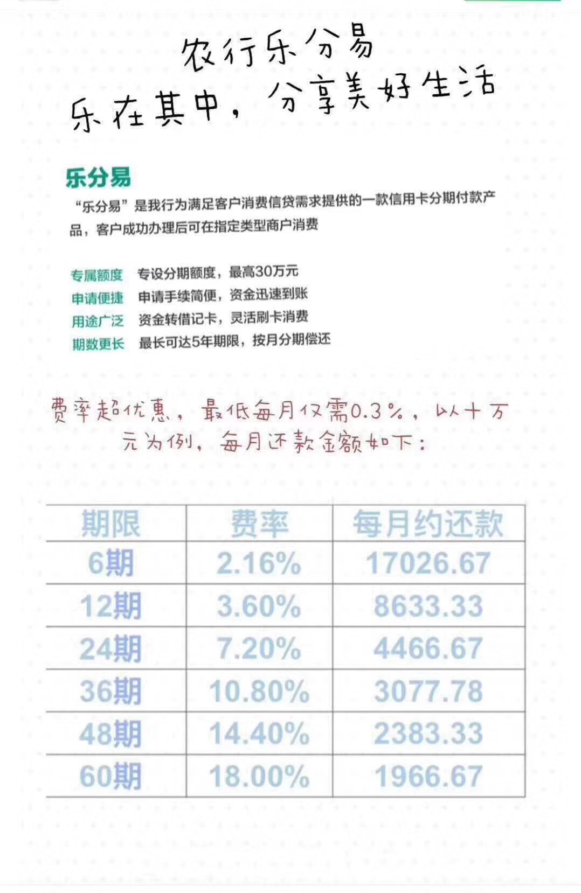
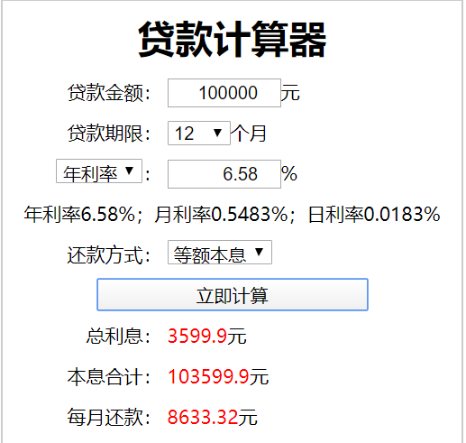

### 防不胜防的消费贷套路

其实我挺反感任何金融产品玩弄年化收益率或利息的，**包括但不仅限于**：各种理财收益、各种贷款利息、各种保险收益。。。

这种小把戏的玩弄类似于商店门口写着活动促销1折，然后试了半天一问价格，人家才和你解释海报右下角还有一个【起】字，是‘1折起’！！

今天接到一个农行理财经理的电话。小姑娘声音很甜美，上来就说我的房贷还款记录极好，可以给到我年化3.6%利息的无抵押贷款。

我第一反应是问：有没其他服务费？3.6%是不是所有的费用？因为有些银行的套路就是把利息做的低一点，但会有一堆杂七杂八的服务费，比如之前接到浦发的电话就是这种套路。

在确认这次不是这种套路的时候，我产生了兴趣（我好奇这次是啥不一样的套路）。我知道不可能只有3.6%，我就开始追问有没官方的资料发我看下，理财经理见我有了兴趣立马要求加我微信，说可以在农行官网查到，然后发了一个简单的宣传图片，如下图：

初步一看确实一年3.6%的费用，最多可以贷款5年，**每月等额本息还款**。但是我稍微算了下这个12期的每期8633.33是怎么来的？（100000*1.036）/12=8633.33

咋一看确实只有3.6%的费用，那么问题出在哪呢？

**利息是一次按年给你计算的，但是你第一个月还的钱只用了一个月，只有最后一个月的还款才真占用了一年。**所以粗略算下资金占用6个月的费率是3.6%，一年毛估估就是7.2%

精准的计算入下图所示：

虽然很多成熟的投资人都一看就知道里面有猫腻，但是我真的遇到很多小白就不会想那么多，也不会去细算。本来只是写个简单的帖子，可写着写着就来劲了，那就干脆写成文章吧，回头也好给遇到类似问题的朋友反复看看。

最后我想告诉大家：**考虑问题还是多用一点常识，特别是和钱有关的**，银行不是慈善家（何况还是高傲的四大行），保险公司也不是公益机构（无孔不入的保险推销员真的很可恶，我丈母娘上周又被忽悠买了一份年金险，我真的欲哭无泪，今天的愤慨有这个一部分的原因），**切记天上不会掉馅饼**。

额外提醒：该产品利息其实还蛮高的，而且属于是信用卡贷款，只能用于消费。如果提出来需要通过POS机套现，这个严格来说是存在一定违规的，但其实业内都这么玩，唉！

防不胜防！
