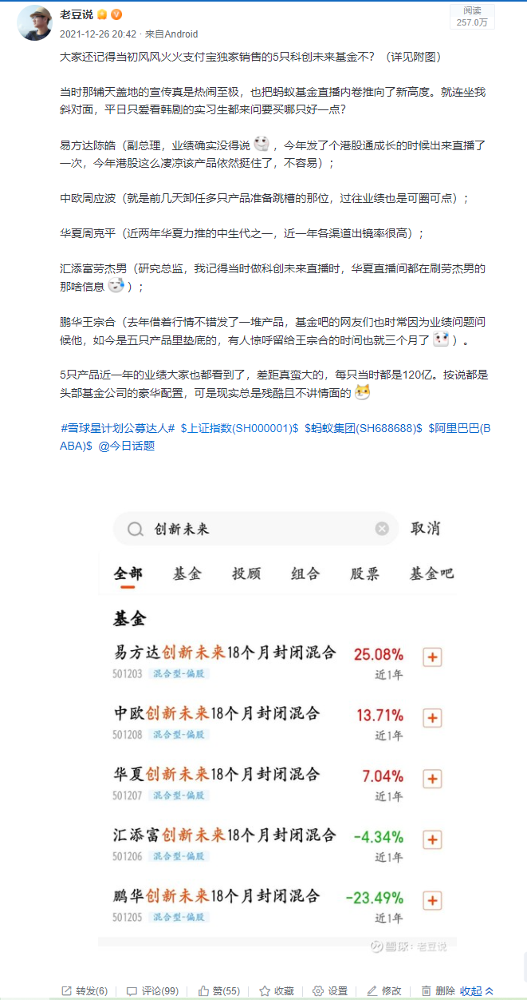

### “创新未来”们还有未来吗？

上个月我发了个帖子（见下图），大意就是当年支付宝独家的五只“创新未来”18个月封闭基金快要到期了，可一年多运行下来五家顶流基金公司的产品业绩差异不小，特别是留给鹏华基金王宗合扭亏为盈的时间已经不多了。

我本想着这事也就这样了吧，哪知道昨晚一位老哥对我说：四季报出来了，王宗合的创新未来居然割了白酒追了新能源，看后哭笑不得。我们还讨论说，这老王买科技股是自愿的还是被迫的？是最后三个月的破釜沉舟吗？

当然我也要特别申明，自己没有嘲讽哪个基金经理，毕竟金牛奖得主肯定有过人之处，只是不免觉得有些惋惜。在顺风顺水的时候发了太多新基（那段时间我印象深刻的还有嘉实基金的归凯也是高密度发新基），最后这一年多下来业绩稍显拉跨，那么在当时买入的基民情绪肯定是难平的，你看看基金讨论区的评论（主要是谩骂）就知道了。

回望5只创新未来整个生命周期充满了关注点，这是蚂蚁平台第一次独家销售5只主动基金产品，当时各方宣传力度是空前绝后的，基金直播也是从那时候正式进入了内卷期（部分传统渠道为此还颇有微词，但基金公司肯定谁都不敢得罪呀，毕竟渠道都是大爷）。当时的宣传点就是蚂蚁上市后的战略配售，意外的事就是蚂蚁在马老板的口嗨后被暂停上市了，那么迫于各方压力5家基金公司和蚂蚁商量后给出了转场内的方案，如果等不及18个月的持有人可以提前转出离场，我没记错的话当时离场的朋友好像都有赚到。

好了，我也不带入太多主观感受了（大部分上月的那个帖子里已经说了），既然四季报出了，那么我就把5只创新未来基金最新的一些数据贴给大家吧。（数据日期2022年1月20日收盘）

**最新净值>> 易方达:1.1992元，中欧：1.1370元，华夏：1.0526元，汇添富：0.9518元，鹏华：0.7287元；**

**最新规模>> 中欧：106.12亿元，易方达:100.88亿元，华夏：89.69亿元，汇添富：78.64亿元，鹏华：58.65亿元。（注：募集规模当时都是120亿上限）**

“创新未来”们只剩下2个月了，汇添富的劳杰男可能努力下还有希望上1元净值，这四季度换仓新能源且最新净值只有7毛多的鹏华王宗合该如何是好？神仙难救的局该如何破？！