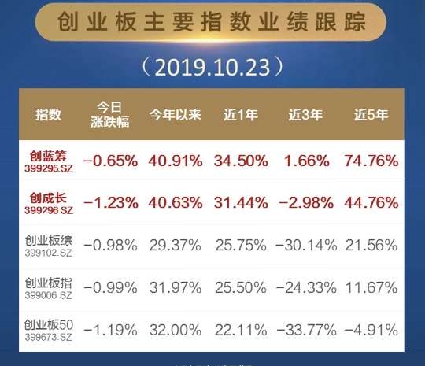

### 这小伙子今天10岁了

方丈昨天在雪球上搞了一个 #十年如一# 的命题作文，然后我一想雪球不是才刚8周年么，哪来的十年呢？我脑子里随即跳出来的第一个十年就是创业板开板十周年了，所以我今天想写写创业板这个已经10岁了的小伙子。

中国人其实对周年庆还是很重视的，特别是10的整数倍甚是欢喜。比如今天（10月23日）我老婆的奶奶90高寿了、下个月老丈人60大寿、下下个月我和老婆都30周岁了（太密集）；再比如投资人关注的，今天是创业板开板十周年纪念日。我女儿5岁生日都要拍套亲子照片来纪念下，创业板作为中国独特的二板市场，十周年了肯定要回顾下这十年心路历程。

十年间创业板从无到有，逐渐壮大，已经成为了中国资本市场的重要组成部分。创业板成长的十年也是中国经济转型和升级的十年，于我个人而言也是我投资经验积累的十年，写创业板突然有了种在写同龄人的感觉，哈哈。

其实不单是创业板，整个中国资本市场都是一直在摸着石头过河。当年总设计师也指出：“证劵、股市，这些东西究竟好不好，有没有危险，是不是资本主义独有的东西，社会主义能不能用？允许看，但要坚决地试。看对了，搞一两年对了，放开；错了，纠正，关了就是了。关，也可以快关，也可以慢关，也可以留一点尾巴。怕什么，坚持这种态度就不要紧，就不会犯大错误”。

就是这种勇于尝试、敢于摸索的态度才有了今天资本市场的多元化发展，也正因为创业板经验的积累才有了科创板的成功开市。易会满主席10月9日在深圳调研时则表示，证监会将聚焦先行示范区建设需求，整体谋划、突出重点，分步实施、抓住节点，全力推进深圳资本市场改革发展，尽快取得阶段性成效，切实提升资本市场服务实体经济的质量和效率。李超副主席10月20日表示，证监会将加快创业板改革，聚焦深圳中国特色社会主义先行示范区建设需求，推进创业板改革并试点注册制，完善发行上市、并购重组、再融资等基础制度，进一步增强对创新创业企业的制度包容性。我们即将看到又一个蜕变的创业板，十岁后的创业板像个大小伙子了，也可更好的服务实体经济。

创业板这十年来涌现了一批市值翻好几倍的大牛股，给相关的投资人创造了暴富的可能；当然也有不少公司上市没多久就业绩变脸，甚至像乐视网这样从‘为梦想而窒息’到‘窒息’，眼看起高楼、眼看宴宾客、眼看将倾覆，回头再看总是令人唏嘘不已，感慨万千。

那我们投资人如何参与创业板呢？因为创业板是二板，所以需要单独开通创业板交易权限。第一次开户的朋友如果想交易创业板的个股，那就得临柜开通，且需要填一堆问卷，然后双录（即录音录像）方可开通。还没结束哦，若你满两年以上交易经验,在T日申请开通,可在T+2日开通创业板市场交易；未满两年交易经验的客户,在T日申请开通,可在T+5日开通创业板市场交易。

其实有些人觉得这个好麻烦，但这也是监管部门在保护投资人，毕竟创业板的机制和风险与主板还是有很大的区别的。当然也不是完全没有办法避开这些繁琐的步骤和条款，公募基金就是一个很好的参与方式，如果是场外基金的话甚至连证券账户都不需要。

那我们接着看下市场上主要有哪些创业板的相关指数基金呢？

- 易方达创业板指基金（2011年9月20日）

- 华安创50指数基金 （2016年6月30日）

- 华夏创蓝筹&华夏创成长 （2019年6月14日&2019年6月21日）

易方达的创业板ETF成立的比较早、规模也是很大，是当前市场上最大的宽基之一；华安在2016年6月推出了创业板50ETF，也是对创业板指数基金的一个创新。因为创业板指数选取创业板内最大的100只股票作为成分股，而创50指数则是在创业板指的100个成分股内再选50个流动性好的出来。

讲真即便现在创业板已经有770只股票了，我还是觉得从中选100个优质企业出来略显捉襟见肘。我也很不理解为什么直到2016年6月底，才有人醒悟要出一个只需要选50只成分股的创业板指数基金呢？

但在我看来这依然不是创业板的最优选择，直到今年华夏基金推出了创蓝筹ETF和创成长ETF这一组双子星。除继承了优选50只创业板的成分股外，这两只基金还都是Smart Beta基金，即不再只是单纯粗暴的用市值去衡量入选与否和权重多少，而是加入SB因子来增强实际收益。这就是一种自我净化的创业板精神，而且细心的朋友也发现了，我们的创蓝筹和创成长指数都是每季度更新一次成分股，这种规则升级也是为了更好的适应创业板的发展。

看上图就很明显的知道SB因子对于收益的有效贡献，华夏双创因为是今年刚成立的基金，如果只是用近3年收益或近5年收益吊打同类指数，那么有人会说你这个是指数回测的过度拟合。那么我们就看今年以来的业绩，在这10个多月的时间里**创蓝筹和创成长均超过创业板和创50至少8%以上。**

所以在这创业板开板十周年之际，我们要感谢这个时代给了我们更好的选择，同时也要感谢华夏基金在敢于创新的创业板精神之下给我们带来了与时俱进的创蓝筹和创成长。我是一个推崇指数定投的人，如果大家看好我们国家未来科技的发展、看好创业板的后续发展，那么华夏双创是个不错的定投标的。
