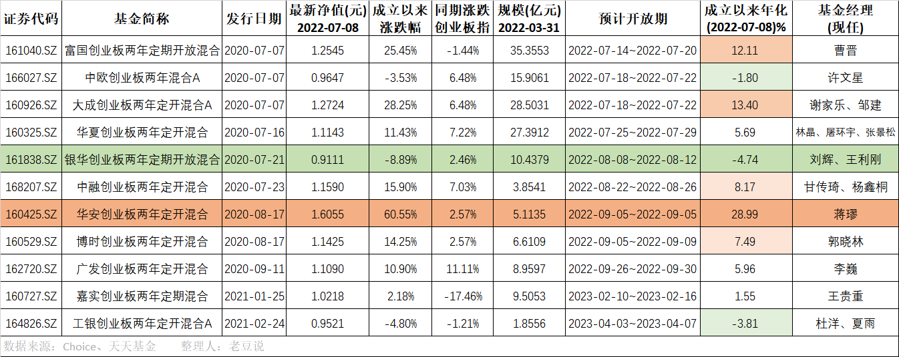

### 两年前的创业板定开基金将陆续到期

2020年7月~9月先后有9家基金公司发行了创业板两年定开混合基金（富国、中欧、大成、华夏、银华、中融、华安、博时、广发），2021年初嘉实和工银也发了相关产品。我在去年7月底盘点过这些创业板定开基金的业绩概况 《11家创业板战配基金收益都不错，除了它！》，现如今一年又过去了，业绩排序上有了不小的变化。在提醒大家买了相关产品要注意定开基金开放期窗口外，也和大家分享下这些产品的业绩排序。

我判定一个基金是不是好的产品很”简单粗暴“，就是有没有给基民带去了可观的收益？因为这些是定开（定期开放）基金，不存在中途的卖出和买入，大家都是发行的时候一起认购，现在到期了一同赎回（再续期2年的不在本文讨论范围内）。

虽然是各家出的产品，但同属一个系列，且发行时间相对靠近，值得去对比下各家业绩。我们**考虑的点主要是：两年到期收益如何？相对同期创业板指数超额收益如何？**基于这个规则我把这些产品先分类到”优良中差“四个等级内，结果如下（本文所指业绩数据截至2022年7月8日）：

- 优（正收益、超基准）：华安、富国、大成、中融、博时、华夏；

其中华安基金这只一骑绝尘（净值1.6055元，同期创业板指才+2.57%），去年这时候看它也是遥遥领先，并且在这一年过山车行情里稳住了收益，必须给基金经理蒋璆手动点赞下。富国基金虽然排在第二名，但去年这会净值和华安差距不大，可现在净值只剩1.2545元了（同期创业板指为-1.44%），但也印证了那句话：瘦死的骆驼比马大。

第三名大成基金中规中矩，净值1.2724元（同期创业板指+6.48%），与剩下三家优秀类产品比胜在稳健。第4~6名依次是：中融基金，净值1.1590元（同期创业板指+7.03%）；博时基金，净值1.1425元（同期创业板指+2.57%）；华夏基金，净值1.1143元（同期创业板指+7.22%）。

- 良（正收益、未超基准）：广发；

广发基金虽然正收益（净值1.1090元，同期创业板指+11.11%），但没有跑赢同期创业板指，非要评下业绩只能说：没亏钱。如果它最后两个月保持住了业绩，基民就当买银行理财产品了，可你细想下：既然都跑不赢创业板指数，那我当初买它的意义何在？。

- 中（负收益、超基准）：无；

负收益还想超基准确实不容易，也没产品在该象限内。

- 差（负收益、未超基准）：银华、中欧。

这批产品里最差的就是银华基金，而且去年这时候创业板总体不错的时候也是唯一亏损的产品，不能说一棍子打死一个基金公司吧，但这两位基金经理（刘辉、王利刚）的产品我觉得有必要以后都规避下。当然中欧基金（许文星）也好不到哪去，去年还是1.2附件的净值，现在已经跌破面值了，难道是怕银华基金一人在差生小组里寂寞？

两年的时间里创业板指数本身大环境其实还是不错的，一张开卷且容易的答卷非要考出两个不及格的学生，我也是蛮”佩服“银华基金和中欧基金的。不少人直呼花了那么多管理费，收益还不如直接买创业板指数基金，还要封闭锁定整整两年！

这里再说两组完全同日上市、同日到期的产品，这种面对面的”厮杀“对比是最扎心的。7月18日到期的大成基金（1.2724元）和中欧基金（0.9647元）；9月5日到期的华安基金（1.6055元）和博时基金（1.1425元）。博时基金对比业绩差一点，但至少是正收益呀；而你中欧基金这净值亏损又拉跨，让人联想起4月份到期的中欧创新未来也是负收益。我想未来很长一段时间里，在上海地铁里看到中欧基金满屏广告的时候，内心是会唏嘘的！

2021年初成立的嘉实暂时为优、工银为差，但这两只产品还有可努力的时间，暂时不在本文多阐述，重点还是近2月要陆续到期的那9只产品。至于我本人运气还不错，当年买的是华夏基金和大成基金的产品，这结果马马虎虎还算过得去。

最后我想说，类似这种”任务“性质的概念基金这几年也发了不少，大部分基金公司都会很认真地对待，安排靠谱优质的基金经理用心管理，最后给基民们也带去了还算不错的持有体验。而有些基金公司就真的当作一个任务了，整个管理周期都比较”佛系“，最后出来的业绩就是让大家感到失望。一家基金公司想要做好口碑，是需要从做好每一个产品开始的，基民对基金公司的信任会在一次次不良的持有体验中慢慢消磨掉，请善待持有人对你们的信任和托付。