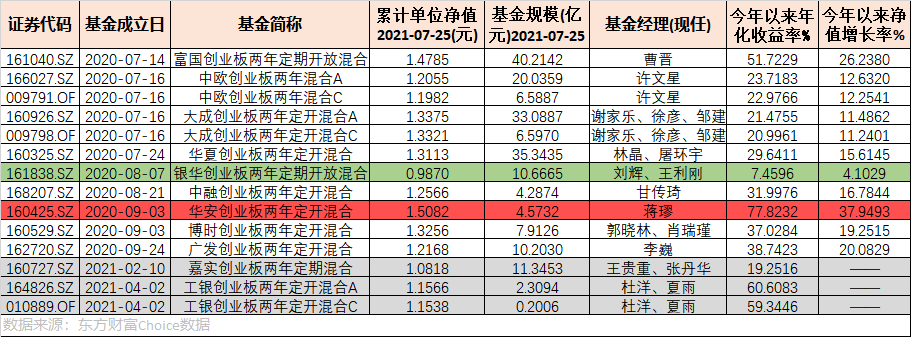
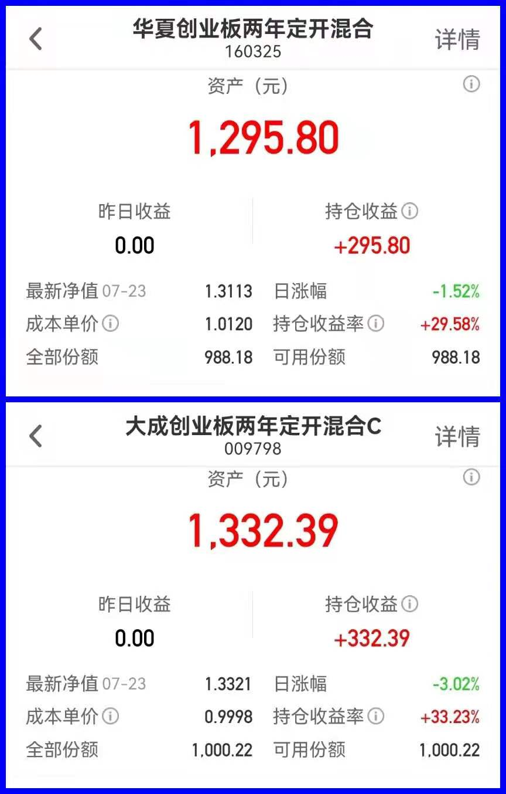

### 11家创业板战配基金收益都不错，除了它

在宁德时代等权重股的带领下，创业板指成了上半年最彪悍的宽基指数（近期甚至点数超越了上证）。甚至你会发现创业板的十大权重里医药和新能源占比太大，大到都不像是个宽基，而有点像主题指数了。最近几天基金自媒体都在勤劳地分析着各类二季度报，我就不扎堆凑热闹了。今天我想和大家聊聊貌似已经有点被大家遗忘的，一年前开始陆续成立的那些创业板战配基金们。

截止今日总计有11只创业板战配基金成立，最早成立的是2020年7月14日：富国创业板两年定期开放混合。先帮大家回忆下为什么会有这么些个创业板战配基金？去年科创板和创业板先后实行了注册制，那么很多头部基金公司都陆续分别申报了科创板战配基金和创业板战配基金（本文暂只讨论创业板战配基金）。

这些创业板战配基金最大的优势就是如它们的名字那样， 可以优先参与创业板的配售（含定增）。如果参与了战略配售，就能以比较低的成本得到相当一部分的筹码或者仓位，这种先发优势（制度红利）也是各大基金公司纷纷申报成立的主要原因。

此外我们也可以看到，创业板战配基金们被要求80%以上非现金资产需投资于创业板股票，这就保证了战配基金可以充分参与创业板，紧握中国创新成长型企业投资机会（近大半年主要是新能源和医药）。

而且这11只产品清一色是两年期定开基金，我个人一直是比较推荐普通基民尽可能优先考虑1~2年的定开基金，是帮助大家强制长期持有的一个好办法，事实也确实是赢率更大。（过往任意时间买入创业板指并持有半年、一年、两年的平均收益率分别为6.39%、12.83%、29.06%）

上图就是这11家产品，其中中欧基金、大成基金、工银瑞信是同时发行了A\C类型的。我们对上面的表格做一个简单的阅读（嘉实基金和工银瑞信今年才成立，时间较短暂不参与相关排序。数据源，choice）：

1、11家产品均为两年定开基金、费率均为1.5%的管理费+0.25%的托管费；

2、今年以来年化收益最佳为华安基金（77.82%）、最差为银华基金（7.45%），完成排序如下：华安 > 富国 > 广发 > 博时 > 中融 > 华夏 > 中欧 > 大成 > 银华;

3、11家产品规模排序（A/C类合并计算）：富国 > 大成 > 华夏 > 中欧 > 银华 > 广发 > 博时 > 华安 > 中融。（因为是定开，所以规模排名仅代表的基金公司对产品的重视度、销售渠道的能力、基金经理当初的市场认可度）

我们看到华安基金的这只华安创业板两年定开混合（160425）业绩真的很彪悍，远超第二名。除了产品规模较小比较讨巧，我相信最主要的还是基金蒋璆的水平不错。然后我翻看了下蒋璆的在理产品基本上都是很迷你，在管总规模仅41.89亿元（其中30多亿还是今年刚成立的成长先锋）。

与之形成鲜明对比的是银华基金的银华创业板两年定期开放混合（161838），成立快一年了，在大风口创业板的浪潮下还能把净值做到低于1块，我只能惊叹真TM牛。其实我对银华基金这家公司印象还是可以的，但这个产品能亏成这样子，我也是目瞪口呆。属实有点心疼那10亿规模持有人的钱，我粗略看了下该基金三次权重股仓位变化，默默把基金经理拉入了黑名单。也不能怪我，现在啥都内卷，优秀的基金经理那么多，不要怪我没有给你第二次机会，因为大家的时间都是有成本的。

为什么我会写这篇文章呢？因为去年7月第一批创业板战配基金出来的时候，我也抱着观察下的心态就买了两只产品，分别是：华夏创业板两年定开混合（160325）和大成创业板两年定开混合C（009798） 。买入以来最新收益率分别是+29.58%和+33.23%（详见下图），总得来说还是挺满意的，希望明年打开赎回之时会有更好的收益情况（虽然实验金额不大，但这种高收益率的小喜悦也是极好的）。

在给自己的实验记录下的同时，也再次建议大家：如果管不住手，那就尽量选一些靠谱的基金公司、靠谱的基金经理买他们的定开产品，总体来说收益还是不错的，但也要注意现金流管理和分散投资哈。

