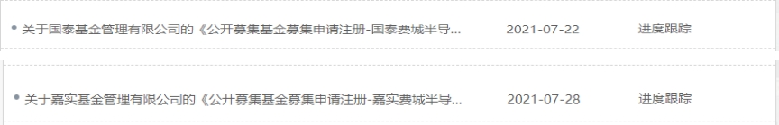
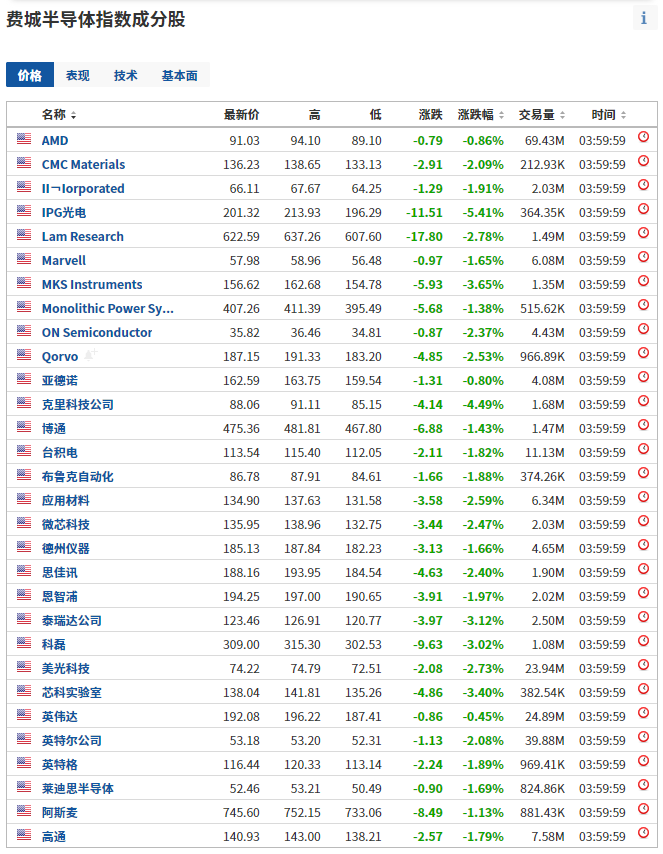
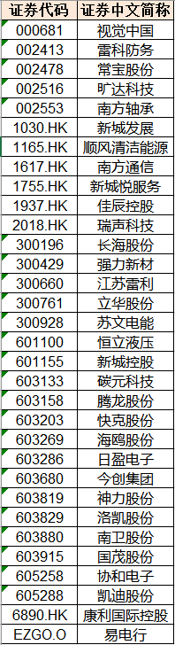
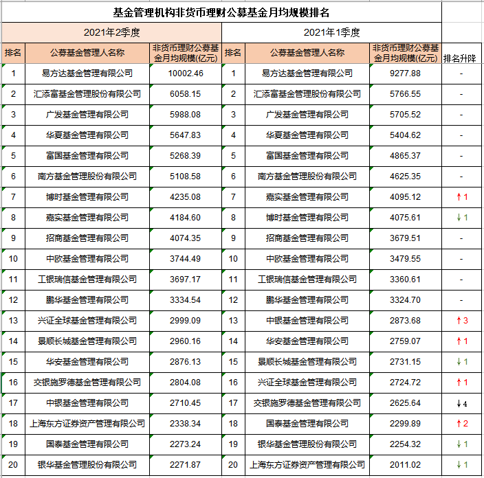

### 又一家申报了费城半导体基金

上周（7月22日）国泰基金不是刚申报了个"费城半导体"指数基金嘛，这不今天嘉实基金也提交了这个指数的材料。 指数基金这个行业，我只能说卷卷更健康。

这个指数我觉得还是有看头的，你查下费城半导体指数的成份股，然后再看看国内的半导体相关指数的成份股，我只能说都是小弟弟。我其实还蛮期待后面有更多的基金公司可以跟进该指数，毕竟ETF工具箱是多多益善嘛。

另外今天中证指数公司又新发了4个指数，分别是中证绿色能源指数、中证沪港深食品主题指数、中证信银沿海核心经济带ESG优选100指数和中证武进发展指数。

这个中证武进指数我光看名字想了半天也猜不出来是干嘛的，看了介绍才知道是一个地方经济的指数：“中证武进发展指数从沪深市场、香港市场和美国市场中选取江苏省常州市武进区的上市公司证券作为指数样本，以综合反映武进区上市公司证券的股价表现。”

这个就很厉害了！之前什么长三角、粤港澳、京津冀主题指数这都是非常正常的；再小一点的比如杭州湾区、苏州绿色发展、无锡指数这些也是可以理解，毕竟都是国内经济发展极好的省会级（副省会级）城市；现在好了，在江苏勉强排个前五的地级市下面的一个区都能单独整一个指数了，我内心是直呼666的。虽然这个指数的成份股会来自沪深两市+港股+美股，但我觉得应该不会有基金公司去申报这个指数的产品吧。最后附上成份股，自己感受下吧：

最后说下基金业协会官网已经公布了基金公司非货币理财公募基金规模排名，我把二季度数据和一季度做了个对比（详见下图）。我们可以看到：

1、头部排名很稳定，前6名都排序很规整，即便是前12名里，也仅有嘉实和博时换个位子而已。也祝贺一哥易方达规模上万亿！

2、规模全线增长，上榜的基金公司二季度规模在一季度的基础上都有了不小的增长，看得出整个行业还是强劲动力在发展的。

3、涨幅最快的是兴全，然后是东方红资管。这两家同在上海的基金公司也确实在二季度以肉眼可见的速度，发了很多新产品或者是多次放开了封闭定开基金的申购。本次跌幅最大的是中银基金，直接掉了4个名次。

4、20名以外的第二梯队貌似没几个能打的呀？两个季度了，前20名一直被这些头部基金公司霸占着，第二梯队的兄弟们要加油哈！

