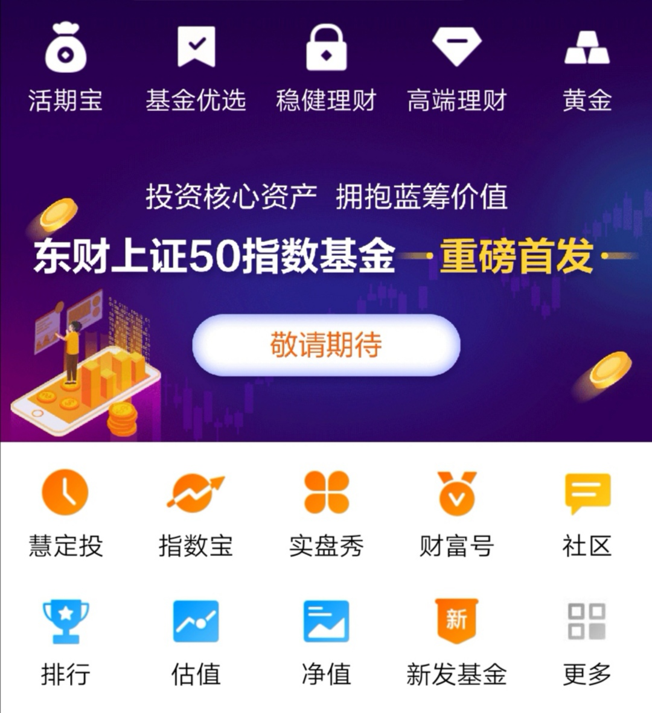

### 易方达的20BP战队遇到了新对手

近两年公募基金降费大战很是激烈，如果说之前天弘基金和广发基金对C类的销售服务费打对折是小打小闹，那么今年在易方达基金的全面攻势之下新发的指数基金费用为20BP基本成了标配。显然这已经是短期内行业所能承受的最低费率了，但有只明天首发的基金在20BP的基础上进一步做到了降费。

> **东财上证50指数基金**

东财基金是如何在当下行业认可的最低费率前提下继续降低费用的呢？

老基民都知道基金有时候会分A、C类（B、E、F较少），常规认知就是A类适合长期持有，C类适合短期波段操作。早期的基金A类至少需要1年才免赎回费，一般都需要2~3年；而C类只需要7天或者30天就可以免费赎回了，甚至在没有7天惩罚性赎回费新规前，有一部分是随时赎回即免费。而C类对应的代价就是需要按天扣除销售服务费，通常为0.4%/年，这个切入点也是上一段说天弘和广发降费的点。

随着广发和天弘的带领，很多老的C类基金把销售服务费降到了0.25%或者0.2%，今年都有出现了不少0.1%/年的销售服务费（比如我常说的大成中证红利C）。然而价格战总是越打越恶劣的，去年开始有了另外一个趋势：**A类收费C类服务**

带头的是汇添富基金，典型的就是我之前提过的汇添富中证全指证券公司指数基金A。这个券商指数基金是我所知道的当下最便宜的券商场外指数基金：60BP+0.08%的申购费+30天免赎回费。

这是我发觉的第一只A类收费但提供C类服务的场外基金，汇添富也不止这一个基金是如此，有兴趣的大家可以去翻一翻。但这毕竟是60BP的基金，易方达的伟大在于能在20BP的情况下依然做到A类费用C类服务，可惜的是易方达的场外联接A类需要180天后才可以免赎回费。但我觉得这已经是很大的进步了，而且易方达新出的联接A类基金基本上都采用了这个模板费用。

可汇添富和易方达还没发挥到极致，而东财上证50指数基金就真的做到了A类收费C类服务。标准的20BP费用且A类持有7天后就免赎回费，堪称逆天赎回条款。

东方财富其实也是一个很厉害的企业，早期是做信息和社区起家。很有眼光的收购了证券牌照、期货牌照、港股牌照、基金牌照，形成了一个很完美的闭环或者说是生态系统。所以这次作为首发基金，销售渠道均为东财系：东方财富证券、天天基金、东财基金。

我们知道基金销售是需要给渠道支付一笔不小的费用，这也是为啥现在20BP基本已经是极限了，只有易方达这样的大公司敢大规模的出20BP的基金，小公司更多的还是60BP甚至更高。东财基金现在在自己兄弟公司售卖，成本显著降低了，这样就有了7天免赎回的勇气。

而且细心的朋友也会发现这几天东财的首页、天天基金APP的首页都是这只基金的大幅宣传，这种曝光度，这么有诚意的费用，我觉得销量应该不会太差（即便只在东财系的若干渠道销售）。

我在看基金公司的官方宣传海报的时候发现一个点：东财基金自称**致力于成为中国优秀的指数基金供应商**（所以指数化道路真的很适合小的基金公司）。

**我一直觉得指数基金就应该工具化，有效的跟踪、低廉的费用。**东财基金拿到牌照后也是顺理成章的从指数基金切入，并且很‘鸡贼’的选择的了超级蓝筹指数上证50。该指数**市场认可度高，流动性极强，且为单一市场产品**，非常适合作为首发产品，首发还是稳一点更好。而据路边社消息：东财基金后面还会陆续上市医药和通信两个指数。

以前是基金公司顺带也卖卖基金，现在是基金销售公司直接‘自产自销’，非常有趣的一个现象。其实基金公司也一直想摆脱渠道的束缚，尤其像易方达、华夏、博时等这类大型基金公司，自己的销售渠道往往是0申购费。对于资金量大，或者只需要主流品种的朋友，在基金公司自己的官网渠道买入也是挺有诱惑力的。

这么多年这个模式一直不温不火，但这次渠道直接下场发售基金，这个我觉得更有看头。而且作为蛋卷基金这种没有基金牌照的渠道方，也在想法设法和基金公司搞独家销售的产品，比如中邮的中证价值回报量化策略指数基金、景顺长城的中证沪港深红利成长低波动指数基金等。

作为普通投资人我还是希望基金公司或者渠道都能继续良性竞争，我们需要更多优质廉价的指数基金选择，但愿ETF真的可以‘拯救世界’。
