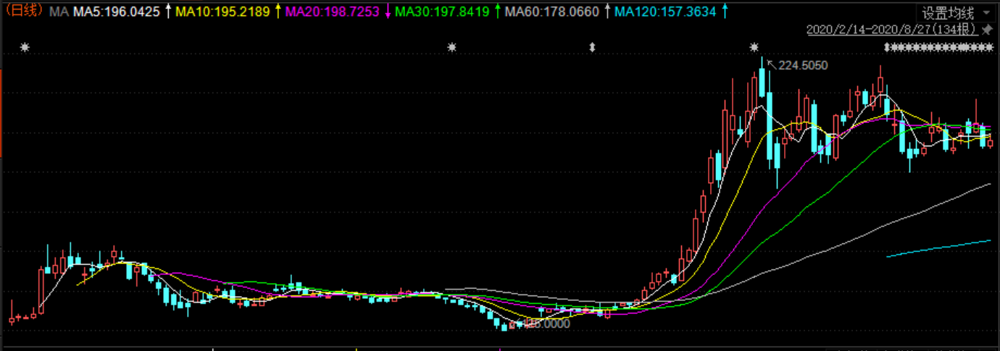

### 首家第3次发可转债的公司已揭晓

不搞悬念直接公布答案：对！就是东方财富。昨晚东方财富发布公告：关于筹划向不特定对象发行可转换公司债券的提示性公告。

看到公告后的第一感觉：这应该是A股的首家第3次发行可转债的公司。为了证实我的想法，去查了下可转债列表，最后确定东方财富就是第一个吃螃蟹的人，还是那种熟练工。

深证的可转债如果第2次发行名字就叫‘XX转2’；而上证的命名方式是‘X年份转债’，我个人感觉深证的这种命名方式更合理、更简单明了。因为我更关心的是第几次发行，而不是哪一年发行的，这个也算顺带再次吐槽下上证可转债制度的low。按这命名规则我查到了如下这些第2次发行的可转债（如有遗漏可帮忙补充）：

从上表我们可以看到二次发行可转债的企业有19家，其中6家已经顺利退市：万达信息、东方财富、万科A、东方盛虹、长青股份、巨轮智能。二次发行的企业显然是更有优势，操作流程上也更有经验。从退市时间上就能很明显的看出，刚说的6家退市平均耗时1.7144年，而所有已退市的可转债平均数据是2.0898年。

自从上市公司定增被‘规范’后，可转债发行成了民营企业融资的主流手段，上图中19家企业里1家中外合资、2家地方国企、16家民企。因为国企央企的融资渠道更多、更便利，而且发行可转债容易落下个国有资产流失的罪名。而民营企业对发可转债这件事情毫无抵抗力，稍微稀释下股份就能换来大量的真金白银，一旦企业尝到了甜头就根本停不下来，本文的主角东方财富就是一个典型。

接着我们来回顾下东方财富前两次发行可转债的过程：

- **东财转债：** 发行规模46.5亿，2018年1月29日上市、2019年5月10日退市，历时1.39年、总计308个交易日，最低价109元、最高价201元，在2019年2月开始交易规模突增，三个月不到的时间顺利强赎退市。

- **东财转2：** 发行规模73亿，2020年2月14日上市、2020年8月27日退市，历时0.62年（这个退市效率能排前5，非常厉害）、总计134个交易日，最低价125元、最高价224.505元，在2020年6月开始交易规模突增，两个月的时间顺利强赎退市。

对比两次可转债的发行数据，抛开股市大环境的差异后，我们会发现东财在转债发行上越来越娴熟了，而市场投资人对于东财的转债也是有了更高的认可。这里顺带再提下，有些公司是前面的可转债还没退市就开始第二次的发行（就是两只转债同时在市场上交易），而东财在大家眼里就算“好孩子”了，每次都是前面旧账结清了再借，俗话说：“有借有还，再借不难”。但是东财的融资欲望也是很强烈的，每次前面一批刚结束就立马筹备下一批的可转债。

**良好的借贷履历 + 急切的借钱姿态 + 尚可的企业盈利 ，就导致东财的转债总是那么抢手，市场也愿意给更多的溢价。**