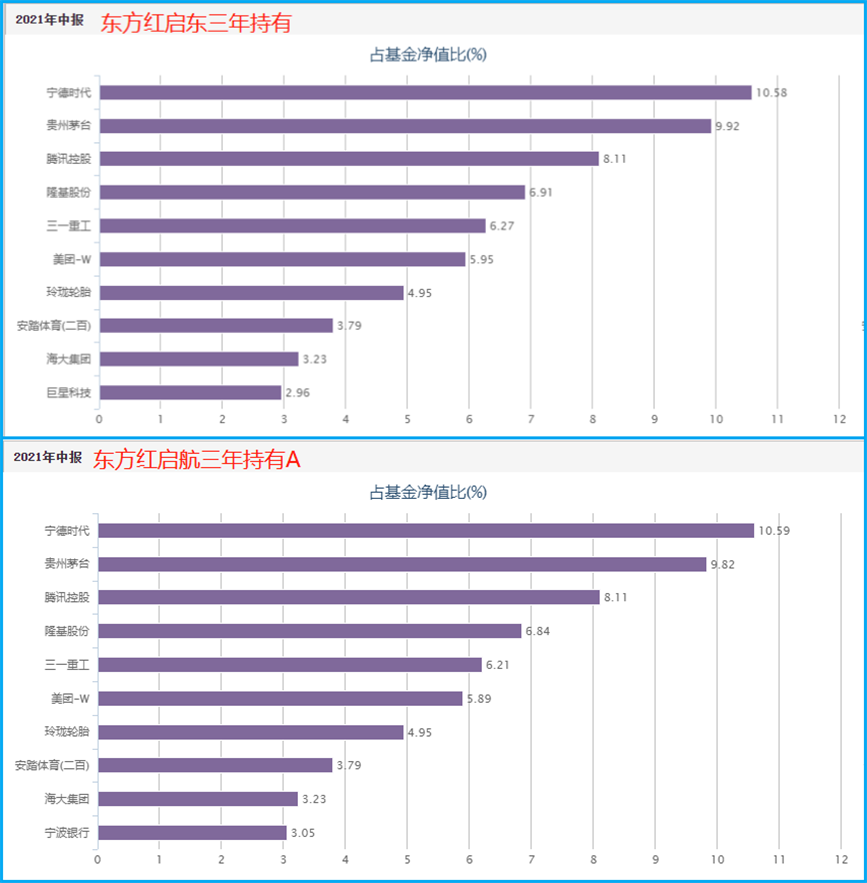
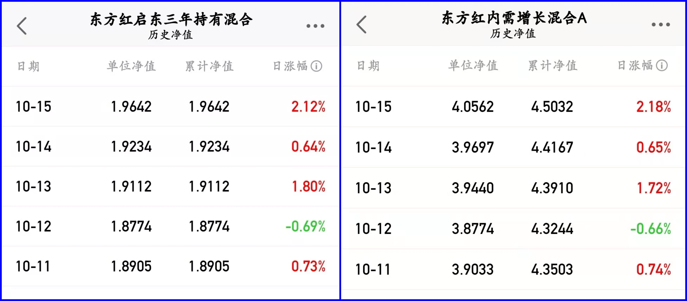

### 持仓高度一致的基金经理发新品要买吗？

近期发新产品的基金经理不少，中欧基金周蔚文、嘉实基金谭丽、广发基金费逸、博时基金沙炜.....其中肉眼可见铺天盖地宣传的当属中欧基金的周蔚文。当然今天我们讨论的不是他，是东方红资管的李竞，李竞的新基金“东方红睿和三年定开”在10月12日发售。

先申明**本文只探讨：对于在管多只基金产品持仓高度一致的基金经理发新产品，要不要买？**本文不做产品宣传、也不刻意针对具体哪个基金经理或基金公司。

李竞最新的在管规模是196.99亿元，其中东方红启东三年持有（166.76亿元）、东方红启航三年持有（A类12.83亿元 + B类17.40亿元），另外还有6月1日刚成立的东方红内需增长因为披露数据暂无，故不统计在列。

我先说下**我对李竞的认知：在管基金持仓“无差别管理”，且急于追求个人管理总规模。**

> 在管基金持仓“无差别管理”

我们先看东方红启东和东方红启航的2021年中报十大持仓（详见下图），我觉得也没必要细说了，就是肉眼可见的【Ctrl C + Ctrl V】

因东方红内需增长的持仓我们暂时不得而知，那就用最近5个交易日的净值变化做个估测（详见下图），依旧是肉眼可见的【Ctrl C + Ctrl V】。

当然这里也说明一下，同一基金经理在管产品持仓高度雷同也不是就一定业绩不行。两者没有必然联系，在某种程度上持仓一致化确实有利于基金经理的管理。

> 急于追求个人管理总规模

东方红启东是2020年3月11日发行的，发行后也一直没打开申购，直到今年的2月19日恢复了一天的申购业务。因为我是启东人，所以看到这名字觉得应该买一份体验仓玩玩，申购了1000元，实际配售到314.96元（45亿限额单日售罄、且按比例配售，不得不钦佩东方红的品牌影响力）。东方红启东这之后的业绩是红红火火，在鼎盛时期又突然打开了申购（5月6日），因为恢复申购的公告有点含糊其辞，可很多老持有人还以为是继续单日限额（再次放开首日我又追加了1000元体验仓），哪知道后面是很长时间的放开申购且不限额。而东方红启东之后的业绩也顺着大市一路下滑，这时我才感受到李竞强烈“追求管理规模”的野心。

当然如果仅仅是这一个事，我也还能理解，毕竟李竞是专户出身，现在转公募后想乘着行情还行就努力做大规模。但就在东方红启东再次放开无限申购后没多久（6月1日），又立马发了新产品东方红内需增长，该产品的持仓我们上面也预估了，高度复制东方红启东的持仓。

你以为这样就结束了？这才10月就又立马继续发新产品东方红睿和了。而且这次东方红睿和的募集上限是100亿，募集期也是整整三个月（监管许可的最长期限了）。也就是说李竞对于这100亿的规模是“势在必得”了，自此李竞短期内对于管理规模的追求已经毫不掩饰了。

> 小结

基金经理对于管理规模的追求无可厚非，基金经理的持仓高度一致也不一定就是说业绩会差。但是李竞固守其擅长的消费和互联网龙头，也导致今年其业绩只能说就那样。5月初第二次放开无限申购东方红启东深套一批持有人，6月初新产品东方红内需增长成立以来仍然处于亏损状态，如今刚过国庆就又急吼吼打算募集100亿“新子弹”。对于这样的基金经理发新产品我是很排斥的，我也不认为有申购其新产品的必要性。

