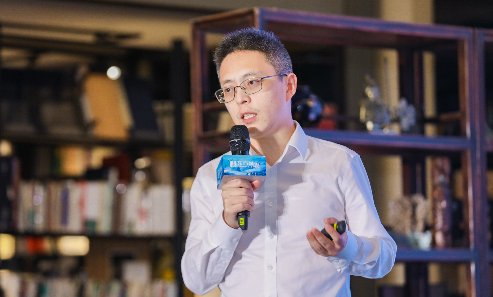
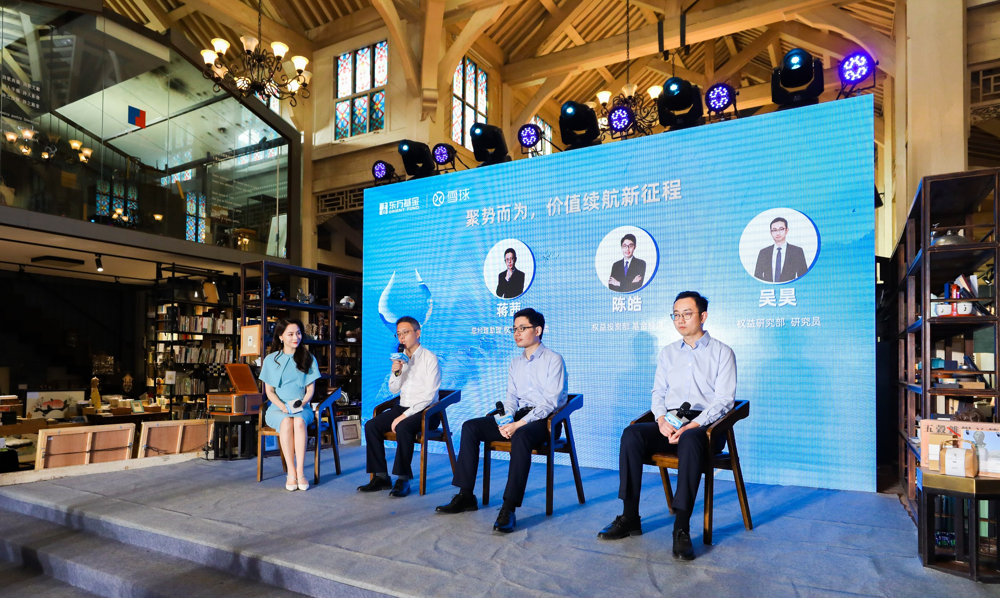

### 四季度会是新起点？

上周末去北京参加了东方基金“聚势而为，价值续航新征程”的活动，在这秋高气爽的时节出去走走，听一听金牛奖基金经理对后市的一些展望还是蛮不错的。

出席活动的除了东方基金总经理助理、权益副总监蒋茜，还有权益投资部科技组的基金经理陈皓、研究员吴昊。会议分享的内容基本围绕着“新半军”展开，同时还讲述了他们对于后市的一些看法以及布局策略。

蒋茜上来就很坦诚地说道，2022的前三年可以说是成长股的狂欢，东方主题精选能获得“三年期开放式混合型持续优胜金牛基金” 很大程度也是得益于此。只是谁也没料到紧接着的2022年是如此极端的大熊市，回顾已经过去的三个季度又有点类似那个内忧外患的2018年了，所以整场下来蒋茜多次强调：四季度很可能是未来两三年大行情的新起点！

同时蒋茜也指出，我们中国不得不面对经济增速放缓这个现实，在人口老龄化加剧的伴随下，整个社会从之前的“投资导向”阶段慢慢步入了“创新导向”阶段。这几年一直在提的“高质量的发展”其实就蒋茜说的那个“创新导向”，这也是为什么以“新半军”为代表的成长股前几年表现尤为亮眼，股市往往是提前于市场的一种表现。

在对未来展望上，蒋茜认为当下是“宽货币、宽信用、低信心、弱复苏”，在这样的大背景下如果未来两到三年有大行情的话，那么成长股依然是一个更优的选择。蒋茜说现在市场情绪很低落，已经有点接近今年4月份那会了，但表示自己心态要比那会好，主要是看到一些问题正逐步得到解决（或落定），甚至乐观预计未来四个季度的经济都会实现环比增长。

在谈到消费时，蒋茜认为未来除了“消费升级”，还好有“消费分层”。消费虽然是人类永恒的话题，但消费的内容是很有可能变化的，这种变化不仅体现在1->2的升级，也可能是1->a的革新。就如同有些行业随着社会的进步在慢慢消亡，但总是会有新的消费需求被挖掘出来，不需太过担忧，但仍要清醒认识。

说道担忧，蒋茜认为整个实体经济对于资金的需求量还是很弱，毕竟中长期的贷款数据依然没有出现一个明显的拐点。说得直白点就是信用“宽”不出去，只有这个数据出现了拐点，那么未来3-6个月经济向上的可能性才会增加。

整场活动听下来我还是从三位那学到了不少新观点，也能感受到基金经理们的乐观，也认同蒋茜说的“宽货币、宽信用、低信心、弱复苏”。因为“宽货币”是事实，而“宽信用”现在也没宽出去，我甚至觉得当下内忧外患的经济环境比2018年还恶劣。未来复苏是肯定有的，我也相信中国经济的强大韧性，但什么时候复苏、复苏多少？

这些担忧是如今市场低迷的症结，我们每一个老百姓都能切身感受到这股“寒气”，连任正非都在喊：要高质量地“自救”，要在寒冬里活下去。我不知道四季度会不会真如蒋茜所说是未来牛市的起点，我只希望寒冬别太难熬，春日早点到来，愿春暖花开时你和我都在！