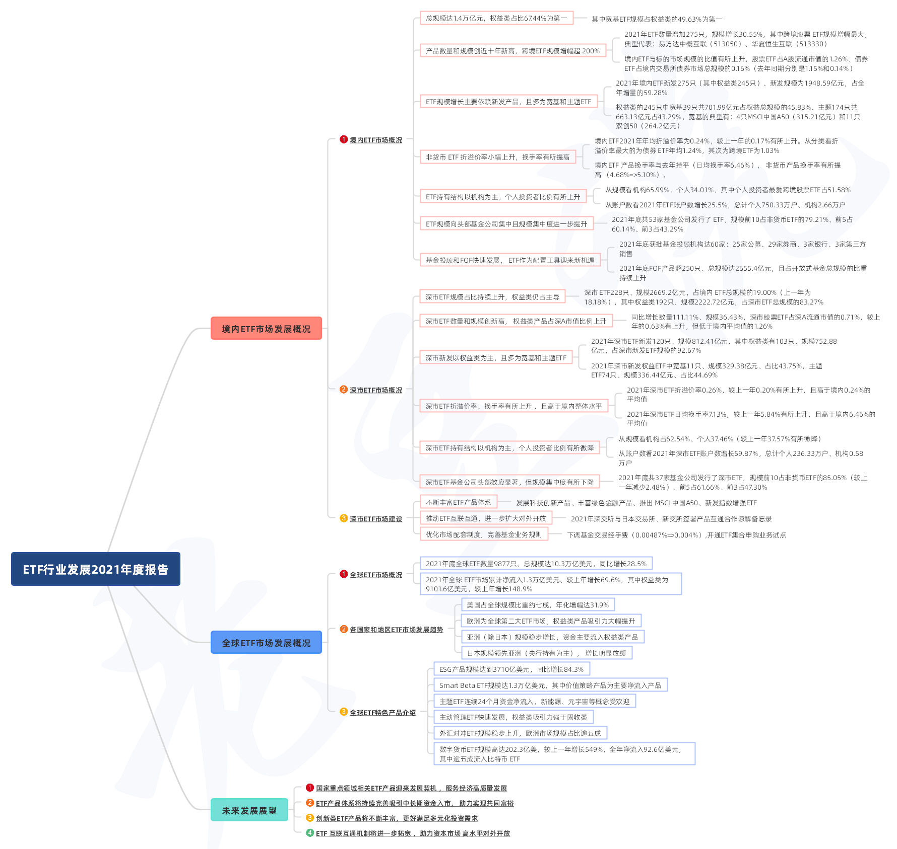

### ETF行业发展年度报告整理

两周前（4月10日）深交所发了一份《ETF行业发展年度报告（2021）》，看完后我也做了些简单整理，今天与大家分享下吧。我把认为值得关注的几个点单独罗列下，其中重点为国内沪深两市ETF情况局部图我也单独导出了（见图1），建议看下图，更直观、数据更详细。另外包含深证市场、海外篇、展望篇 的完整图我放在了最后（见图2），如果再想看详细内容的朋友可以自行去官网查找原文件PDF阅读（共38页）。

1、国内ETF规模已达1.4万亿元，其中权益类占比超6成，而权益类里宽基又占近一半。

2、ETF的数量和规模都在持续创新高，越跌越买的“丐帮”们2021年规模增幅最大。另外伴随着ETF规模的增长，ETF占A股流通市值的占比也逐年增长。

3、ETF规模增长主要依靠新发产品，2021年新发产品规模占全年增量的近6成。而且你会发现宽基类和主题类占了绝大多数，其中宽基靠单个规模大取胜，而主题类靠新发数量多取胜。

4、ETF持有结构以机构为主，个人投资者比例有所上升（个人偏爱跨境股票ETF）。非货币 ETF 折溢价率小幅上升，换手率有所提高。

5、ETF规模向头部基金公司集中且规模集中度进一步提升，53家基金公司发行了 ETF，规模前10占非货币ETF的79.21%、前5占60.14%

6、深市发展情况总体与国内ETF沪深两市总况类似，但部分数据仍弱于沪市，深交所还有努力的空间。

