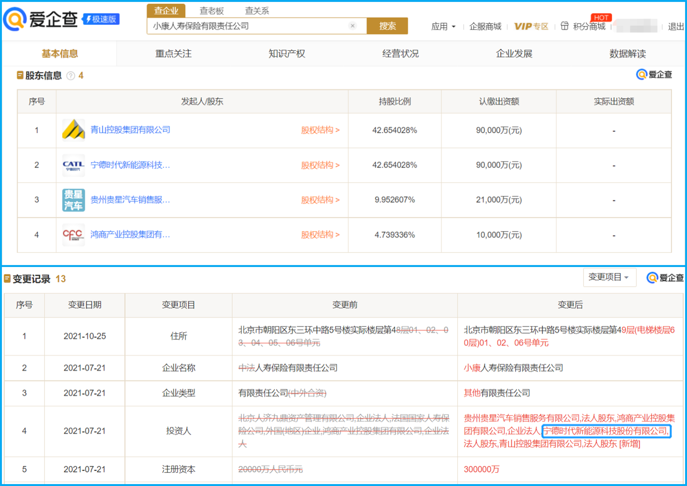
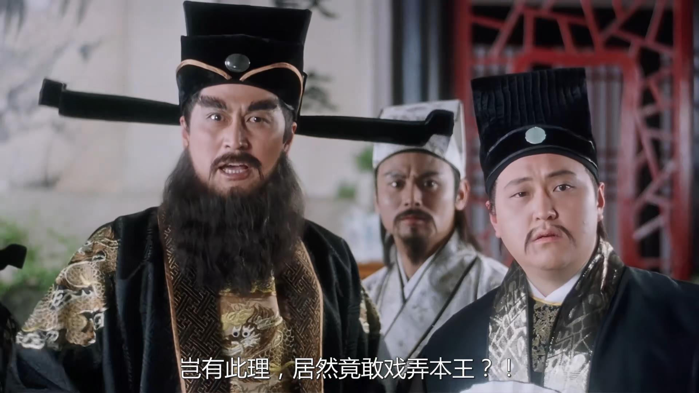
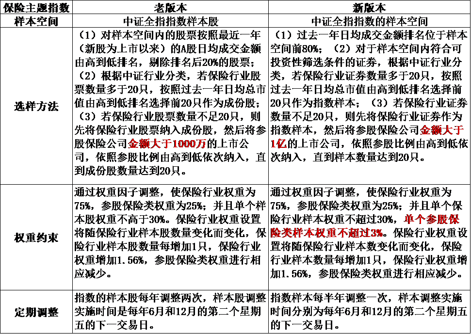
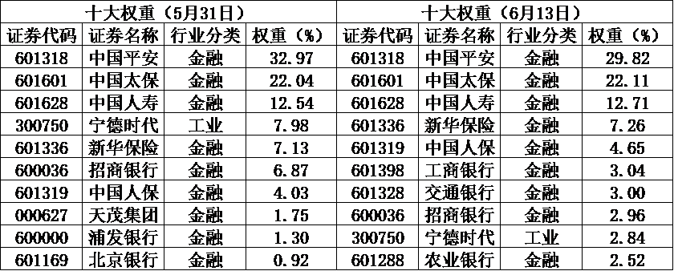
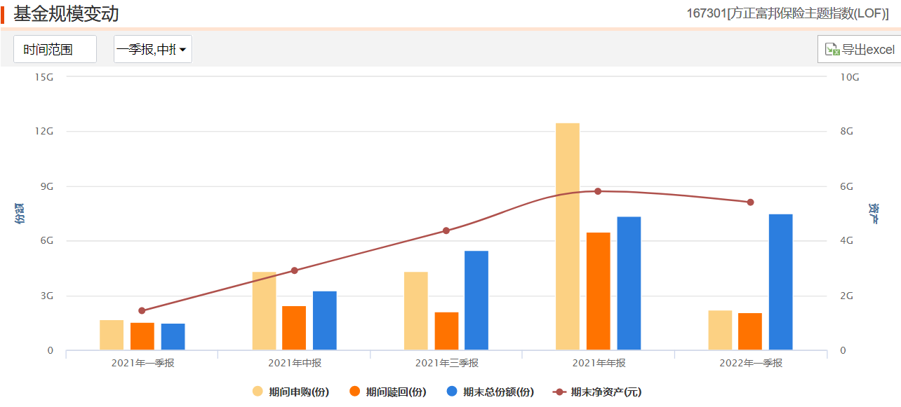

### 小伙伴说：就算轮，也该轮到金融了吧？

最近一段时间金融板块表现很是突出，以6月15日为例：保险指数（399809）+5.62%、券商指数（399935）+3.39%、银行（399986）+1.75%，看了数据是不是有点小意外？最近光大证券“6天5涨停板”很是热闹，谁想到金融板块里涨幅最大的竟然是保险指数。

这市场一热闹吧，来询问的小伙伴也就多了起来，券商和银行之前聊过很多了，市场上对应的产品也众多。唯独这保险行业指数产品就是很稀缺，稀缺到“纯净版”产品只有**方正富邦中证保险主题LOF(167301)**，其对应的指数为中证方正富邦保险主题指数 (399809)。

当然如果你不是那么追求高纯度的话，市场上也有好几只证券行业与保险行业混合的指数产品。由于我是第一次聊保险相关指数，且中证方正富邦保险主题指数近半年来更具话题性，所以本文就着重讲讲它。

虽然方正富邦保险主题基金是当下市场上保险板块的孤品，但在去年底之前，除了平时较关注指数基金信息或者比较在意保险板块投资标的的朋友，很少有人知道这么一只跟踪保险板块的高纯度指数基金。那这只保险主题基金后来是如何进入大家视野的呢？

故事还得从自带流量的“宁王”宁德时代说起，如上图所示：宁德时代在2021年7月21日投资入股了小康人寿9亿元（并列大股东里还有今年伦敦期镍事件的主角青山控股集团）。而中证方正富邦保险主题指数的编制规则恰巧又是：从沪深市场中选取 20 只保**险行业与参股保险类上市公司**证券作为指数样本，以反映保险主题上市公司证券的整体表现。

概括说就是，宁王去年7月入股了保险公司，而保险指数成分里是会纳入参股母公司的。虽然这种事情在指数界也不是什么新鲜事，但树大招风你抗不住人家是万亿“宁王”啊，宁德时代市值大还波动剧烈，想不被关注也难啊！同样该指数之前就有的招行银行、中国石油、中国中冶、完美世界、出版传媒、深圳能源等成份股主业也不是保险，产品有了那么久也没见大家太多的议论保险指数。

所以核心还是中证方正富邦保险主题指数在2021年12月13日纳入万亿宁王后，宁德时代的股价出现了较大的回撤（截至6月14日，宁德时代今年已跌了24.86%）。何况宁德时代占指数权重约8%，这就让近一年不怎么好看的保险指数更是“雪上加霜”。因此对于新手基民亏钱了心里有点想法是可以理解的，但随着你投资经历的积累，应该学会客观地看待指数产品的脾性。

好在**指数产品的“自我进化”不仅体现在成份股的定期优胜劣汰，还体现在指数编制规则的与时俱进。**近期让大家关注比较多的指数编制规则变动除了中证100指数，应该就是本文主讲的中证方正富邦保险主题指数了。主要变动点如下：**1、选样方法中关于待选样本参股保险公司的金额要求修订为不低于1亿元；2、增加“单个参股保险类样本权重不超过3%”的权重限制规则。**（详见上图）

优化编制规则后，保险主题指数对参股保险类样本的纳入标准有所提高（1千万=>1亿），这会使得指数的保险“血统”更加的纯正。参股金额可以反应参股保险的公司日常经营与保险业务的紧密程度，参股保险的母公司股价对于保险行业情况也有更好的反应。

而且参股金额的提高能一定程度上避免，因参股金额较小但参股比例较高，导致参股金额较大的公司因为参股比例不高而被排除的情况。6月13日修正后的十大成份股里出现了以往没有的工商银行、交通银行、农业银行就是这方面的体现（详见下图）。这些新纳入的成份股从历史的收益风险特征来看，也更为接近保险公司，使得指数成份股整体的收益风险特征更为统一。

另外，单个参股保险类样本的权重限定在了3%，这更为有效地降低了单个参股样本对指数整体的影响，从而让指数整体更为纯正。从上图的最新十大权重股来看，宁德时代的权重也从修订前的7.98%降到了2.84%。这也体现了我前面提到的，指数进化过程中指数编制规则的与时俱进，让指数得以更好地反映相应市场或行业的变化。

最后呢我再说说自己对于这个指数以及相关产品的一些看法：

**1、珍惜保险行业的指数孤品。**方正富邦保险主题LOF是当年分级基金转化而来的历史产物，以当下保险行业的个股数量以及国内基金行业的惯例，该产品显然已是孤品。说得再直白点就是：你若想买只纯粹的保险类指数产品，貌似只有选它了！（规模54亿可放心“食用”）

**2、要正确认识指数产品特性。**指数产品的透明性就来自于其编制规则的前置且公开，那么我们在指数成份股更替的时候就要理性看待它。那些有不满的小伙伴要是宁王上半年继续暴涨，那他们还会有怨言吗？我觉得一个理性的指数基金投资者不应该有这样的偏见，就我自己而言是：规则改之前这成份股我表示能接受，如今优化规则后我觉得更满意了。

**3、保险今年可能真的有机会。**我这人很少去预测短期行情，更喜欢看大概率的事。用小伙伴的一句话说：现在的保险业估值肯定不算贵，后面就算轮，也该轮到我们保险了吧。至少我自己现在是持有一部分保险行业权益资产的，虽然不知道风何时来，但我觉得这个赔率值得配置一些。

**4、投资要学会看诚实的“身体”。**别看这半年来保险指数在宁王的带动下常被提及，也偶尔有些吐槽的人，但你看看市场里投资者真金白银的选择：方正富邦保险主题LOF近一年多来基金份额被持续的净申购（详见下图）。

