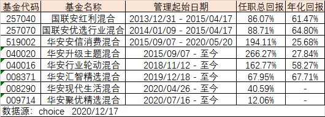

### 今年新发基金已超3万亿了

据财联社消息截止12月17日，今年新成立基金数量已高达1339只，总规模达30141.95亿元。这个数据有多恐怖？**2020年的新基金规模超过了2017年、2018年、2019年三年的总和！**这也直接导致今年公募基金出了很多爆款，以200亿元为界限的就有5只（广发、南方、汇添富、鹏华、华安）。当然不是说低于这个规模就不是爆款了，下半年有些是应监管要求，有些是基金公司主动限制规模（适中的规模有利于跑出业绩），所以我个人认为单日能售罄60亿元以上的都算爆款基金。爆款基金不仅是投资人对基金经理的认可，也是基金公司实力强劲的体现。

因为今年爆款基金真的很多，所以我这次就先把几个大于200亿的主动型基金稍微看下（如上表）：

- 刘格菘的广发科技先锋混合是今年1月底发的，基本上是借着去年科技冠军的热风赶紧出了个爆款，现在看来也没出现大家常说的‘冠军魔咒’。该基金今年业绩依然不错（因为今年科技股依然较强劲），看基金名字就知道依然走的是科技风格，该基金业绩大幅度跑赢了同期的沪深300和中证500指数。

- 茅炜、王博的南方成长先锋混合A是唯一一个大幅度跑输同期沪深300和中证500指数的。这就让我联想到前不久写的《还记得半年前的新三板精选层基金不？》中比对了6只新三板精选层基金，其中南方基金的南方创新精选一年定开混合C业绩也是垫底的。为什么会有这样的联想呢？因为据说南方的这只精选层基金推后上市，就是为了给南方成长先锋混合A这只‘爆款’基金让档期，没想到现在这两个基金倒成了难兄难弟，这让我不得不有所思考。

- 剩下三只基金（胡昕炜的汇添富中盘价值精选混合A、王宗合的鹏华匠心精选混合A、饶晓鹏的华安聚优精选混合）都是7月份成立的，业绩也是很均衡的跑赢了同期的沪深300和中证500指数，另外考虑成立初期需要一定的建仓时间（三季度末的持仓比例都不高），这三只基金的业绩确实挺好。

但是华安的饶晓鹏成功引起了我的注意，因为胡昕炜和王宗合大家常能听到，你去看他们的履历里都是一堆奖，一位看似平淡无奇的基金经理怎么就发了那么大一个爆款（数据也显示华安聚优精选是5只里规模最大的）？当然也可能是因为饶晓鹏，是这三位里唯一我近距离见过真人的，所以我带着这样的疑问重新去翻阅了这位基金经理的各方面材料，在此也给大家做个分享和交流吧。

如上图，我整理了饶晓鹏的历史上所有管理的基金业绩数据。最上面两只是他在国联安时候的产品，都是接手别人的老基金，在任期间业绩也是不错，当时市场大环境也是很好的时间段。然后是华安安信消费混合和华安升级主题混合，从任期上我们就能看到这两只都是饶晓鹏新入华安基金后接手蒋璆的产品，也是他管理时间最长的两只基金。时间上也是从上一轮牛市末期到现在，五年左右的业绩周期已经很能说明基金经理的水平了，两只基金年化均在25%以上，这个是不错的。

然后在2018年底接手了陈媛的华安行业轮动混合，这个看基金名字也是很符合饶晓鹏的风格，任期业绩上也是很好，2年多时间内年化有58%的收益，可圈可点。饶晓鹏在华安基金多年业绩突出除了受到投资人的认可，基金公司也愿意给予更多的资源倾斜。很明显就是2019年底至今刚一年的时间，已经给了三只全新基金的发售（华安汇智精选混合、华安现代生活混合、华安聚优精选混合），特别是我们开头提到的**华安聚优精选混合（009714）**，还是超大规模爆款基金。我们回到表上可以看到，这三只新基金的业绩也是没让我们失望。

在查看资料的时候，我看到有人对这位基金经理的评价是“中生代的宝藏基金经理”，这个我觉得还是挺到位的。什么是‘中生代’呢？跟业绩辉煌的老将比更年轻有活力，跟新锐们比风格更稳定，是基金界承上启下的中坚力量。饶晓鹏作为一名实力派中生代基金经理，业绩我们上面也看到了，在对于牛熊转换和市场风格的变化下都能很好的跑出业绩，这个还是可圈可点的。饶晓鹏给我的总体感觉是**风格低调，奉行行业均衡、不追逐热点、严格的价值投资派。**

在写这篇文章的时候，我还问了几个研究主动基金经理比较有经验的朋友，有人告诉我饶晓鹏的换手率不低。这个我在翻阅他历史管理的基金每季度的前十大仓位时，也发现了这个问题。但这正是我上面说的，他不盲目参与抱团那些消费、科技、新能源等，而是做到了行业均衡和坚守自己的一套价值投资体系。而且我们看一个基金经理最重要的还是关注其长期的收益是否优秀且可持续，能否适应不同的市场风格和牛熊变换。

还有一点我觉得也有必要和大家讲下，饶晓鹏之前管理的几只基金规模相对于最新的爆款基金华安聚优精选混合（009714）比都很小。但是5个月过去了（而且还包含了建仓期），饶晓鹏跑出来的业绩没有问题，依旧跑赢了同期的沪深300和中证500（和同期发爆款的两位老将不相上下），也配得上中生代宝藏基金经理的称号。要知道很多基金经理的策略和投资体系对于大规模的基金会部分失效，但饶晓鹏经受住了规模的考验，这个也是挺不错的。对于华安聚优精选混合我也会持续关注，希望基金经理能给我们一个越来越优秀的业绩展示。

