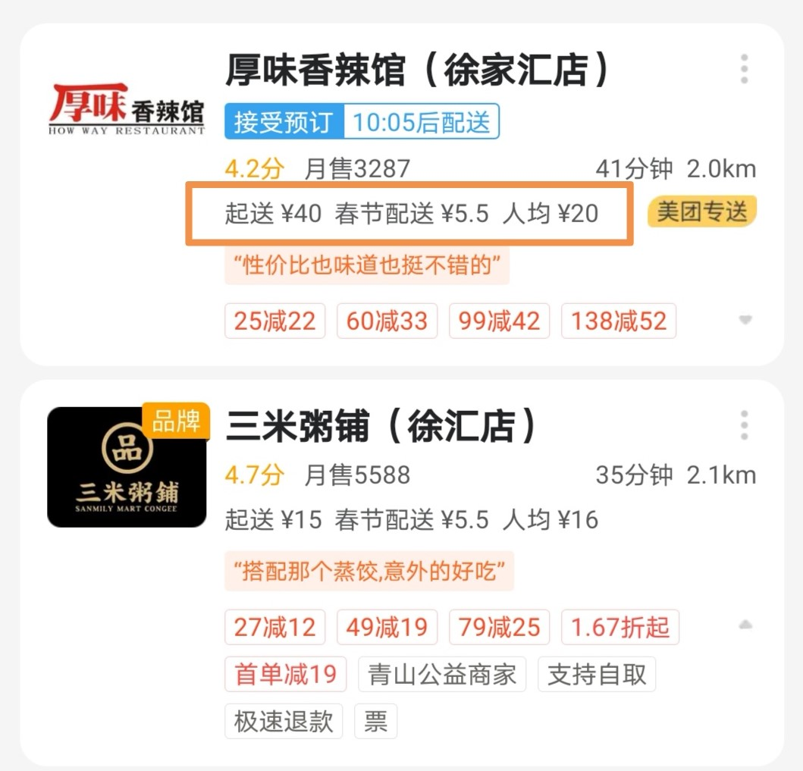
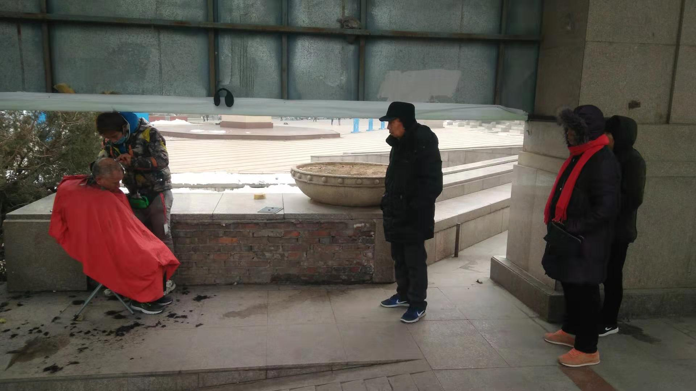
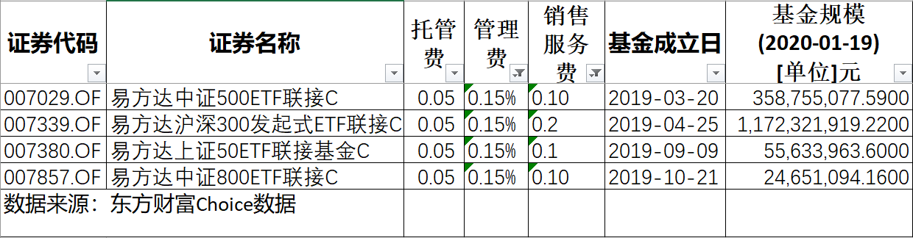

### 过年记得把这好东西送给长辈

昨天不少同事已经返乡过春节了，都回村当他们的‘二狗蛋’去了。‘热爱工作’的我们还要照常挤地铁来公司打卡，但留守在公司的同事们也基本都进入半休假状态。

上海进入了春节涨价模式：外卖小哥的配送费开始涨了，家里请的钟点工阿姨也涨价了，连楼下美容美发去剪个头都涨价了。

关于昨晚理发涨价还不能用会员卡这个事我上午发了个帖子，然后 @青春的泥沼 老哥就发来了如下照片，推荐我去找这种路边理发5元的，雪球‘捡瓶子第一省钱王’果然是我们泥沼老哥。

看到那么多涨价就‘心烦’，股市今天又不开门，实在无聊就随便翻翻choice上的基金资料，我查了下综合费用最便宜的常见宽基列表，很想在投资上找点不涨价、有潜力的东西。

易方达真的太狠了，除了自家的创业板(SZ159915)没打成20BP,其余的都被它干完了。而且C类的销售服务费才0.1%，7天免赎回费，瑟瑟发抖，喜大普奔。

还有就是去年大家都在说#核心资产#的**中证100指数还是很小众，没有一只20BP的中证100指数，甚至连中证800都不如**，真的太没人疼爱了。

对于易方达基金我还是有几个关心的点：

1、什么时候创业板也降到20BP？

2、沪深300为什么还是0.2%的销售服务费，什么时候也加入0.1%的队伍？

3、为什么没出易方达中证100指数，后续有考虑吗？

---

为什么我突然又要查这个呢？因为低费率宽基是目标投策略的极佳标的。[《懒人理财神器体验报告》](financing/alipay-mbt.md)

上次发文说了‘目标投’这种极简的定投策略，现在这个节点我觉得有必要再推荐一波。因为快过年了，老家的长辈们拿着一年辛苦的血汗钱实在不知道该怎么打理？甚至不少和我们差不多年纪的青年人对于如何理财也往往知之甚少。

这类人群我建议还是**稳健第一**，货币基金和短债基金是他们的首选，比如嘉实超短债(F070009)，对于可以承受一定风险，且短期不用的钱可以投入到一部分目标投这种工具里去，简单明了且全自动。当然也不局限于购买平台和购买标的，乐意自己去操作下的可选标的会更多，且找一些相关性较弱的指数基金可以起到对冲的作用，避免短期内资金占用过大。

对于目标投的优选标的我首推：**沪深300和中证500指数基金**，相关指数的最便宜费用基金已经在上面公布了。如果进阶一点的可以考虑下沪深300医药和沪深300非银，这两个都是60BP收费且C类只要0.1%的销售服务费，七天免赎回费，至于为什么选这两个我后面有时间会单独写一篇和大家聊聊。

而我推荐目标投的**目标收益是5%**，即每次到5%就清仓然后进入下一轮目标投。这个收益率对于小白用户是可以感受到收益和希望的那种，而且一年内完成一轮是极其容易的，只要完成一轮就远超银行理财和年金险的收益了。

最后我想说：复杂的定投不一定适合每个人，宏大的目标不一定适合每个人。目标投简单易用疗效好，过年可以推荐给身边的长辈们，新手可以拿少量资金先体验一轮，我相信他们会爱不释手的。

