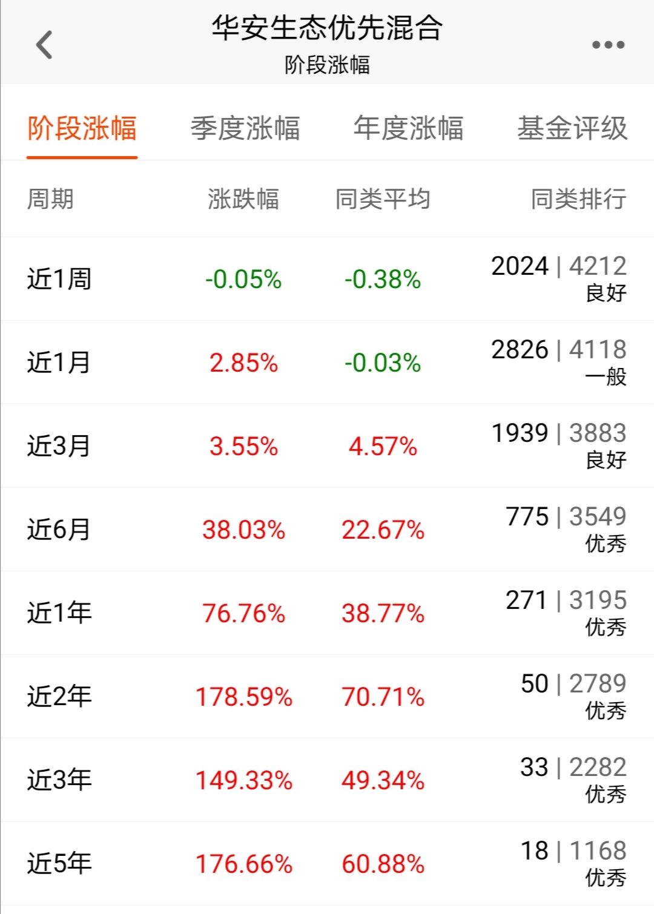

### 双循环下的新兴消费

近年来我国商品服务供给日益丰富，消费规模不断扩大，消费结构持续升级。消费规模方面，2019年我国社会消费品零售总额突破40万亿元，成为全球第二大消费市场。消费行为习惯方面，随着海淘的普及大家已经不再仅限于国内的买买买了；消费的对象不再仅限于商品，也有不少是针对服务的消费；年轻一代人对于个性化的追求从未停止过，也更愿意为定制化产品服务付费；而支付方式的升级改变更是一个让中国人感到骄傲的事情。未来5年中国经济的发展高层已经有了一个较为明确的计划，提出了以国内大循环为主体、国内国际双循环相互促进的新发展格局。我们可以清晰的看到，畅通内循环、扩大内需是未来5年的一个重要目标。

- **庞大的国内市场让中国经济更具韧性**

足够大的消费市场，既可以孕育出新的商业模式、产品创新与技术创新，也可以成为中国争取应有的国际话语权与国际地位的重要筹码。上面也说了，现在年轻人更愿意为个性化定制买单，我们国家人口众多、需求也是纷繁复杂的，那么自然也会激发出新产品、新模式、新服务。在一个足够庞大的用户基数上衍生出足够多的消费需求，再经过无数次的消费体验与反馈不断打磨我们的产品和服务，最终可以推上世界并具备制定相关标准的话语权。一个比较成功的例子有：微信、支付宝、抖音等互联网热门APP极其相关的服务。

- **服务比商品更具增长空间**

文章开头说了，我们国内的消费不再仅限于商品了，服务消费也走进大家的日常生活。那有朋友就问了：哪些算是服务消费呢？常见的有：教育、医疗、体育、娱乐。这么一列举大家是不是就很容易理解我说的，服务消费比商品更具增长空间。教育是中国人的头等大事，家长为了孩子的教育可谓是不惜一切代价，最畸形的证据就是各地高涨的学区房；医疗也是很容易明白，也是大家认可度极高的好赛道，这也是为什么医药医疗股是少有的可以走出长牛的板块，再细分一点的养老医疗我觉得也是一个值得关注的点；体育和娱乐就更不用说了，往小了说比如王者荣耀、往大了说就是任何能让你感到愉悦的服务。而且服务消费这个东西对于不同的人差异还是蛮大的，常见的维度就有：年龄、收入、学历、地域、性别等。对在上幼儿园的女儿来说智能儿童手表是她最近痴迷的一款产品；对于爱刷偶像剧的老婆来说每年把优酷、爱奇艺、腾讯、芒果TV的几家视频会员都充满才是更重要的事；而楼下的张大爷赶着双11又为自己的三条爱犬屯了一堆狗粮....

上面两段就是我上周复盘几个消费类主动基金的一些杂感，其中华安基金的陈媛即将在11月26日发行一只新的消费基金：华安新兴消费（A类:010554 C类：010555），限额80亿、招行托管。80亿？招行？是不是很熟悉的配方？对！大概率就是爆款潜质、按比例配售。新基金参与下我觉得是不错的，但如果你不想等或者懒得去抢配售，那么可以考虑下陈媛的几只老基金，其中我个人倾向于华安生态优先（000294）。我们从下图就能看到华安生态优化在近1、3、5年的收益排名都是很靠前的，甚至可以说是扎根头部的。

陈媛认为“新兴消费”是指通过科技进步或创新商业模式为居民提供优质的产品、服务或解决方案，用以直接或间接提升居民生活品质的相关上市公司，这些公司以消费需求为导向，符合时代发展和国家政策支持方向，具备技术、品牌、管理、人才等方面的核心竞争优势。该基金为了保证名实相符，规定投在新兴消费主题相关证券的比例不得低于非现金基金资产的80%，而且还特意强调了其中港股通标的股票投资比例不超过全部股票资产的50%，这一项也是极其加分的，现在主动基金大多都会预留足够大的港股通口子，便于配置一些优质低估的港股。

华安基金在陆家嘴国金中心的办公室我去过一次，那次见到了胡宜斌、饶晓鹏、许之彦。华安的主动股票投研团队已经超50人，主动管理权益基金经理平均从业年限超10年，研究部平均从业年超限8年，经过多年的积累和沉淀，在科创企业投研能力方面已形成了自身的竞争优势。我们知道要做好主动基金的业绩，只具备金融学识及经验的储备是很难长期战胜市场的，优秀的基金经理往往懂技术、懂市场、懂产品，而华安基金具备这三点的基金经理还不少。最客观的就是数据：

> 小结

中国作为全球第二大消费市场，我们消费的方方面面都在发生着极大的变化，期间也培育了很多优质的新兴消费相关企业。畅通内循环是未来5年的一个重要目标，在如此庞大的消费市场之上我们的经济将会更具韧性。而服务比商品更具增长空间已经成为了大家的共识，在这更大的空间之上可以激发出新技术、新模式、新媒介、新需求，进而体现在更快速的放量和发展上。最后我觉得大家如果看好将来新兴消费的发展，那么11月26日的华安新兴消费（A类:010554 C类：010555）可以关注下。

