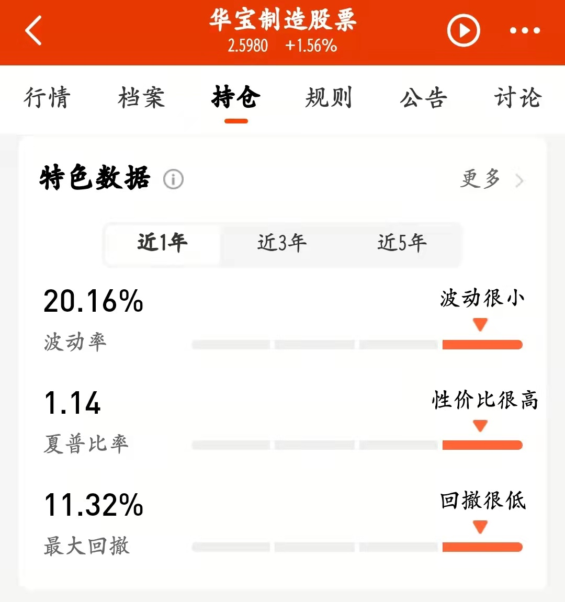
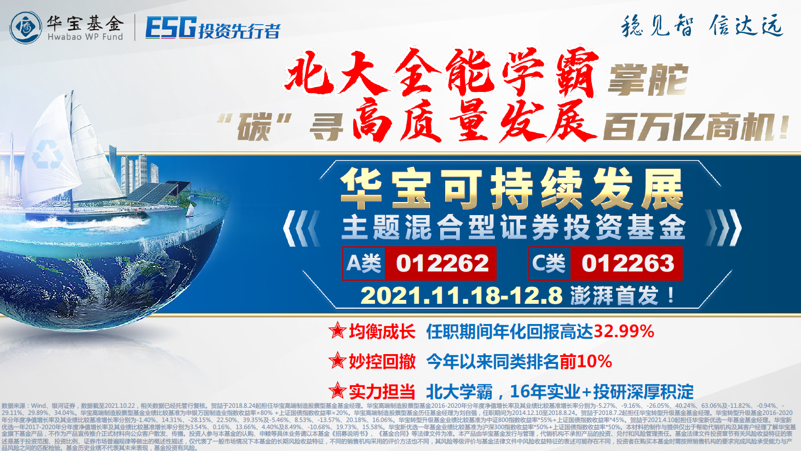

### 震荡市里更要走好“可持续”的路

一晃2021年又要快过去了，回头看正如去年底很多人说的那样：2021年A股赚钱难度会比2020年大很多。也就是去年四季度的时候，大家很明显能感受到“核心资产”抱团抱不动了，而新能源板块的崛起基本延续到了今天。说赚钱变难是因为今年A股的风格变化太快且貌似没啥规律，即便是踩准了“碳中和”板块的投资者们经过这一年来的疯涨，要么早早离场、要么担忧估值过高时刻准备离场。

面对估值过高的碳中和板块，说心里不犯嘀咕是不可能的。我在考虑降低碳中和指数基金仓位的同时，也在寻找一些相关板块回撤控制能力较强的主动基金经理。我把这个诉求和一个朋友说后，他建议我去看看华宝基金的贺喆，这位朋友给的评语是：**“中长期业绩都很优秀且控回撤能力强”**。这就把我的兴趣给吊起来了，立马找一堆资料研习了起来，看过后我觉得是一位值得与大家分享的基金经理，有兴趣的朋友可以关注下。

贺喆从北大毕业后去无线通讯行业工作了8年，进入华宝基金前还有过私募从业经历，2013年入职华宝基金。代表产品华宝高端制造基金已管理3年又86天（本文数据默认截至11月17日），任职回报148.35%，近一年波动率20.16%、夏普比率1.14%、最大回撤11.32%（详见下图），要知道这只产品今年的收益率已经高达23.89%了。反正这数据看得我是很满意，所以这只基金获得了银河证券（最近一年、最近两年）五星好评的时候，我一点也不惊讶，同时还加深了我进一步想挖掘的兴趣。

贺喆在持仓上还是较分散的，你会发现他似乎没有偏爱哪些行业（化工、有色、电子、机械啥的都持有过），重仓股方面也很克制（单一个股一般在5%以下、前十仓位一般在45%以下）。在行业分类上基本上一半偏成长、一半偏周期，贺喆甚至也坦言自己不怎么用传统的方法来看待行业分类。他说事实上，一些归在传统行业的周期股今年很多新需求都是来自新能源行业，不少传统行业在新产业需求之下找到了新的增长曲线，如果你能摒弃固有观念就能先人一步发现优质标的。在全国产业结构升级的过程中，基金经理具备这种打破固有刻板印象的技能是非常重要的。

另外我看到贺喆很注重产业趋势的观察，他认为把握行业渗透率加速期是关键，并且不局限于个别行业内，我想这应该是他产品收益的奥义所在吧。当然我更关注的是基金经理长期业绩的保持以及对产品回撤的控制，上面我们也有说到华宝高端制造基金近一年最大回撤才11.32%，要知道近一年来A股市场至少有两次较大级别的调整，这个数据也让我看到了基金经理的控回撤水平。

我试图在寻找贺喆是如何控制回撤的，在一次访谈中他自己是这么解释的：组合中绝对收益（防御属性）和相对收益（进攻属性）股票各占一半，白马和黑马占比7:3，在产业链分散之外，还会有10%到20%仓位放在市场忽视的低估值个股上，通过有体系和层次的组合搭配，在市场调整中控制波动。然后我去看了该基金近一年每季度的主要持仓，基本上能很好的印证贺喆所阐述的方法。我自己平时的投资也好，每周分享的一些实盘记录也罢，都是非常注重组合回撤的控制。虽然说长期持有是获胜的关键，但对于大部分基民来说，平稳的收益才是大家长期持有的最大源动力，所以我对非极致型的基金经理会天然的更有好感。

唯一让我稍有困惑的是贺喆的管理规模不算很大，好在我看到贺喆近期有新产品在募集：**华宝可持续发展混合（A/C 012262/012263）11月18日-12月8日**。我看了下该基金的投资范围也是紧扣名字，投资于可持续发展主题股票的比例不低于非现金基金资产的80% 。华宝基金在当下推出这款产品不仅可以很好的聚焦高质量发展、锚定“碳中和”这条主线，也是其作为国内资管机构中在绿色投资、ESG责任投资领域的先行者和践行者的一个体现。华宝基金凭借其在ESG责任投资领域的前瞻部署（华宝生态中国、华宝绿色领先、华宝绿色主题、华宝MSCI ESG基金），于2020年、2021年两度斩获“金基金·社会责任投资(ESG)基金奖”。而且就在11月16日，中国证券投资基金业协会绿色与可持续投资委员会正式成立，华宝基金总经理黄小薏女士任委员会主席。

我觉得对于擅长挖掘二线小而美公司的贺喆来说，在新品募集后可以有更广阔的舞台来展示，何况其均衡成长的风格在当下A股行业轮动极快且不规律的情况下是非常有优势，也更显弥足珍贵。

