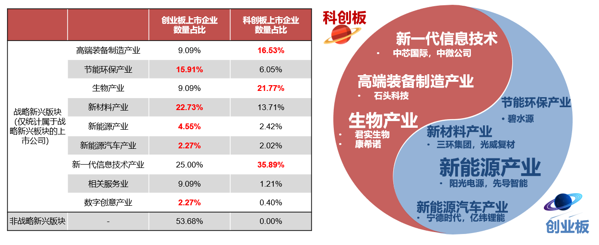

### 当下A股最后一个重要的跨市场宽基指数

科创板和创业板先后成为了我国注册制改革的试验田，这种自带稀缺属性的板块从一“出生”起就不缺热度。而创业板作为深交所的先行者，在不断自我更新的同时更是紧紧追赶科创板的各项先进制度，经历了这十多年的摸索，大家对创业板指的认可度也是日益增长。我们常可以看到这两个板块经常被拿来比对，甚至大家为了证明谁才是中国的‘纳斯达克’而辩得不可开交。

**但小孩子才做选择，我们成年人当然是两个都要！**我自己平时就是两个指数都买，而且基本上是（创业：科创）4：1的资金配比。当我前不久知道要出这个“当下A股最后一个重要的跨市场宽基指数”【中证科创创业50指数：931643】的时候是很开心的，因为我可以省时省力的一键买入两个中国未来科技发展的核心领域板块（新能源、电子通讯、计算机、生物医药、健康医疗等）。对于这个指数的宣传这几天是遍地都是，我也看了很多相关的文章和材料，现在给大家讲几点我的看法，如果嫌长的朋友可以直接阅读文末小结:

虽然双创指数也是主流的市值权重，从指数的前十成份股我们也看到确实创业板暂时更具优势，但因部分非科技属性的创业板大市值企业长期占据了创业板的权重而被人所诟病。双创50在这方面就吸取了历史经验，让该指数科技含量更足，主要体现在：“指数选取**新一代信息技术产业、高端装备制造产业、新材料产业、生物产业、新能源汽车产业、新能源产业、节能环保产业、数字创意产业等新兴产业**上市公司证券作为待选样本；”。

因为双创50对企业科技性的要求更为严苛，所以我们耳熟能详的东方财富（互金券商）、温氏股份（养猪大户）、金龙鱼（粮油大亨）等创业板大市值非科技企业就被排除在外了，从根本上让双创50指数更具未来科技活力。如上最新的前十大权重股截图（6月21日），我发现网上很多文章的权重股数据还是6月中旬调整之前的，中证指数官网可查最新的前十权重已经没有中芯国际了，但有金山办公。这要说明下：双创50指数是每季度调整一次样本股，分别为每年3月、6月、9月和12月的第二个星期五的下一交易日，侧面反映了该指数具有较强的自我代谢优点。而且因为这两个板块构建初衷的差异，让他们双拼在一起后可以很好的做到行业布局的完美互补。

双创50指数的“高”科技含量不仅体现在行业筛选上，还体现在权重集中度和跨板块大范围选股上。如前面所示，指数前十大权重股占比53.44%，而且还能看到宁德时代和迈瑞医疗占比都在10%上限附近，我个人是非常喜欢这类集中度高且具备锐度的指数的。科创50指数给人的感觉就是在当前萌芽期的科创板块内硬选50个大的；而创业板指就是能打的都在头部、还个别权重不算科技行业。不是说这两个老前辈不好，只是当下有了更好的选择：双创50指数（931643），**一份在跨板块选股的、更集中的双拼摆在你的面前，你怎么能不动心呢？**

这种充分吸收了前辈经验的天之骄子，业绩也是理所当然的优秀：2020.1.1-2021.5.31双创50指数累计收益110.56%，相对创业板指、科创50指数累计超额收益分别为26.53%、66.29%。截至2021.5.31，双创50指数ROE达14.56%，高于创业板指、科创50、沪深300；双创50指数高ROE源于其相比同类最高的营收增速与毛利率，分别为37.09%与35.47%（数据源wind）。这些优秀的业绩表现背后，是指数成份股们**更为强劲的行业竞争力、持续投入的高研发经费水平、更加强大的综合创新能力。**

如果说中证100代表了A股的中流砥柱，那么双创50就是代表未来科技的想象空间：汲取**双创**精华、严选**龙头**好股。细心的朋友会发现我给“双创”和“龙头”都加粗了，正好华宝基金这次作为首发成员之一，对应的产品简称就是**【双创龙头ETF（认购588333）】**。从当年的科技龙头ETF开始，华宝基金就一直致力于“投龙头、选华宝”的口号，华宝的整个龙头ETF系列也都深深地烙下了华宝基金指数研究投资部总经理胡洁的印迹。说到胡洁总就再说个细节，华宝基金我上个月还去过一次，看到胡洁总、周晶总这些大佬都是很随和的与大家坐在一个开放的区域办公，指数团队和互金团队也紧挨着，相互沟通起来也蛮方便，我是很喜欢这类企业氛围的。

> 小结

双创50指数作为当下A股最后一个重要的跨市场宽基指数，吸取了创业板指和科创50指数的经验，从指数编制方法层面就确保了其必定更具“科技含量”，买入华宝基金的双创龙头ETF就是省时省力地一键买入中国未来科技发展的核心。