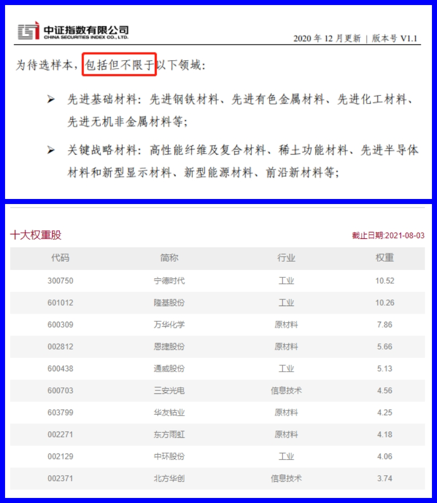

### “硬科技”的发展根基--新材料

> 白酒们还香吗？“硬科技”是真的硬！

今年以来医药、消费、互联网相关指数都不是很突出（近三月更甚），尤其是前几年屡创新高的白酒行业。这些板块的变动除了估值持续推高后的市场自发回调外，更主要的是有关部门从整个社会的**整体效率能否进一步提升、社会资源分配是否公平、未来是否能可持续发展**等角度出发，打出了一套组合拳（比如：坚守房住不炒、整顿校外培训、互联网反垄断）。

都说资本永不眠，敏锐的大资金们也纷纷调整了。公开数据显示，除高瓴外，景林资产卖出持有好未来股数的77.61%，瑞银卖出8740万股持有的高途股票，老虎环球基金在一季度清仓了高途。甚至可以从前不久高瓴路演资料看到，其看好未来两到五年里科技领域的半导体、前沿科技、新能源、智能硬件等四大细分板块，并将硬科技称为“历史性的结构性投资窗口期”。再说得具体点就是：7月27日宁德时代公告，公司于7月27日与高瓴等合作方签署了《北京高瓴裕润股权投资基金合伙企业（有限合伙）有限合伙协议》，公司作为有限合伙人之一参与投资“北京高瓴裕润股权投资基金合伙企业（有限合伙）”，宁德时代认缴出资金额为人民币3亿元。

这个创投基金主要就是投资于前沿科技、芯片、半导体、太阳能、电池、智能驾驶、AI技术、智能终端等科技产业领域。而且你会发现，光伏等碳中和领域上市公司，也是高瓴近年来的一大投资重点，比如通威股份、隆基股份、阳光电源等上市公司。那既然大佬们都纷纷站队“硬科技”，那我们就看下今年以来相关代表指数业绩如何（数据源：choice）：

我们看到中概互联今年以来跌幅已经-27.95%了、中证白酒也高达-14.09%、沪深300医药稍微好一点+2.05%，反观“硬科技”就很支棱，国证芯片涨+45.91%、光伏产业涨+45.97%、新能源车涨+53.66%。在一看你会发现这些数值和近三月数值很接近，这就表明在中短期这种风格变化很明显。这也让我想起以为大佬说的，现在就是流动性导向的一个市场，而大资金又洽洽是对政策引导最敏感、反映最迅猛的。所以这些“硬科技”板块我不认为需要太较真的看什么估值，至少短期不需要！作为普通投资者也尽量不要逆市而行，深陷泥潭的滋味很煎熬。

> 材料足够“新”，科技才能足够“硬”

纵观人类利用材料的历史，可以清楚的看到每一种重要新材料的发现和应用，都把人类支配自然的力量提高到了一个新的水平。材料科学技术的每一次重大突破，都会引发生产技术的重大变革，甚至引起一次世界性的技术变革，大大的加速了社会发展的进程。给社会生产力和人类生活带来了巨大的变革，把人类物质文明推向前方。

毫不夸张的说：**人类利用材料的历史就是一部人类进化和进步的历史。**每一次新材料的发明和广泛应用，都会带来一场工业革命的旋风。第一次工业革命（18世纪），制钢工业的发展为蒸汽机的发明和应用奠定了物质基础，第二次工业革命（20世纪中叶以来）单晶硅材料对电子技术的发明和应用起了核心作用。

那下一次风暴何时到来？我觉得我们现在正处于这么一个时期。比如前几天宁德时代搞了纳电池的发布会，为什么要研究纳电池？因为我们国家锂不足，国际市场又很贵，体现在新能源汽车上就是成本居高不下。那遍地都是的纳电池就能缓解这个现状，通过技术的升级使得钠电池在部分场景得以应用，随着碳中和的进行，大规模储能电池也是一个确定性很大的风口。

还有为啥之前靠补贴都活不下去的光伏产业，这两年又突然支棱起来了？这个其实也是材料和技术升级后给光伏行业带来的新希望。简单概况就是：持续材料和技术迭代可以不断降低成本，成本下降会持续刺激需求，进而盘活了整个中国光伏产业。

> “芯”“锂”“有”“光”，新材料ETF你值得拥有

什么是“芯锂有光”？其实就是大家对于今年以来很热门的芯片、锂电新能源、有色金属、光伏产业的简称。这些高景气板块近三月的表现是一骑绝尘，俨然成了股指拉升的核心动力，最直白的例子就是：富含“芯锂有光”的创业板指近期已经超过上证综指了。这些都是政府一直在引导和鼓励的，起码在可目视的两三年内，只有利好没有利空，唯一的缺点就是股价贵。但我上面也说了这些“硬科技”板块我不认为需要太较真的看什么估值，至少短期不需要！买他们就是看中了他们身上的“正能量浓度高”，在中国高投资那啥一定要正确。

那聊了这么多，肯定有朋友要问了：有什么基金产品可以一网打尽这些充满正能量的硬科技呢？我认为**中证新材料主题指数（H30597）**是个不错的选择，该指数从沪深市场中选取 50 只业务涉及**先进钢铁、有色金属、化工、无机非金属等基础材料以及关键战略材料等新材料领域**的上市公司证券作为指数样本。下图中的“包括但不限于”也很好的为指数后期的扩展预留的余地，便于指数后期的自我进化。

为什么说中证新材料主题指数是对硬科技一网打尽呢？因为该指数超7成仓位聚焦于新能车、锂电池、芯片、光伏概念龙头股，剩余3成仓位兼顾军工、化工以及新型建筑材料等主题龙头股，全面表征新经济、碳中和背景下的主流行业表现。现在回头你再看文章第一张图表，是不是发现新材料指数的业绩（今年以来+48.98%、近三个月+42.01%）也非常的棒。而且中证新材料主题指数的长期业绩也是颇为亮眼，自2015年3月1日至2021年8月3日期间，中证新材料主题指数累计收益为129.96%，年化收益为14.19%，相对创业板指、沪深300均有明显的超额收益。

那市场上有哪些产品跟踪中证新材料主题指数呢？已经上市可交易的有华宝基金、天弘基金、国联安、平安基金，待上市的还有建信基金和华夏基金，这个阵容真的可以说非常热门了。我按照基金成立时间整理了下表，通过表中数据的对比我自己最终选择了华宝基金的**新材料ETF（516360）**，为什么呢？

ETF费率一致选规模和流动性最强的。下表内这几家的费率都是60BP，那我们就看看谁的流动性最强，毕竟场内交易流动性很关键。虽然华宝的这个规模排第二，但是单日成交额是最好的，而且你再看下这些ETF成立时候的规模就会发现，**只有华宝基金的这只规模在持续增长，其他的都在加速萎缩。**为什么会这样？我可以大胆的揣测其余三只产品在发行的时候找了大资金临时帮忙了下（业内也是惯用的手法），刚上市没多久就现出原形了。你看平安基金的这个产品实际上市才一周就已经规模减半了，反正我觉得有点不厚道，这类产品我自己是不敢长期投的。

> 小结

未来3~5年投资正能量浓度高的“硬科技”板块是符合顶层思维的大势，要想一键配置“芯锂有光”等优质资产，那么华宝基金的新材料ETF（516360）应该是首选。当然知行合一的豆哥肯定已经按老规矩设置好了场内定投，如果你觉得对该指数产品感兴趣，可以多多关注。

