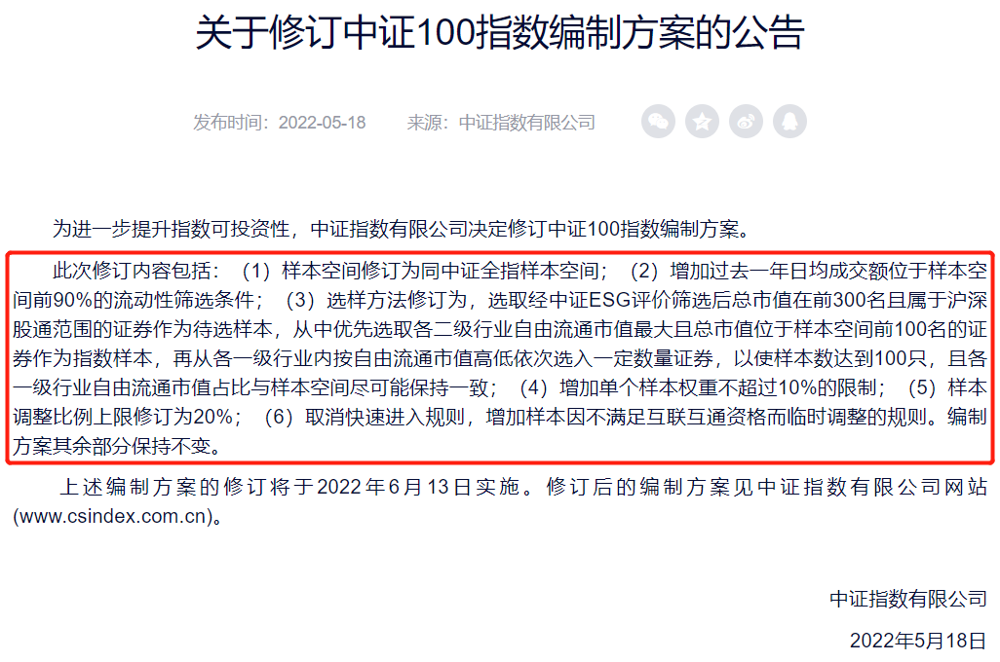
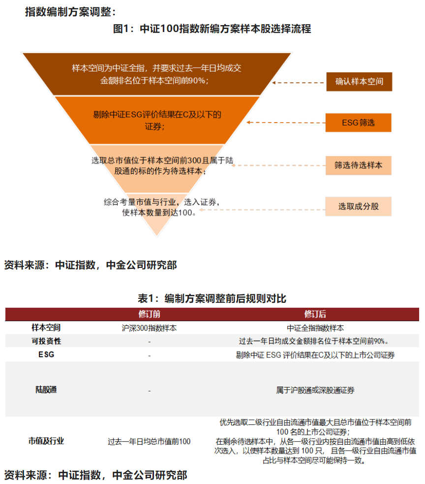
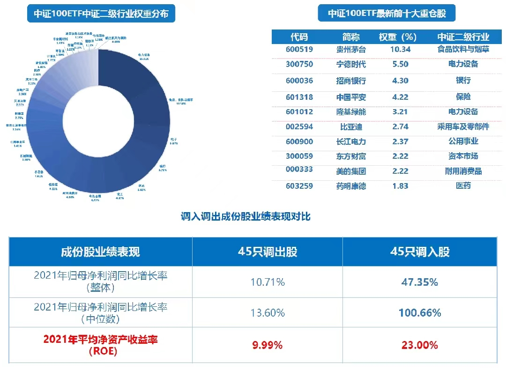

### A股核心资产焕发新生

暑假开始后带娃的工作量明显上升，以至于患有懒癌晚期的我把解析中证100指数编制规则这事拖到了今天。好在晚也有晚的好处，可以让我们更细致地复习下本次中证100指数编制规则大优化的方方面面，那闲话不多说就开始我们今天的分享。

上一次我们大范围地探讨中证100指数应该还是2019年全民聊“核心资产”的时候，中证100虽然是一个认知度挺高的宽基指数，但在这次编制规则优化前一直是作为“A股晴雨表”沪深300的一个子集存在着。或许是看到去年MSCI中国A50指数产品大火后，中证指数公司官网在5月18日发布了关于中证100指数编制规则变更的公告（详见下图）。

本次中证100指数编制规则升级后6月13日的成份股变更了45只，是该指数从2006年发布以来样本调整比例最大的一次，甚至有人直呼：这哪是升级指数呀，简直就是再造了一个新指数（我表示认同）。

老的中证100指数编制规则极其简单（从沪深300里选近一年日均总市值最大的前100只个股），而修正后的规则就相对复杂得多，为了更直观地让大家理解编制规则的变动我找了下面这张图。升级焕新后的中证100指数我觉得可以提取为如下几个关键字：**行业龙头、均衡配置、成长荣耀、责任投资、互联互通。**

**1、行业龙头：**新规表明将优先选取二级行业自由流通市值最大且总市值位于样本空间前100的证券，这个就很好的保证了28个二级行业龙头全覆盖。强化了全市场全行业的代表性，更科学的定义了行业龙头标准，妥妥的“真”核心资产指数。

**2、均衡配置：**优先选取二级行业龙头后再从各一级行业按自由流通市值选入样本，最后还要确保一级行业自由流通市值占比与样本空间尽量一致。这条新规促使中证100指数成份股的行业比例与中证全指趋同，指数行业分布更为均衡后就打破了原有的“大盘指数注重金融地产”的刻板印象（新中证100指数中计算机、基础化工、有色、电子、电力设备等新经济行业权重上涨了17.38%）。

**3、成长荣耀：**基于上面两条的优化，新中证100指数纳入了更多的千亿市值以下的公司，让不同市值水平的成份股权重占比更为均衡。修正了过往单纯以市值定义的龙头，能更好地接纳新兴行业快速发展之下催生出的一批兼具稳定现金流和高成长的企业。调整后的中证100指数成份股近一年总利润增长率由12.1%大幅提升至24.5%，且明显高于沪深300指数；而自由流通市值加权ROE也由16.1%增长至18.7%，指数的整体收益水平得到增强。

**4、责任投资：**规则里新增了ESG负面剔除，ESG这个概念近几年越来越多的被大家提及，ESG是指从环境、社会以及公司治理角度来衡量企业发展的可持续。因其符合国内对于可持续投资的趋势需求，而越来越多的被引入到基金产品中来，修正后的中证100指数则是首只纳入ESG指标的中证核心宽基指数。

**5、互联互通：**新编制规则增加了成份股需为陆股通的限制，在便利了海外投资者交易的同时也强化了指数产品的流动性，更有利于指数的健康发展（截至一季度末，陆股通、公募基金持有A股市值TOP50个股中，分别有76%和64%为中证100成份股）。

当然除了这五点还有不少新变化，比如：样本空间从沪深300扩展为中证全指；增加单个样本权重不超过10%的限制；样本调整比例上限修订为20%；增加过去一年日均成交额位于样本空间前90%的流动性筛选条件等。

随着中证100指数编制规则的升级完成，“中证100知名度不低、认可度不高”的现状明显改善，相关的指数基金产品也开始活跃了起来，其中华宝基金最具代表性。近期新发行的**华宝中证100ETF（562000）**募集了7个亿，是当前场内跟踪中证100指数规模最大的ETF，而且小伙伴们要知道：目前场外规模最大的中证100指数基金也是华宝基金的产品。华宝中证100指数A（240014）成立于2009年9月底，该基金截止今年3月末相对基准超额收益高达34.56%，且高出同期上证指数56.98%，这个成绩还是难能可贵的。

近5个完整年度（2017~2021年），中证100指数的ROE和股息率均显著优于同期沪深300、中证500、中证1000等A股主流宽基指数。优化升级后的中证100指数更能代表中国的“真”核心资产，指数成分定期更新优胜劣汰的同时，国家经济发展及企业利润的增长也会推动指数长期向上。希望通过一只基金均衡配置A股行业龙头、分享中国经济发展红利的小伙伴可以考虑下华宝中证100ETF。