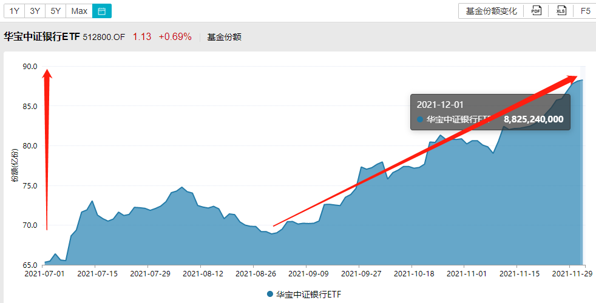
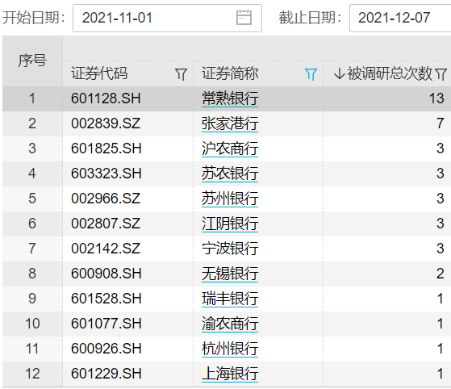
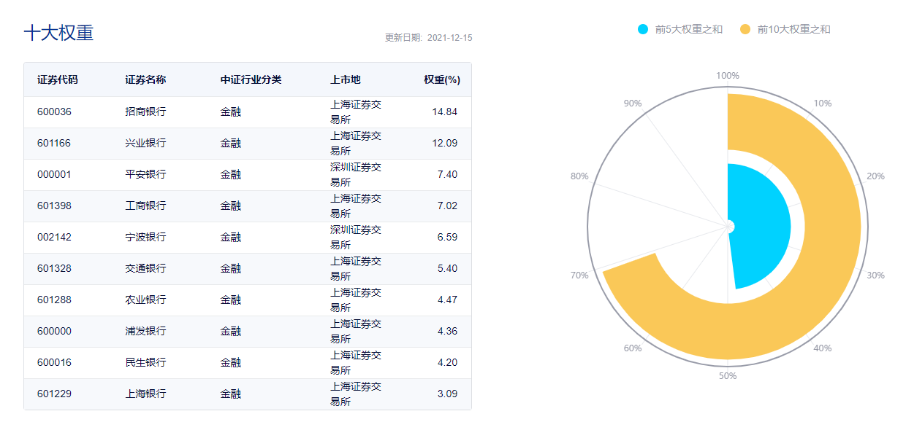

### 稳增长信号之下，2022银行板块有望“闻风起舞”

2021年就这样将要过去了，有人依旧沉浸在“碳中和”主题胜利的喜悦中，也有人发出“我为什么被中概一整个‘丐住了’”的感叹。但比回首过去更重要的是展望未来，我们看看哪些板块在明年会有一个不错的表现可能？

我自知能力有限，平时看好哪个行业，基本上就通过买入相关的行业主题ETF来布局，这就自然让我对各大ETF的数据变动较为关心。上周在照例盘点今年权益ETF规模榜单的时候发现：除了近一个月非常热闹的A50ETF规模破百亿上榜，还有华宝基金的银行ETF也在12月初规模迈过百亿大关。这就使得我有再次关注银行板块的兴趣了，期间查了一些相关的数据，也在学习大会后“稳增长”新思路的过程中有了一些观点与大家分享。

> 银行板块获得资金持续流入

以银行ETF为例，自9月初到12月初份额增长近20亿份、流入资金近23亿元，光这么说大家可能没有直观感受，我们直接看下图。我认为银行ETF能获得资金的持续流入，与银行板块的估值较低、安全边际较高有关。我们都知道ETF是机构投资者重要的资产配置工具，其规模变化可以很好的体现出市场对板块走势的判断，尤其是机构投资者往往会“越跌越买”。

事实上我们也看到，近三个月银行板块的股价一直是区间小幅震荡，在这样的形势下机构依然很有共识的在持续买入银行ETF。我对于这种行为的推测如下：①、银行板块估值处于历史底部区域，安全边际较高；②、银行板块三季报业绩优秀，不良资产率降低、平均净利率提速；③、宽信用力度加大+房地产市场“暖风频吹”，有助于银行股估值的提升；④、银行的逾期贷款率已经低于不良贷款率，报表显得更为扎实。

> 机构频繁调研银行股

一个板块未来是否被大家看好，持续的买入是一方面、密集的调研也是一方面。11月以来，常熟银行、张家港行等12家银行迎来机构调研，合计被调研总次数达41次（详见下图，数据源:wind）。期间知名机构有：11月30日，花旗集团、美林证券参与对渝农商行的调研；11月10日，易方达基金张坤参与对宁波银行的调研；11月3日，高毅资产参与了对常熟银行的调研。在疫情防控常态化的背景下，各家机构依然很积极地现场调研银行板块的个股们，其中最受关注的常熟银行居然短期内被调研13次，我当时看到这个数据的第一反应就是打开软件看看常熟银行的近期情况。

在这份被调研名单里，我也看到银行板块里区位因素的重要性。江浙地区的优质上市银行更受机构的喜欢，这些银行受益于区域经济环境的改善，未来信贷投放有望延续“量增、价稳”的同时，有望维持较优质的资产质量。近期大会过后，上层释放出了很明确的“稳增长”信号，随着政策发力、宽信用力度稳步推进，“政策底”有望逐步向“经济底”传导。明年宏观经济将止住下滑态势、触底回升，经济景气度回暖，也将为银行业经营创造稳定的市场环境。

> 普通投资者可借道ETF参与

开头也说了，我平时对于看好的板块通过会买入对应的ETF参与，银行这块的话首选**华宝基金的银行ETF（512800）**，我自己场外组合里选择的是华宝中证银行ETF联接C（006697）。

华宝的银行ETF优势很明显：**日均成交额、基金规模同类第一**，这就保证了充足的流动性和规模效应，场外的联接C费率也是很友好。银行ETF及其联接基金包含了40只上市银行股，能很好地反映板块整体行情，避免个股黑天鹅风险，7成仓位聚焦十大头部银行股，3成仓位分享中小银行的业绩高弹性成长机遇。银行ETF实际跑下来的业绩也超过了全市场76%的银行A股，对于个股研究精力与能力不足的朋友是一个不错的分享银行股行情的高效投资工具。

> 小结

1、银行板块获资金持续看好，行业估值处于历史低位，业绩持续向好衬显较强安全边际，已具备较高的配置价值；

2、稳增长信号之下宽信用力度稳步推进，2022年经济景气度大概率回暖也会为银行业经营创造稳定的市场环境，春江水暖“机构鸭”们密集调研是个信号；

3、行业个股挑选上可以优先考虑“底部效应” + “区位因素”，如果你是普通投资者，那么华宝基金的银行ETF也是分享银行股行情的高效投资工具。