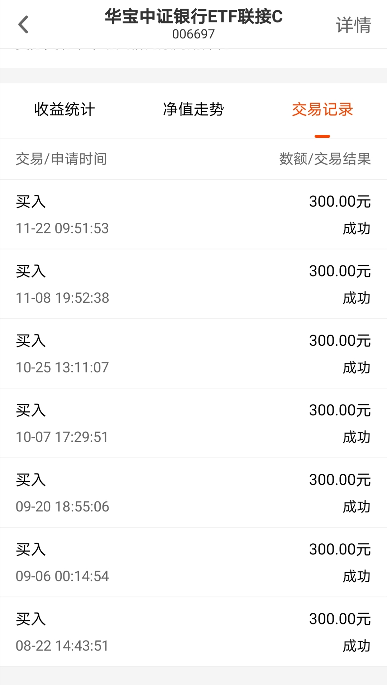
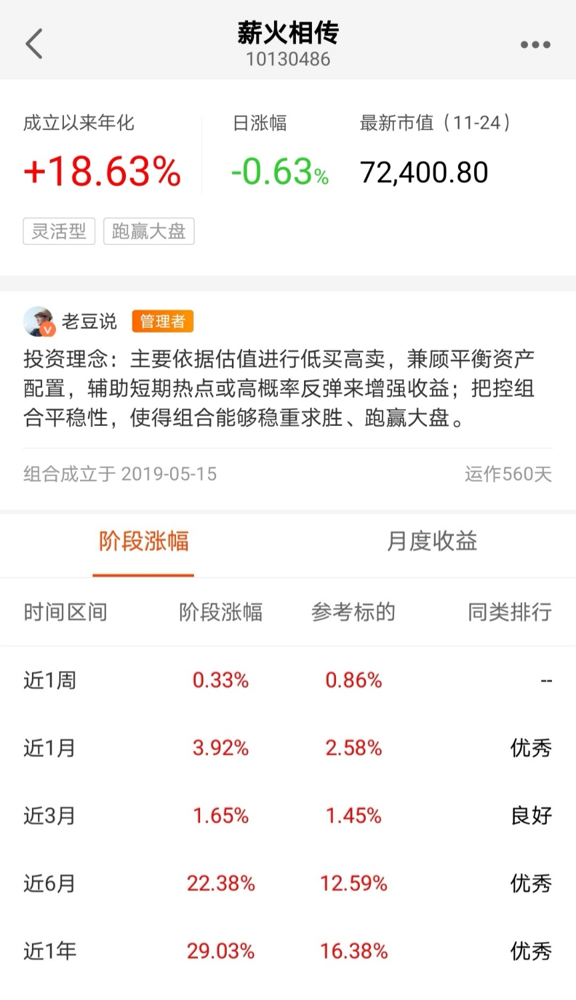

### 这次轮到银行了？

如果说哪个词是四季度财经领域的大热词，那**“顺周期”**应该当仁不让。煤飞色舞、水泥钢铁、汽车家电等都在最近的顺周期浪潮里涨势喜人。我们可以很明显地感受到下半年中国经济一直处于持续复苏阶段，那么企业复苏的同时对于资金的需求也会变大，因此我们能想到的第一相关板块就是银行。再结合最近整个金融板块的持续回暖上涨，我们来探讨下这次是不是真的轮到银行了？

因为疫情的关系，今年国家要求银行业让利给实体经济，这个应该是大家今年不是很看好银行的一个主要原因。但市场绝大多数时候是有效的，所以对应的担忧已经体现在了前期银行股的股价内了。而且大家要明白，银行作为百业之母本来就是有这份责任在里面，帮助实体经济渡过难关后企业会有更好的发展，后期利润会辐射到银行业上来。

银行业很大一个作用就是辅助社会财富更好的流动分配，这也是为什么我们生活中总感觉银行无处不在。只要社会经济在持续的发展，那么老百姓的财富总量也会不断增加，进而银行所能运作的资金也会不断壮大，这就是人们常说银行业没有天花板的原因之一，也因此我认为银行板块是一个值得长期关注和逢低配置的行业。

前天有朋友问我怎么看最近银行股的上涨，我的结论是：**低估值与经济反弹共振后，银行业的估值合理修复。** 要细说理由的话我认为有如下几点：

① 今年成长板块已经涨得很多了，比如消费、医疗、科技等，市场上今年也发了很多爆款基金。手握重金的机构看着成长股和周期股的估值差，不配置一些银行股实在说不过去。

② 由于疫情的关系今年上半年数据不是很好，但这也给明年一、二季度留下了一个快速增长的契机。这种近乎共识的预期也会激发大家的投资欲望，进而会加速大家提前布局周期股的意愿，而低估值的银行是一个靠谱的选择。

③ 周期股其实在疫情期间受影响程度较大的，现在疫情对正常的生活、生产影响已经极小，那么不能只有成长股在飙升，水涨船高是大概率事件。叠加短期内低估值且业绩确定性高这两个相对优势，银行股涨一波的逻辑是站得住的。

④ A股市场的年度考核机制，使得机构在四季度往往呈现保住收益的倾向，这一定程度上将使得在前三季度表现落后的顺周期板块，在四季度表现占优的概率加大。

 

那面对低估值的银行板块我自己是如何操作的呢？我唯一公开的场外基金组合【薪火相传】（每周一上午定时发车）在8月22日开始买入银行ETF联接基金，差不多时间点加入的板块还有地产（但买入比例比银行要少），银行和地产也是成了我今年唯二在公开组合里新增的行业指数基金。这几天跟车的朋友们也有问的，我们提前三个月就逐渐开始埋伏好了，现在银行指数基金的收益也上来了，年底前要不要卖出止盈啊？**我的回答是：不要慌、继续买。**

 

为什么？我们卖出一个东西就要看是否达到了当初设定的目标或者当下的环境已经支撑不了之前的买入逻辑了。我上面也说了，我认为银行板块最近的上涨只是经济反弹共振后的估值修复，明年的经济复苏会进一步，那么银行业的估值修复我认为是极大概率的事件；再来我们从PB百分位看仍然处于8%附近，远没到我们该卖出的时间节点；而且我认为银行板块适合底部区间积极配置，需长期持有、不适合短期炒作。综上就有了“不要慌、继续买”的结论。

接着说说我们普通投资人该如何参入银行板块的估值修复行情呢？我的建议直接买银行ETF，有人会说银行业内部也有差异化，有些银行今年涨的更猛。我想说的是：我的建议是针对普通的散户投资人。任何行业ETF的成份股都会有一定的差异表现，但对于绝大多数投资人来说如何选择是个终极难题，我们既然是看好这个行业，何必又再纠结于个股的选择呢？如果你总是用后视镜的视角去看投资，说我今年买了平银和宁波就会更好，那我觉得这样投资会很危险。当然如果你觉得你自己对银行业了如指掌，那么就当我什么都没说。

对于具体的投资标的这块，我自己选择的是华宝基金的**银行ETF（512800）**，场外的朋友可以买**华宝中证银行ETF联接A/C（240019/006697）**。华宝的银行ETF优势很明显：日均成交额第一、规模与持有人数同类第一，这就保证了充足的流动性和规模效应，我自己公开的场外组合内选的联接C费率也是很友好。

> 小结

明年经济会持续复苏，实体经济的反弹会给低估值的银行板块带去共振。最近银行板块的上涨我认为只是估值的适度修复，具体操作还是不要慌、继续买。普通投资者最好的参与方式就是直接买入银行ETF（512800）、场外的有华宝中证银行ETF联接A/C（240019/006697）。
