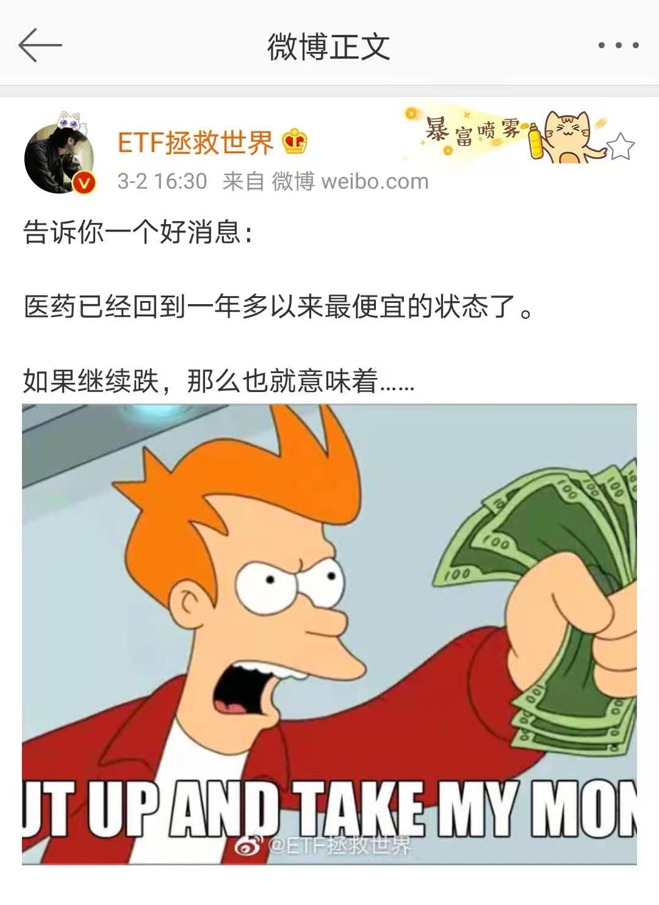
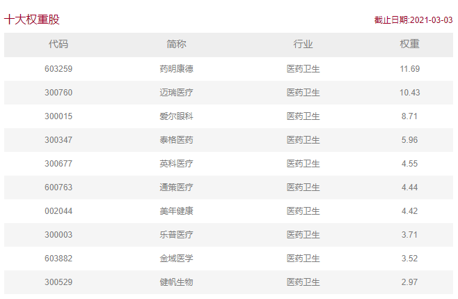
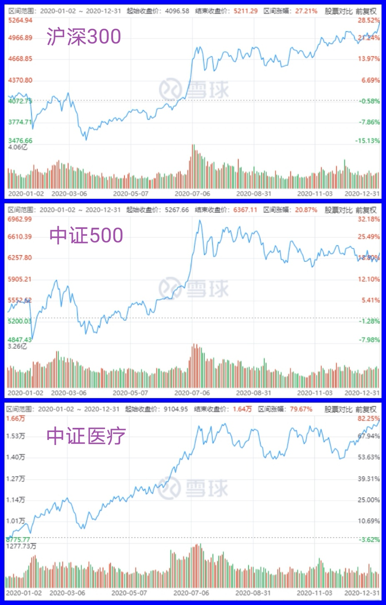
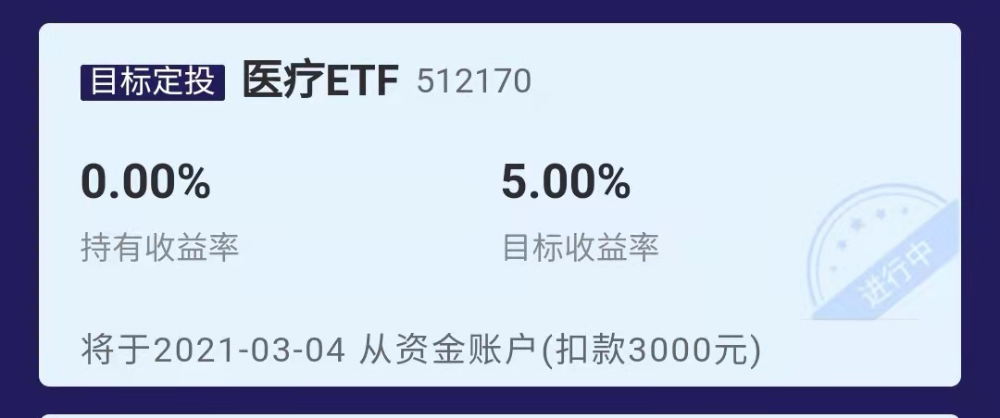

### 暴跌之后，可以关注下这个板块

周二（3月2日）我看到@ETF拯救世界 发帖子说：**“医药已经回到一年多以来最便宜的状态了。如果继续跌，那么也就意味着....”**这句话E大没写完，但熟悉他的朋友都能猜到他应该是想说如果医药再跌就可以考虑入手了。

E大释放了这个信号后，外加这几天的走势也符合他说的“继续跌”（3月2日至3月4日中证医疗又跌了约5%），我这两天一直在看医药、医疗板块。期间在上交所官网查相关ETF份额变动的时候发现有个产品份额突变：医疗ETF（512170）份额从2月3日的7.2亿份，到3月3日陡增至22亿份。后来一查才知道该ETF在2月24日进行了份额拆分（原1份额拆分为3份），这样的话就解释了为什么一个月的时间份额激增了三倍，不然我还以为是有机构在快速布局中证医疗板块呢。

说到ETF份额拆分，我就顺便聊几句：这个操作本身对现有基金持有人无任何影响，也可以说是“无感知”的（净值减少的同时持有份额增多了，总资产不因拆分而变）。但拆分后因为每一份的净值变小了，普通投资者借道医疗ETF参与中证医疗指数的**投资门槛变低**了，市场**交易的活跃度也会因此变得更好**。这几年实行份额拆分操作的ETF有不少，通常也侧面说明了这些产品的历史业绩还不错，只有净值积累的不错才有拆分的资本（不然你本来就5毛的净值，再拆分成1毛也不好看吧）。

既然E大都说现在的医药板块的值得关注了，那我们就看看这中证医疗指数是否算是“暴跌之下可以关注的板块”？

中证医疗指数（399989）：从沪深市场中选取业务涉及医疗器械、医疗服务、医疗信息化等医疗主题的医药卫生行业上市公司证券作为指数样本，以反映医疗主题上市公司证券的整体表现。即在中证全指样本里选年日均成交额排前80%的业务为医疗器械、医疗服务、医疗信息化等医疗主题的上市公司，再按年日均总市值排序选取前50只个股作为中证医疗指数的成份股。最新的前十大权重股如下图：

我们看一下整个2020年中证医疗指数的业绩，做参照的有沪深300和中证500指数（见下图）。2020年沪深300涨27.21%、中证500涨20.87%、中证医疗涨79.67%，很明显即便去年一直有集采的影响，但中证医疗依然大幅跑赢两大标杆宽基指数。但2021年至今（3月4日）沪深300涨1.33%、中证500涨0.55%、中证医疗跌2.27%，这又呼应了开头E大说的该板块已经回到一年多以来最便宜的状态了，是值得我们去多多关注的。

中证医疗的价格已经进入了值得关注的区间，那么它未来的前景如何呢？我们买东西除了看好价格、也注重好的未来呀。所以下面讲几点我对医疗板块未来的看法：

**1、中国老龄化问题加剧，带动医疗需求的持续。**截止2019年底中国60岁以上的人口已经超2.5亿，要知道我们父母那代人对健康的追求已经很重视了。这种医疗的刚性需求在显著地持续增加，叠加医疗服务升级的迫切需求，医疗在至少未来三十年都会是一个非常好的黄金赛道。

**2、居民消费水平的提升可以支撑更高水平的医疗消费。**城镇化水平不断提高，大家对生活质量的追求也是越发的高，自然而然会有更高要求的医疗需求。去年的新冠疫情也给我们国家的公共卫生体系敲响了一次警钟，让各方都意识到了医疗卫生产业的重要性，后续这方面的建设力度肯定也不小。所以说某种程度上是新冠把我们国家的医疗体系推上了新的台阶，这也会促使中国医疗行业的进一步发展。

**3、后疫情时代，需求常态化。** 顺着上面说新冠加速了我们国家公共卫生体系的升级，其实也让医疗器械、耗材的出口需求持续扩大。比如核酸检测、测温枪、防疫防护用品，最为大家熟知的就是呼吸机的出口非常火爆，这些企业也因此有了迅猛的发展，而全球疫情应该还有很长一段路要走，中国医疗企业的成长也会继续。

> 小结

春节后大盘开始了强烈的调整，在这种环境下我们要学会减少不必要的慌张，要继续寻找更大的确定性和更高的性价比的投资标的。在E大的提醒下我们发现中证医疗是一个当下值得关注的指数，对应规模最大、流动性最好的产品是华宝基金的**医疗ETF（512170）**。上面论述了中证医疗近期调整到了可以开始分批买入的价格区间，且该板块长期看是具备非常好的前景的，另外医疗ETF去年的收益率是+86.75%，这个也是在中证医疗指数（+79.67%）之上做到了很好的超额收益。

我觉得对医疗板块有兴趣的朋友可以关注下，而我自己也已经设置了医疗ETF的目标投，每周分批买入、5%阶段性止盈且循环执行（详见下图）。2021年好多人说要降低投资收益预期，我想再补充下：在这样的震荡市里猥琐一点没事，找到更稳健的板块，运用自己感到舒适的策略去执行显得尤为重要。

