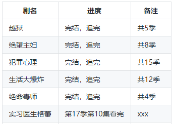
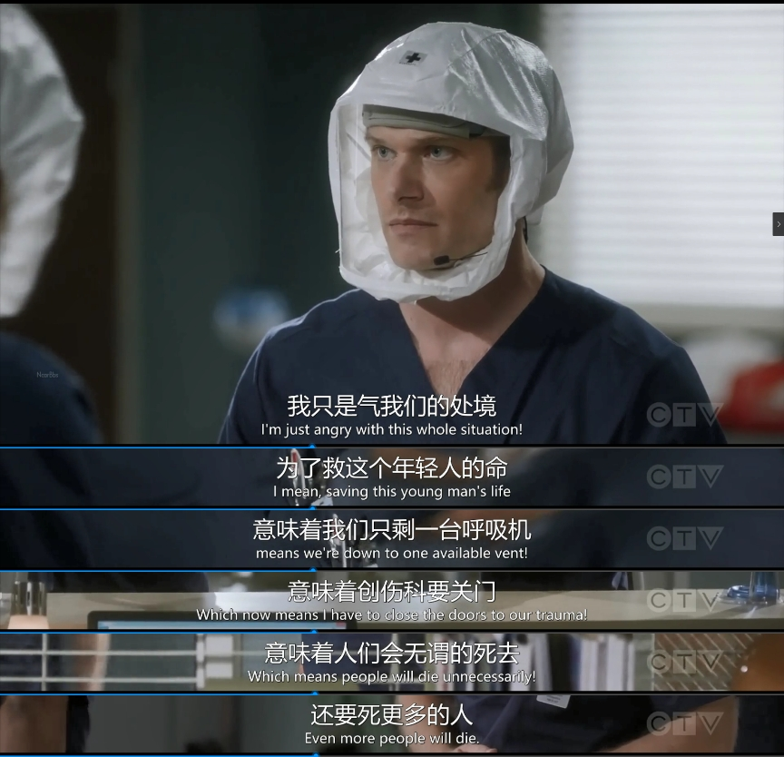
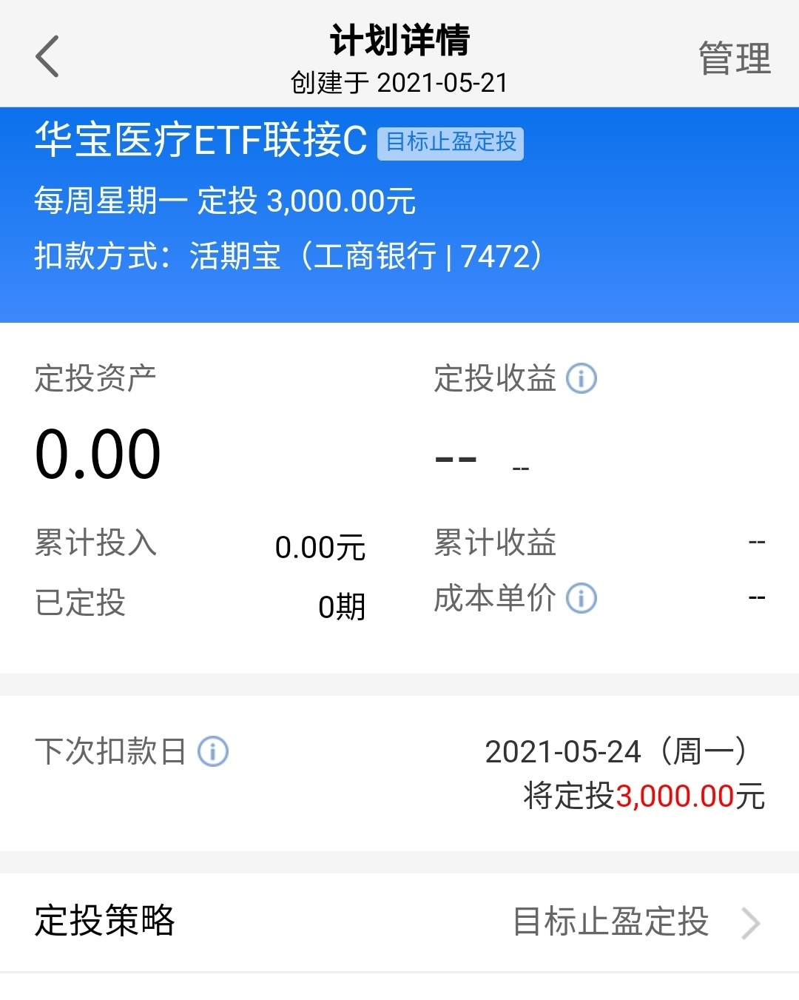

### A股再上3500点，还有哪些板块值得下手？

不知道大家平时看美剧不？第一部美剧是哪一个？追过最长的美剧又是哪一部？

因为我在追剧这块有强迫症，要么不看、要看就追到底，所以我每次入坑都谨慎点。我看的第一部美剧是《越狱》，我相信这么经典的剧会有很多人和我一样，因为它而入美剧的坑的。学生时代还追过《绝望主妇》，工作后追过《犯罪心理》、《生活大爆炸》、《绝命毒师》，但这些都好在已经完结了，唯有《实习医生格蕾》至今还在更新（下图就是我平时追美剧和日漫的部分记录）。

今天这篇文章的灵感也正是源于这部已经连载了17季的《实习医生格蕾》，因疫情关系第16季其实是草草结尾的。随着疫情的初步缓解，《实习医生格雷》第17季也恢复的拍摄和播放，整个这季就是以新冠疫情为大背景。昨天我看到第10集时一段台词给了我不小的触动（见下图），大意就是医院被设为新冠收治点，但是**呼吸机日渐紧缺**，最后已经影响到了创伤科的关闭，以至于会有更多的人无谓死去。

回到题目上，最近A股再次上摸3500点，有些获利止盈的朋友会疑问：后续有哪些板块值得关注并买入呢？这其实也是我对自己的问询，直到看了这集美剧才有些许灵感，再想想最近印度等国家疫情持续恶化，连我国台湾省也出现了大量的本土病例，还有部分省近期也有零星的本土病例出现，继而脑海里就一个念想：**疫情使得全球对于医疗板块有一个前所未有的重视和倾斜，中证医疗指数可以继续关注并买入。**

为什么说“继续”呢？因为我在3月初写过[《暴跌之后，可以关注下这个板块》](financing/hbyl-info)，当时我就明确表态看好医疗板块，并且选取了华宝基金的**医疗ETF（512170）**作为目标投的标的。在4月底我也发帖告诉大家，仅定投了49天就获得了+6.54%的收益，这个收益换成年化率是相当可观的，算是很标准的微笑曲线了。

当时还有朋友问，医疗ETF有没有场外联接呀？毕竟有些人还没证券帐号，也有一些人不方便开证券账户。可惜那会四月底确实没有特别好的场外推荐，因为广发基金虽然有个相关的LOFc类产品，但规模太小了就没选上；华宝基金有个原来分级转型的联接A，但因为费率问题不适合做目标投，也就被暂缓了。好在市场需要啥，基金公司就会想办法给大家提供解决方案：在今年5月13日华宝基金推出了**华宝医疗ETF联接C（012323）**，费用也是非常友好。反正我看到后第一时间就给加入了自选，并在天天基金上也设定了场外目标投，这个即便没有股票帐号的朋友也可以试试，用过的都说好！（我是每周3K、5%止盈后循环，详见下图）

自此华宝基金给大家很好的解决了场内、场外购买中证医疗指数基金的需求，那华宝的医疗ETF有多优秀呢？截至5月20日，医疗ETF已连续10个交易日资金净申购，年内份额增长超40亿份，资金净流入超32亿元，基金总规模已超52亿，融资余额为1.15亿元。这些数据在全市场20多只医药医疗类ETF中稳坐第一，在规模、流动性等方面表现出了绝对的优势。对于刚成立的华宝医疗ETF联接C，其费率也是非常友好，7日免赎回、销售服务费仅0.2%/年，这个C类服务费在华宝基金里算是超有诚意的了。

然后再次回到题目的探讨上来，3月初市场暴跌的时候，我让大家可以关注医疗这个板块。那现在上证指数于3500点附近徘徊时，为什么还是要关注医疗板块呢？因为我们发现医疗板块依然处于相对低估的区间。**截至5月21日中证医疗（399989）的PE-TTM值为47.94，历史百分位为16.78%（数据源choice）**，为什么股价涨了不少，这估值还是偏低呢？因为2020年医疗板块归母净利润超500亿元，同比增长165%；2021年一季度归母净利润又超175亿，同比增长358%。在医疗板块利润维持高成长之下（得益于医疗产业的创新创业活跃度和产业景气度的进一步提升），估值就被很快的消化掉了，这也是为什么说行业估值依然便宜（估值水平为近20个月新低），医疗ETF依然值得买入。

当然新冠疫情是突发事件，在2020年之前大家是无法预测到的。那这种偶发事件带来的企业业绩超预期会让部分投资者有所担忧其持续性和持续力度，但如果你关注了我们国家最近的人口普查数据，你就会发现中国的人口老龄化已经有感知的来到了我们的身边。所以完整的来看就是，中国人口老龄化加速、国产设备进口替代进程加快、后疫情时代的公共卫生建设，三大因素将推动医疗行业未来的高增速发展。在这三个因素的叠加之下，医疗板块会给大家提供一个非常复合性的、长期的、有抗风险能力的成长，这种板块就是我常说的：长期确定性大、且回撤小。所以在当下我依然看好整个医疗板块在2021、2022年的投资前景，头部企业将会随着逐步的平台化，能力不断增强，具备国际竞争力，有望受益于产业链转移和内需爆发双重的浪潮。

> 小结

医疗板块的产品因为贴近老百姓的生活而更容易得到广大投资者的认可，在老龄化、国产替代、后疫情时代等因素推动下医疗板块给大家提供了一个长期确定性强且回撤小的选择。在医疗板块高成长之下，行业估值很快就被消化了，当下的中证医疗依然处于历史较低区间，这时候入手医疗ETF极大概率不埋人。3月份我提醒那一次大家赶上的朋友们，这次也别掉队；如果上次3月初你没赶上的，这次就别掉队了哦！华宝医疗ETF联接C走一波！
