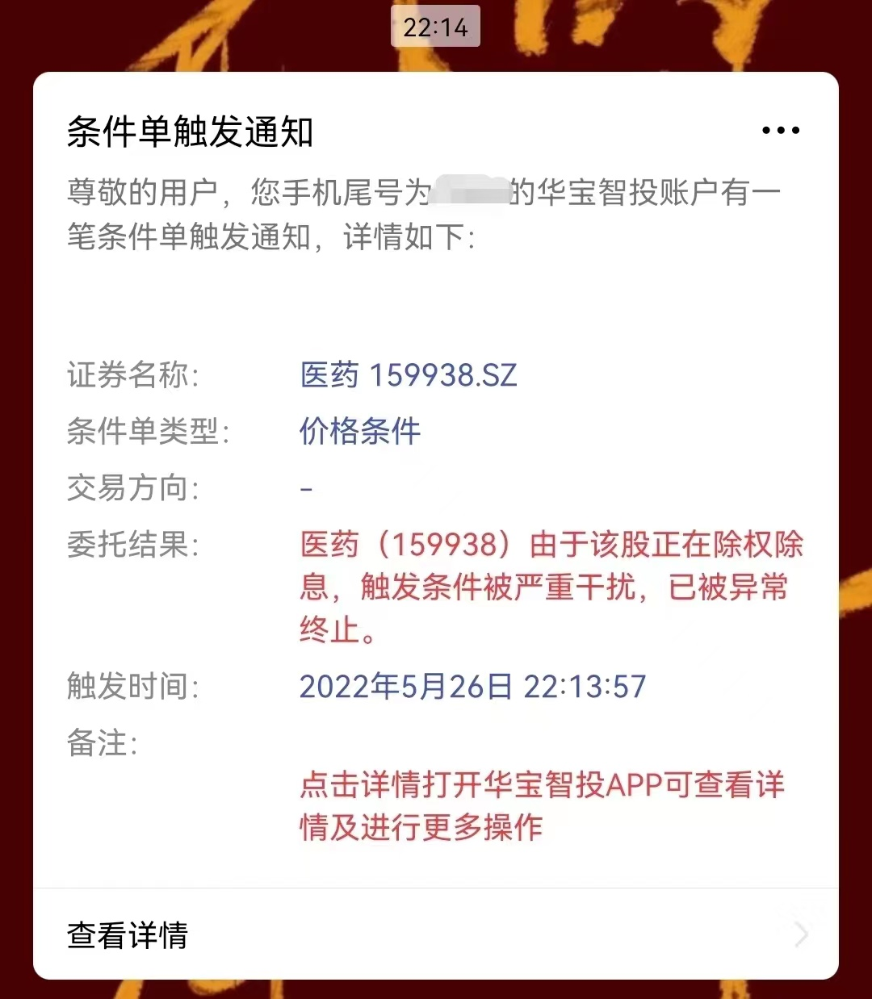
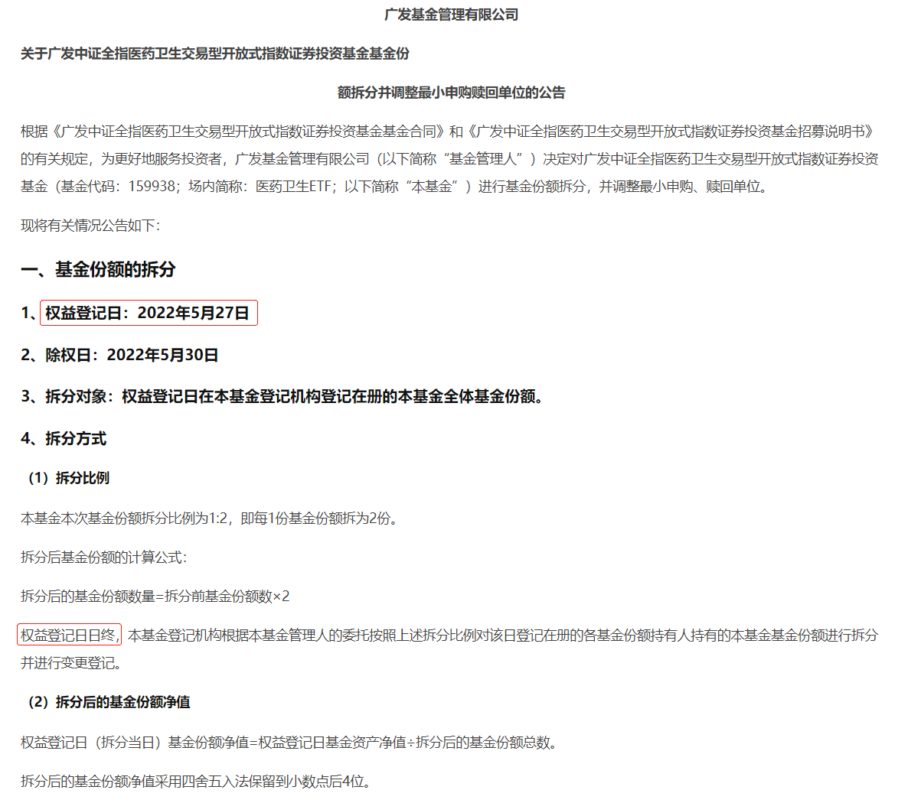
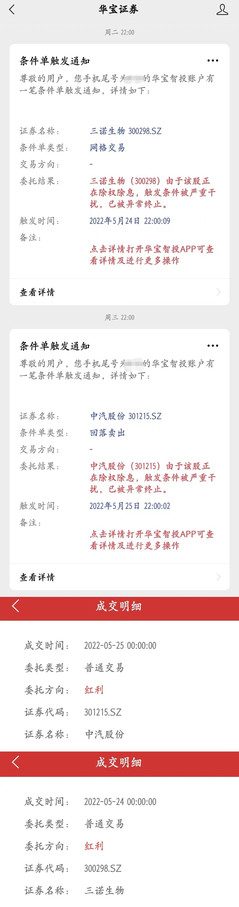
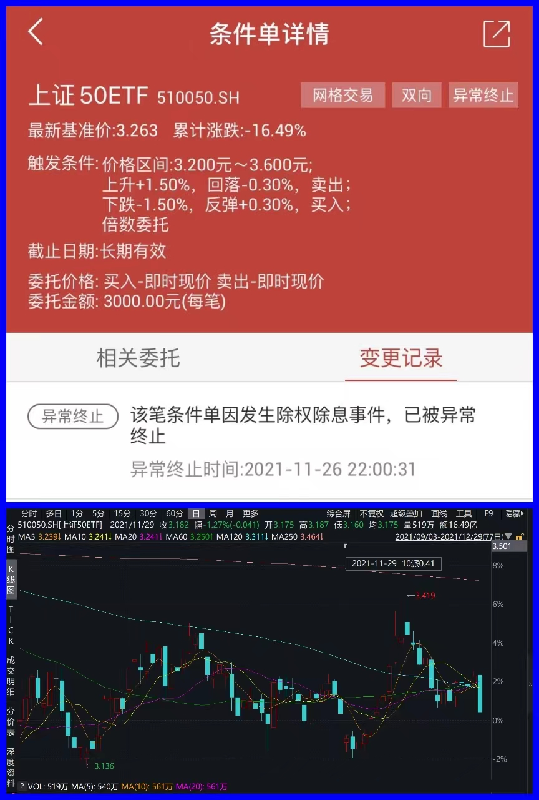

### ETF玩条件单也得注意别踩坑

与股票相比ETF交易的费用低廉很多，这让不少人开始尝试条件单交易。借助软件程序实现较为初级的自动化交易现在已经有不少券商在做了，我自己以及身边的不少朋友也有过一些尝试。昨晚（5月26日）都准备睡了，一个萌新小伙伴突然发了下面的截图问我：这是什么意思？怎么就自动终止了？该怎么办？（申明：本文提到的任何券商、软件、个股、ETF等均不含推荐意图，仅作解说事件之用）

这其实是投资标的在分红、送股、拆分等需要除权除息的操作时，华宝证券条件单基于保护投资者的角度给与关闭条件单的一个举措。通常的做法就是根据除权条款调整触发条件后直接重启条件单即可，我们平时也是在盘后收到通知修正下即可，所以我也是这么回复这位小伙伴的。顺带这里表态下：我个人是比较反感ETF份额拆分这种行为的，为了把净值单价做低后让基民有种很便宜的错觉外毫无意义，本次的是广发基金的医药卫生ETF。

因为我对广发这只基金也不是很熟，就又去翻了下他们的公告，但总觉得这日期好像有问题。上图公告显示登记日（5月27日）日终才正式拆分份额，但为什么26日晚就终止了条件单？不是应该27日晚上再终止吗？

伴随着这样的疑惑我翻了下之前类似的经历，可以看到5月24日晚上系统提示三诺生物条件单异常终止，三诺生物登记日为24日，且24日盘中已发放股息；5月25日晚上系统提示中汽股份条件单异常终止，中汽股份登记日为25日，且25日盘中已发放股息。（详见下图）

上面的两个近期个股验证说明程序终止是合理的，那我们再找一个ETF的相关案例。如下图所示，上证50ETF在2021年11月26日（周五）收盘后终止条件单，11月29日（周一）除权除息，这就表明以往的ETF条件单在遇到除息除权也是正常的。

综上我们可以推定**：5月26日晚华宝证券条件单系统对于广发基金的医药卫生ETF突然终止是一个BUG，且大概率为不确定性突发系统故障，是一次较为严重的生产事故。**

大家要知道，对于无迹可寻非必然出现的BUG，要远比普通故障更具隐蔽性和危害性。因为你无法快速定位问题且不知道下次何时复发？正如本文题目说的，条件单是个非常好的工具，给大家的交易带来了极大便利，但我们玩条件单也得注意别踩坑，这里也希望华宝证券在内所有搞条件单的券商们都能谨慎对待系统BUG的排查和消除。

在我初稿写完准备要发布本文前，小伙伴来告诉我华宝证券已经在盘前帮助大家把该异常终止给恢复了。大概率是有人昨晚向券商反馈了该问题，券商方面对异常做了回滚处理。亡羊补牢总归是好的，但我希望相关券商能引起高度重视，这次是正好及时发现并处理了，那下次要是没被发现呢？

还有这次是提前一天终止，即便有影响可能就是让大家丧失一天的自动交易，那如果是推迟N天呢？价格折半后条件单依然没变继续执行，这个后果是不可想象的。毕竟现在华宝证券条件单用户还是很多的，大家也信任条件单系统，何况我们个人投资者也不可能每天盯着去校对交易系统执行是否正确。

再延伸下，ETF的除权除息毕竟小概率事件，但个股的除权除息可是家常便饭啊，这会让类似情况误触的可能大大提升。而且个股交易者人数更多、规模更大，一旦出现了问题又没及时发现，我相信对投资者和券商自己都是一个不小的损失及伤害，还是希望有关方面能高度重视这类生产事故问题。

最后对普通投资者我还是想说，自动化交易工具的普及确实方便了我们的投资，我自己也是一直很喜欢这类工具并积极使用着。但是整个行业当前还存在一些小问题，我们在使用的过程中仍要养成定期复盘校验的习惯，以免出现糟心的结果。

