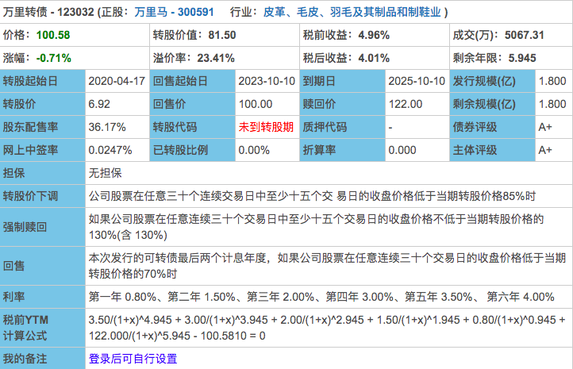
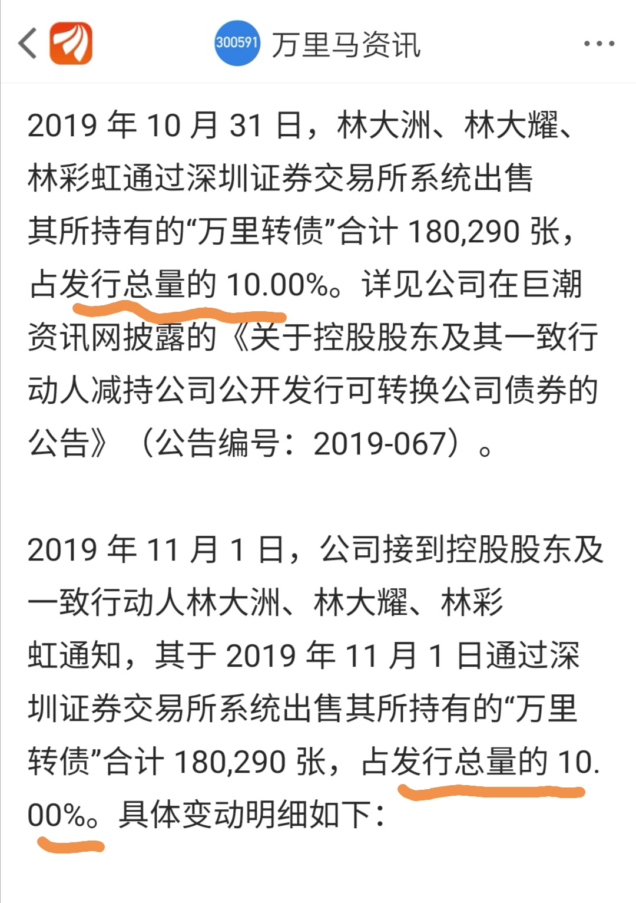
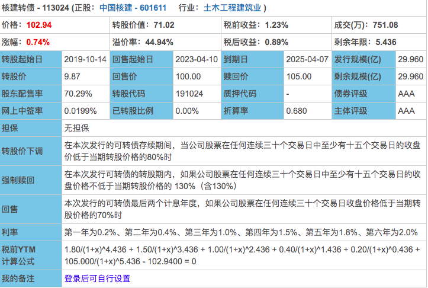

### 分享一个捡漏的机会

今天我们集中讲下本周市场里出现的几个有趣的现象吧，看看能否通过观察找到捡漏的机会？

> **渝农商行上市首日破板**

我们都知道中国A股打新制度就是给投资人的一个福利，甚至大部分基金都以此作为主要的增强收益的手段。自从打新规则改革后，首日44%的涨幅可以算是铁律一样的存在，虽然近两年有连板数减少的趋势，但首日封板44%一直没变过。

但就在本周二（10月29日）渝农商行上市首日封板失败，而且紧接着又是暴跌，截止周五收盘7.88元，与发行价7.36元很接近了。渝农商行成了打新改革后第一只首日开板的股票其实也是多方因素导致的，有人说是千亿规模过大、市场已经被严重抽血。其实我认为最主要的原因还是AH溢价，要知道渝农商行在港股是有上市的：重庆农村商业银行。即便周五跌回7.88元，H/A溢价还有-52.27%，在如此巨大的差价下没有资金傻到高位接盘。

这也看出来沪港通在逐渐发挥效应，市场也逐渐理性，要是放以前先不管三七二十一拉几个涨停再说，哪怕后面跌回来，那是后面的事情了。再补充下刚说的最近市场抽血严重，后面还有邮储银行和浙商银行的上市、500亿规模的浦发转债上市、区块链又埋了很多活跃的资金。。。

> **A+级转债（万里转债）未破发**

万里转债是一只创业板可转债，刚发行的时候很多测评可转债的都说：企业行业一般、质地也差、评级很低、溢价也很高，不少人给出了不申购的建议。平心而论万里转债看数据真的很一般，它要是破发也没人怪它，何况本周市场氛围也很一般。

然而事实就是上市当天最高到了103.8元，惊不惊喜、意不意外？这也看得出大家对转债市场的关注度越来越高了，一个有关注的市场才会有较高的溢价。即便最近两天大股东每天10%清仓式的减持转债，周五收盘价还是有100.581元，接盘的那些人就是看中了A股的转债不会轻易违约，万里转债利率那么高，权当买纯债也值了。

大股东毫不意外的清仓式坚持，为什么每天10%的减持呢？因为监管要求的，不然肯定一天卖完了。因为总计申购了33%，周一、周二应该还会继续减持，不知道会不会跌破100元面值呢？但我相信还是有人会在面值附近接盘的。大股东其实也没办法，很多这些申购的钱也是短期借来了，趁着还有得赚就赶紧卖了把钱还了。

最近市场行情一般，但可转债这种防守型资产又受到了大家的关注。还一个佐证就是浦发转债哪怕是500亿的发行量，且在二股东放弃认购的情况下，大家也才每人3签，而普通的转债现在每次顶格申购后中签率也就是在10%~40%之间，这也看得出大家开始热衷于可转债市场了。随着大家对可转债市场关注的进一步提升，后面捡便宜货的机会越来越少了。

> **AAA级转债（核建转债）只要102元**

一个A+级转债可以在大股东减持之下还达到103.8元，而一个AAA级转债只要102元，世界真奇妙，哈哈。

核建转债在周三（10月30日）跌破了103元，在我当天晚上复盘的时候发现了，第一时间和星球的朋友提醒了下，或许是个不错的低风险标的。在周五的时候最低到了101.9元，并且在102附近停留了很久，对于小散户有足够的时间买入囤货，后来下午随着大盘一鼓作气涨到了102.94元收盘。

对于103元以下的核建转债我觉得是可以安心买入的，如果102元的那甚至连期权部分的价格都免费了。成交量最近周三、周四基本都在五六百万左右、周五在七百多万，对于普通散户这个规模够用了。

核建转债的正股是中国核建，有息负债率67.72%、总市值才180多亿，所以看得出人家根本没打算还钱。AAA评级加持，102元的价格买不了亏、上不了当，耐心持有一年。在这一年内极大概率收益超理财产品（约4%），运气好年化8%也是很大概率的，如果耐心足够大可以直接拿到强赎或者保守点等到130元也行，反正是个不错的低风险标的。

> **小结：**

- 新股不再稳赚，至少这个‘定理’有打破的趋势；

- ‘垃圾’级的转债也不一定会破发，转债市场受到的关注度在提升；

- AAA级转债也有捡漏的机会，平时保持一部分稳定的现金类资产很重要。

---
**提醒**：以上提到的股票（债券、转债）仅作学习交流所用，不构成任何推荐建议。 投资有风险，操作需谨慎！