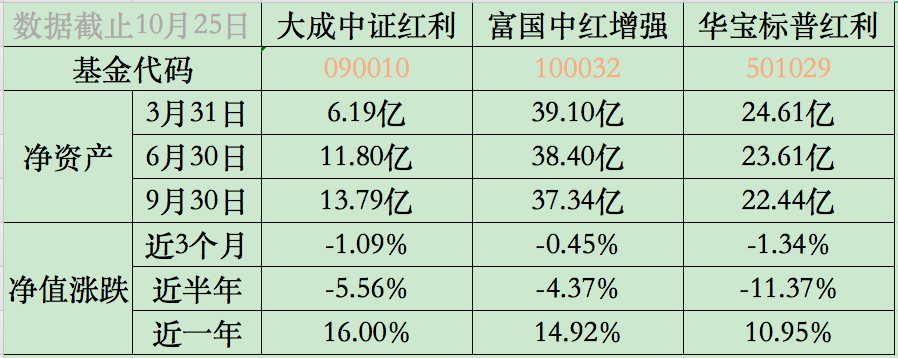

### 好久没聊红利了

熟悉的朋友都知道我是很钟爱红利因子的，但上次写红利还是8月初，那时候大成中证红利出了一个超低销售服务费的C类：[《一个热卖的红利基金又出了个低费用的C类》](https://blog.ytc1989.com/#/financing/zzhl-c-plus)

三季度基金的数据也都出来了，我就顺手对比了下我关注的几只红利基金：大成中证红利A、华宝标普红利A、富国中证红利增强。

从近三个季度基金的净资产规模变化趋势看，大成中证红利逆势增长，而且富国中红增强和华宝标普红利的规模也没减多少，看得出基金份额没啥变化。要知道近半年三个红利指数基金都是在下跌的，基于这个情况大成红利还能保持这么大的规模增速确实蛮不错了。所以从侧面也看出了：今年的中证红利也没大家说的那么招人不待见。我们在做投资决策前往往会去查一些数据、看一些测评，我们不要太在意大家说了什么，因为那不重要，重要的是大家怎么做的。

**或许常对你说中证红利在2019年已经失效的人，转身默默又加仓了中证红利基金。** 投资人的知行合一是纪律，授业者的知行合一是操守。

再看下阶段涨幅吧：近一年大成中证红利收益领先，之前我们一直在说富国红利的增强已经失效了，但从这半年看来富国的增强效果又很明显了，在以每个季度约0.6%的速度追赶大成中证红利基金。再看看我们的小红，真的有点惨烈，但你仔细一看主要的暴跌就在今年的二季度，且近三个月又和中证红利差不多了。我也希望标普红利再接再厉，既然还有22亿多的净资产，那就要给支持你的投资者们一个好的成绩单。

单市场的上证红利和深圳红利不是我的菜，而且上证红利没有场外、深圳红利编制方式略显奇特，所以我平时很少特意去关注他们俩。但对于最近新上市或准备上市的红利基金里面我比较在意：

- 嘉实的红利300ETF**（515300）**8月8日成立，净资产规模截止9月11日为7.84亿

- 建信的300红利ETF**（512530）**8月23日成立，净资产规模截止9月16日为12.68亿

- 招商的中证红利ETF**（515080）**11月22日才能募集结束

红利300和300红利均基于沪深300指数，选取50只作为成分股，所以这两个算正统的大盘蓝筹红利指数，比中证红利还要蓝筹。

嘉实的红利300的全称是：沪深300红利低波动，所以也算是双因子指数基金了。因为加了个低波因子，那么成分股里金融股的占比就大很多了。而建信的300红利就是单一红利因子，所以金融股相对较少，但增加了一些能源、原材料、公共事业等周期股。如果在这两者里二选一，我会偏爱建信的300红利，因为从个人情感看我是喜欢单纯的红利因子，从成分股角度看过重的金融占比不是我的菜，从净资产规模也看得出市场更看好建信的300红利ETF。

最后说下还在募集期的招商中证红利ETF，千呼万唤始出来。我为什么期待中证红利出ETF呢？因为ETF出了以后再出个联接基金那就是水到渠成的事情了，直接把中证红利的费率给降了下来。所以8月2日的时候大成中证红利直接出个只要0.1%销售服务费的C类基金，这就是变相的降低整体费用提前圈一部分投资人，但我觉得真等招商中证红利联接基金出来的时候，大成和富国都要跟着降费，不然日子更难过。