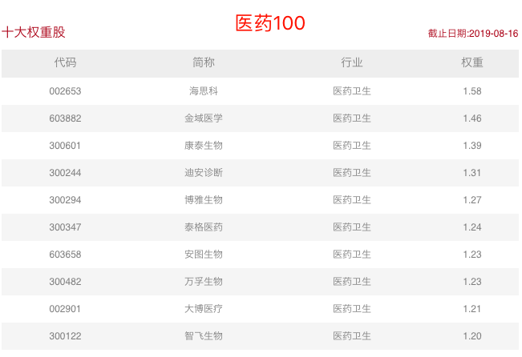
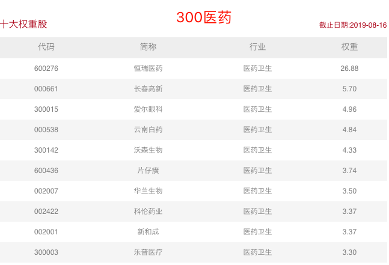
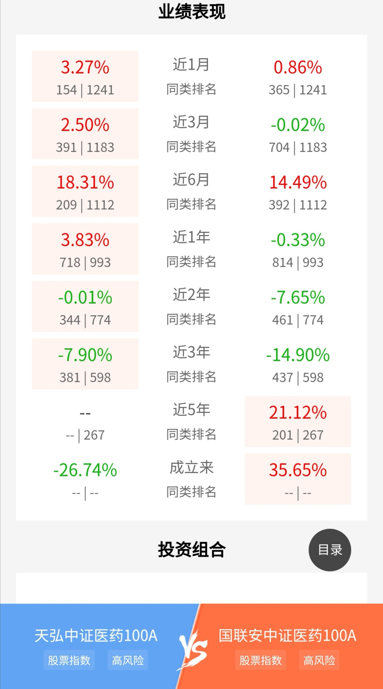
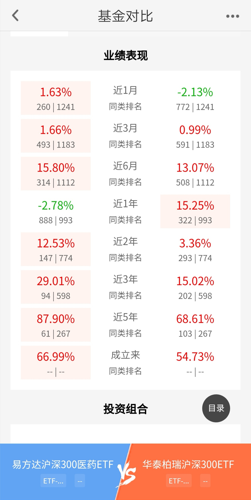
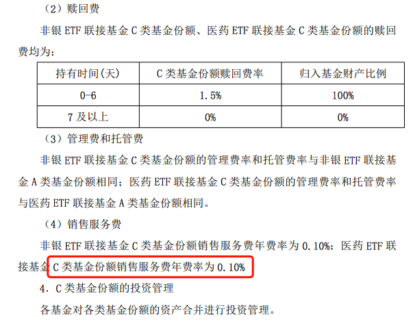

### 医药‘龙头’指数也出 C 类联接了

行业指数里常被人津津乐道的就属消费和医药，即便这几年熊市阴跌不断，但消费和医疗总是能保持较好的增长，甚至这已经成了共识，所以这两个行业也就成了大家抱团取暖的地方，**屡创新高的茅台就是一个标杆**。

今天我们主要说的是医药行业，要不是因为受带量采购的影响，医药还真不一定会输给消费。而医药行业认可度较高的指数有两个：中证医药 100 指数、沪深 300 医药卫生指数。

-   中证医药 100 指数选取医药卫生和药品零售行业市值较大的 100 只股票组成，以反映医药相关行业的公司股票的整体走势。

-   沪深 300 医药卫生指数由沪深 300 指数样本股中的医药卫生行业股票组成，以反映该行业公司股票的整体表现。

前者的优势在于 100 个成分股占比很均衡，而后者则受益于行业龙头的优势，第一权重股**恒瑞医药占比 26.88%**，享受了一把强者恒强。

观察上面两张图就能很直观的感受我刚讲述的事实（数据源：中证指数官网）。

医药 100 对应的基金有天弘中证医药 100 A/C 和国联安中证医药 100 A/C，业绩对比如下（数据源：天天基金 APP）：

上图显而易见近三年内天弘医药 100 完胜国联安医药 100。仔细一看还发现国安联规模反而比天弘的大很多，且机构投资者占比 85.74%，国安联的各项收费要比天弘贵很多。而我印象中医药 100 之前只有天弘有，现在突然冒出来一个国安联，还有了三年的业绩，预计大概率是转型过来的产品，看它的费率和业绩，我也就没兴趣深究了。如果我买医药 100 当下肯定选天弘中证医药 100 指数基金。

接着我们说下 300 医药，从个人主观情感上来说，我对 300 医药的喜爱大于医药 100，因为医药行业是典型的**龙头吃大肉，二弟吃小肉，三弟都不见得有汤喝**。而最强的企业肯定都在沪深 300 里，在 300 里跳出来的医药企业，几乎都是老大老二的角色。

看得出 300 医药还是很好的超额收益了沪深 300，而沪深 300 在近 2 年可谓炙手可热的香饽饽，这也是我更看好 300 医药的原因。唯一遗憾的是去年开始的带量采购使得医药股短期杀跌了一部分，这也是为什么近一年业绩跑输了沪深 300，好在近半年又反超回来了，而且前几年也是 300 医药好于沪深 300（数据源：天天基金 APP）。

仔细的朋友看上图已经发现了，我拿易方达 300 医药 ETF 和华泰柏瑞沪深 300ETF 做了比较。因为现在 300 医药指数对标的只有易方达这只 ETF，而华泰柏瑞的沪深 300 是业界标杆，所以超越标杆的行业指数有如此业绩，真的很是喜人。

这么好的基金如果想要买场外之前只能买对应的联接 A 类基金，而易方达这只 A 类的收费不是很友好，特别是赎回费还是前几年的业界水平。好在今年走在降费让利前列的易方达基金公司在本周末（8 月 17 日）出了对应的 C 类基金，7 天后免赎回费，管理费托管费同 ETF 为：0.5+0.1，而销售服务费只需 0.1%，这个也是今年 C 类的最低标准了，给易方达手动点赞。**要知道市场上独家的产品还愿意直接 0.1%的销售服务费，这个就是很有胆魄的，我们作为投资人很乐意看到这样的让利**。

最后说说当下是否适合投资 300 医药吧。沪深 300 医药指数当前 PE-TTM 百分位是 66.57%（8 月 16 日收盘数据，数据来自 choice）。从死板的估值数据看确实还不值得买入，至少不应该大量的配置，但是基于行业的特殊性（参考消费行业指数），我觉得如果有余钱的，可以少量的买一点。或者多关注下这个指数，一旦有好的买入点，可以优先考虑到还有一个场外低价 C 类联接基金。
