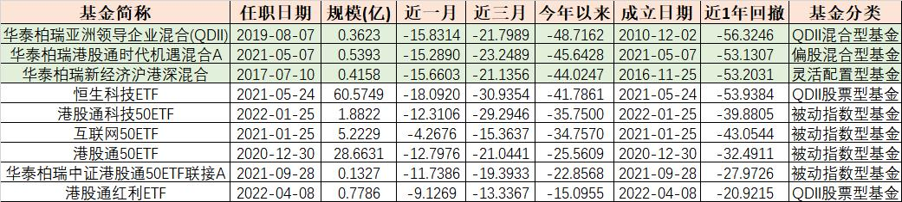
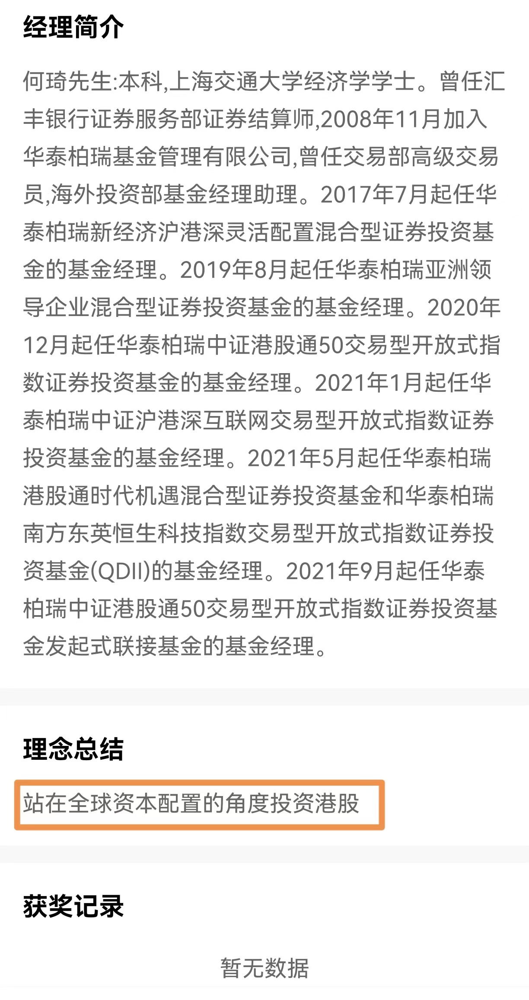
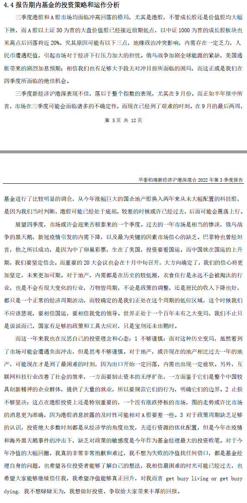

### 三季报恐怖故事：站在全球资本配置的角度投资港股

是时候颠覆我们固有认知了，2022年投资难这个大家都能感受到，但出乎我意料的“可怜娃”根本不是什么蔡经理和葛女神，也不是什么白酒和中概。先给大家一组数据（截至10月27日收盘各标杆基金今年以来收益率）：

芯片主动课代表 >> 诺安成长混合： -38.43% ；

医药主动课代表 >> 中欧医疗健康： -25.89% ；

白酒主动课代表 >> 易方达蓝筹精选： -34.99% ；

港股科技课代表 >> 天弘恒生科技： -39.39%。

如果你觉得这已经很刺激了，那么看下图应该更刺激。

更刺激的是这表格里既有指数基金也有主动基金，而且这9只产品是同一个基金经理管理。图表中三个标出绿色的都是“秒杀四大课代表”的（还碾压了他自己管理的指数基金），个个都具备今年净值腰斩的“潜力”。而本文题目中说到的【站在全球资本配置的角度投资港股】是这位基金经理个人简介页的“理念总结”（见下图），而这种投资理念注定产品业绩在2022年万劫不复。

这位基金经理看似管理着百亿规模，其实主要就是恒生科技和港股通50这两只ETF的规模，其余的都非常迷你，在最新的三季报也提到好几个有清盘风险。那这位基金经理是如何进入大家视野的呢，这还得从一份三季报说起（有兴趣的朋友也可能去官网找原文件）。

其实就季报的诚恳度来说是已经可以了（当然他二季报也是这么诚恳的），何琦坦言自己不够谨慎、执念地产、止损不决、缺乏周期意识、缺乏ZC敏感，**最后近乎央求地说道：“我不想碌碌无为，我想做好投资，争取给大家带来丰厚的回报。”**

（此时BGM响起，跪在地上的三井寿流下了悔恨的泪水，并说出了：“教练，我想打篮球呜呜呜…”）若非要说句不那么悲伤的话，那就是这几个近乎腰斩的主动基金规模都很小，剔除内部持有外受伤的基民应该不是很多了。

最后我想说：估计何琦自己也没想到会以这种形式被大家“熟知”，也不知道他下次写年报的时候还如此“诚恳”吗？我怕后面其他基金经理写报告时会变得更“拘谨”，毕竟2022年投资的日子是真不太好过…

