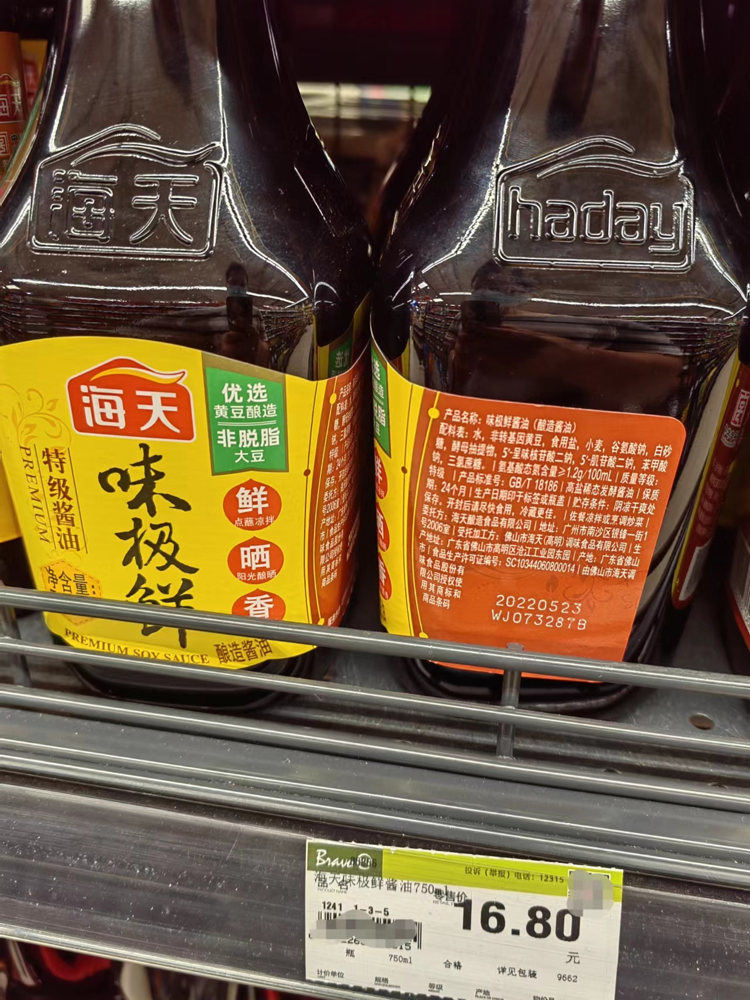

### 该如何面对“科技与狠活”？

短视频博主辛吉飞“科技与狠活”系列作品大家在国庆期间讨论的比较多，其实像我这样‘每天不刷1小时短视频不舒服斯基’的人很早就看过他的视频了。从三花淡奶到揭秘9块9包邮的牛肉粒，而真正让其在投资圈炸裂的是海天酱油添加剂事件。

本来我想简单梳理下事件前后，好在国庆七天写这事的人非常多，大家多多少少也有耳闻了，所以我就不再累述，只谈谈我个人对酱油事件的一些看法：

**1、为什么推进到海天酱油就彻底出圈了？**

民以食为天，酱油是中国人餐桌上绕不开的调味料，远比什么三花淡奶和牛肉粒要广泛得多，因此酱油的安全问题就很容易在网络上炸裂（起初中日酱油产品双标这个宣传点也很能“触痛”国人的心）。

还一个就是屁股决定了立场，海天味业截至8月26日股东数176800户，而近一年海天的股价可谓是一路向西，那么多人被深套着，现在出了这么一档子事必然大家会很“激动”。

**2、“0添加”就一定健康吗？**

这次海天事件的主要争论点之一是：你大声告诉我们是晒足180天的酿造酱油，而配料表里却加了不少“科技与狠活”（呈味核苷酸二钠、肌苷酸二钠、苯甲酸钠等）。

当然我们也要理性看待食品添加剂，在标准许可范围内适当添加也是为了确保产品的品质和安全。如果真的0添加就是健康，那我们是不是烧菜就不该放酱油了呢？

海天这次公关肯定是失败的，但我们不能因此而妖魔化食品添加剂，要一个维度一个维度地看问题，万不能被别有用心的人带了节奏。

**3、低价酱油居然是用豆粕酿造的！**

以前我们总能听到转基因和非转基因的争论，老百姓遇到最多的就是转基因大豆和转基因玉米。即便我知道外面吃的几乎全是转基因大豆油（便宜是王道），但自己家里买肯定会选非转基因玉米油或大豆油（偶尔会买菜油、葵花油、花生油）。虽然可能大概率转基因产品吃了也没啥事，但入嘴的东西还是要稍微谨慎点，在家里自己可以做主的情况下，我相信有这种想法的人应该是大多数。

但酱油用豆粕酿造我真还是这次事件后才有注意到，如果你真的细心也能发现今年开始部分酱油标签上会凸显“非脱脂大豆”酿造（至少我去年没怎么看到）。而这里的脱脂大豆就是我们常说的豆粕，豆粕是大豆榨油后的副产物（大豆全身都是宝），主要作用是当饲料喂猪和家禽。

低价酱油用豆粕做原料的理由也是显而易见的：便宜！所以你说这次海天事件没有教育意义我是不认可的，它让我们开始重新关注调味品的健康与安全，开始下意识地买之前看下配料表。

**4、海天味业贵不贵？**

这里我指的是海天味业股价，海天味业上市后一直在我的自选股池内，但我眼见其一路高涨就是下不去手，说到底还是我认为它估值太贵了。

而周一海天的暴跌应该是跑不掉了，到时候肯定会有人讨论这是不是一次抄底买入的机会？我个人的观点是：依然贵，还不值得下手（也可能是我太保守）。

**5、海天也有“0添加”的产品。**

我自己家买的也是海天酱油，瓶身上是“非转基因、非脱脂大豆、阳光酿晒、真正0%添加”，但你细看还是可以看到有防腐剂和甜味剂的添加（提鲜的添加剂确实没看到）。

有一说一，海天也有出0添加的产品，只是价格上明显要稍微贵一点的。另外我可以很负责地说，低价版酱油和餐饮特供的量贩桶装酱油也肯定是有提鲜类添加剂的。

**6、海天的公关思维还是太传统。**

海天味业的几次回应也是比较失败的，现在做企业一定要找一个懂网络情绪的公关团队，不然你的任何回应都可能起到反作用。

暂且不说中日酱油双标的问题，因为我觉得这里面有带节奏的成分。但在回应添加剂的时候海天的回应是“符合国家标准”，作为一个行业绝对的龙头，等于说了一句废话。

作为行业老大你是有责任以更高的标准来要求自己出产品的，但这一句符合国标从海天嘴里说出来无异于“吃不死人就行”，这不是龙头该有的姿态。

后续让行业协会出的那个公告也是极其不懂互联网情绪，网络情绪很容易被煽动和放大，人们在键盘上的道德往往异常的“高”。很多事你可以这么想、可以这么做，但不能明目张胆地说出来（有多少人还记得之前小米的一个高层脱口而出“得屌丝者得天下”的言论）。

整个市场这么多人盯着你这个龙头企业，你搞这么一出不是授人以柄吗？一个这么大的企业产品分化为普通级、提升级、精品级是可以理解的，消费者根据自己的口袋在做选择也是很自然的事。

**7、我们应该要有知情权和选择权。**

我个人对酱油事件总的看法就是：只要老百姓有知情权和选择权，那么大家基于各自口袋能力选择的调味品都无可厚非。

大家越来越重视健康是好事，但每个人的处境不同，不要太过把自己的意愿强加到别人身上。最终导致人家没感受到健康，还被剥夺了选择权。就好比我都吃方便面了，还在乎毛个健康啊？

如果还是很在意这些，那么你应该少在饭店吃饭，别吃什么外卖和预制菜。其实当我们踏进饭店门、点下外卖订单、冰箱里拿出预制菜的那一刻就已经接受了这么一个情景。

不变的标准和日益提升的百姓需求间的矛盾是客观存在的，且这个情况会一直存在，我们要做的就是从自己实际情况出发找到那个适宜的平衡点。