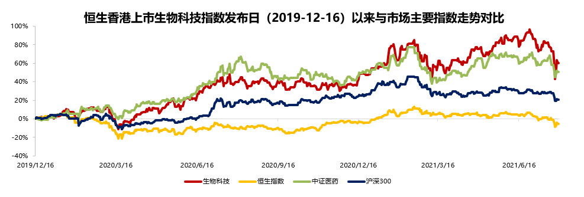
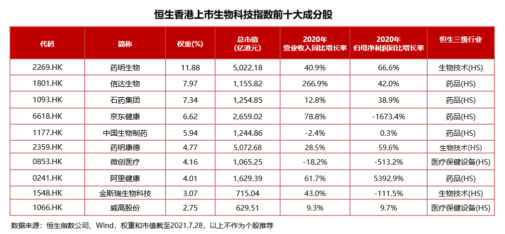

### 港股深度回调，有什么机会值得我们多看几眼？

港股是我们中国和外资良性互动的一个中转站，这种显而易见的战略部署让投资者们无法忽略这个极具特色的市场。我们聊到港股的投资通常会关注这么几个板块：

**1、A/H股折溢价**（AH两地同时上市的企业，港股市场通常会有一个不错的折价，比如绝大多数银行券商保险股）；

**2、中国优秀的互联网企业**（我们中国大量优质互联网企业都在美股上市，无论从国家层面还是投资者角度都是不合理的，现在伴随着大量中概股的港股二次上市，甚至很多互联网企业直接港股上市融资，这些企业未来还会有很多发展的空间，也日渐成为了港股市场非常重要的一股力量）；

**3、港股里的生物科技企业**（港股的上市门槛对生物科技公司很友好，不要求有收入和利润的条款使得很多创新药企、新型生物制药企业都能在港股完成上市，这样的土壤可以孕育出更多有巨大前景的生物科技企业）。

那我们**今天主要聊的是港股里生物科技方面的投资机会**，希望也借这篇文章能和大家有个交流。

> 生物科技,兼具科技和创新的优质医药赛道

生物科技主要包括：**药品**（创新药的研发、生产、销售）；**生物技术**（研究、开发、制造有关生物物质产品，比如mRNA技术）；**医疗保健设备**（器械的研发、制造、销售）。生物科技行业尽管国家层面早就给予了高度的重视，也做了很多政策方面的创新鼓励与倾斜。但这个优质的医药赛道对于普通人而言是很晦涩难懂的，只是新冠疫情才让更广大的老百姓意识到大力发展生物科技的重要。

中国正加速老龄化，医疗健康需求日益增长。截至2019年底，中国65岁以上人口已有1.76亿，占总人口比例的12.6%。而且我们知道老年人的患病率、伤残率都要远高于平均水平，这就意味着他们需要消耗更多的医疗卫生资源。中国日益严重的老龄化现象背后，是可以预见的巨大医疗保健市场大蛋糕。

如果说老龄化带来的医疗消费是刚需，那么中产阶级对医疗质量要求的提升就是国民消费升级向医疗健康领域的一次延伸。中国的医疗健康行业正在由高速增长向高质量增长进阶，这是一个从舞台边缘迈向中央的过程。广大老百姓对医疗健康的品质要求越来越高，更多的人们愿意使用更好的药物、更好的器械；中产阶级更是对医保的依赖度在持续降低，他们更关心的是医疗的质量，而非医保是否覆盖。这些都是我们医疗保健消费升级的必然结果，也是中国老百姓可支配收入与幸福指数增长的一个佐证。

那什么东西可以很好的支撑起我国人民日益增长的医疗保健消费升级需求呢？我想必定是少不了生物科技，所以我看好生物科技板块的长期发展前景。

> 恒生生物科技，港交所新规造就全球第二大生物科技上市地

生物科技公司通常成立时间不长，更加专注于创新药物、技术的研发，所以很多非常有潜力的生物科技公司都不一定有收入和利润。但同时这些生物科技公司又很需要持续的资金支撑到首款产品的盈利，很有战略高度的港交所早在2018年4月修订主板上市规则时，就增加了《生物科技公司》上市新规：允许符合一定条件的未有收入、未有利润的生物科技公司上市。

由于港股允许符合条件但尚未盈利或无收入的生物科技公司上市，因而许多创新药企、新型生物制药企业以及其他生物科技公司都在港股完成上市。港股医疗保健行业上市公司共有179家，子行业占比前三分别是生物科技、西药、生命科学工具和服务。因为港交所对于生物科技行业的倾斜，使得登陆港交所的未盈利生物科技公司数量已达33家。此外，大市值龙头企业数量也在同步增加，目前已有16家公司市值在千亿港币以上。这也让港交所成为了仅次于美国的全球第二大生物科技类公司上市地，港交所这一优势也很好的弥补了大陆A股在相关方面的不足。

港股的生物科技对应的指数有**恒生香港上巿生物科技指数（指数代码：HSHKBIO）**，从恒⽣⾏业分类系统的业务⼦类别中选择属于药品、⽣物技术或医疗保健设备的54只上市公司证券作为指数样本（每季度调整一次），以反映香港上市⽣物科技公司的整体表现。下图我们也可以看到恒生香港上巿生物科技指数发布日以来的优秀业绩走势：

同时我们看到恒生香港上巿生物科技指数共包含了54只成份股，其中36只被纳入沪深港通（占比88.67%）、另有14只被纳入深港通（占比8.55%），总计占比97.22%。而且从成份股市值角度来看，其中有13只市值超1000亿港元、超3成个股市值大于500亿港元、仅6家低于100亿港元。以上数据表明该指数所选个股均为港股生物科技领域市值较高，流动性较好的标的（指数前十大权重股见下图）。

> 恒生生物科技ETF，指数管理大师华夏基金带你一键布局生物科技

**华夏恒生生物ETF（159892）**就是一只追踪恒生香港上巿生物科技指数的QDII产品，买入恒生生物ETF我觉得对于那些看好生物科技领域投资机遇、需要配置医药、生物技术等行业的投资者来说是一个不错的选择。

华夏基金作为境内最大的权益ETF管理人（总规模突破2200亿元），曾连续5年获评“被动投资金牛基金公司”，在ETF领域具备绝对的优势。这只恒生生物ETF的基金经理为华夏基金数量投资部高级副总裁赵宗庭，在管公募基金规模超600亿元，具备丰富的权益类ETF管理经验。

这些对于一只ETF来说就是规模和流动性的保障，同时也可以很有效地精准跟踪好相关指数。另外我们也看到恒生生物ETF的管理费只有0.5%/年、托管费仅0.15%/年，这对于一只QDII产品来说是相当有诚意的费率了。

最后我觉得港股经过这么长时间的回调，已经渐渐突显出布局的机会，同时如果你又恰好认为这么多港股里的生物科技企业有一个不错的未来，那么恒生生物ETF是你一键布局的绝佳工具。

