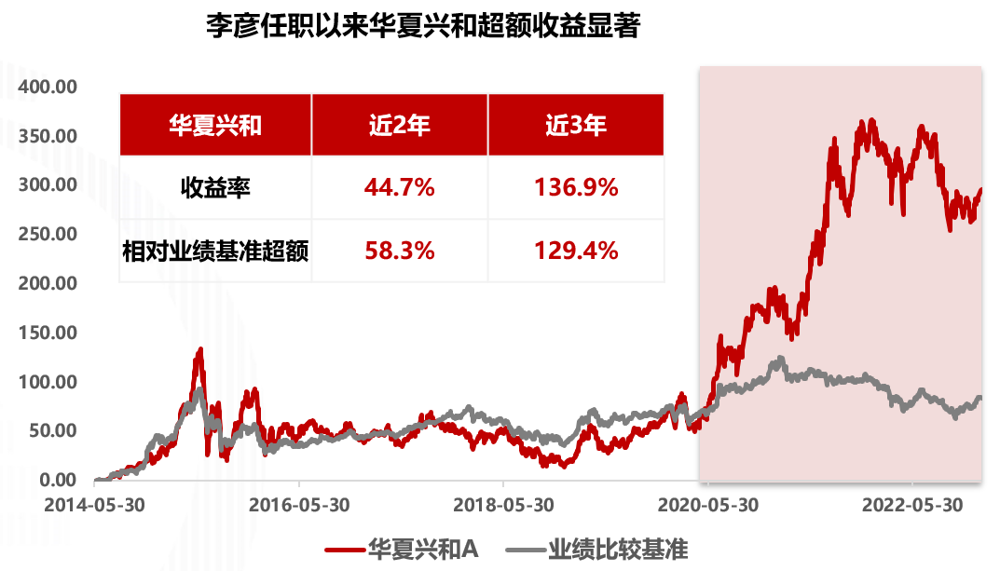
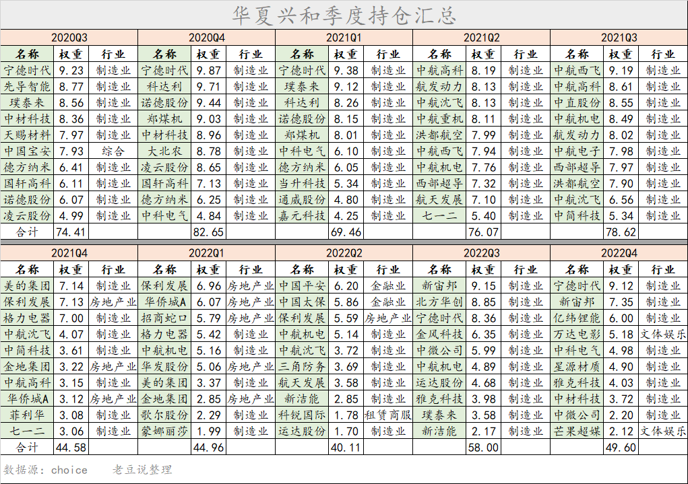

### 做好行业轮动是需要勇气和实力的

2016年后上证总在3000点附近徘徊算是老梗了，但与此同时我们也能清晰地看到A股结构性行情层出不穷。随着全面注册制的推行，这一现象大概率还会持续下去。在A股结构性行情下做行业轮动其实是蛮讨巧的一种投资方式，在赚取较丰厚收益的同时也对基金经理提出了更高的要求，故而主打行业轮动的优质基金经理也甚为稀缺。

那今天要和大家聊聊的就是一位业绩优秀的行业轮动型风格基金经理--华夏基金李彦。李彦于2020年6月接手华夏兴和，截止今年1月末，其任职累计收益高达110.6%，超越基准收益率104.0%，年化收益率高达32.6% 。同时华夏兴和的控回撤表现也很优秀，在近三个完整年度年化收益率超35%的情况下，最大回撤还能做到低于25%，体现到收益回撤比上就是远高于同类产品均值。

我认为在现如今A股浓郁的“价投”氛围下，有着如此鲜明“行业轮动”风格的李彦是颇具勇气的。他在管理华夏兴和的两年多时间内取得了翻倍收益，在银河证券评级中该产品近2、3、5年均位列同类前3。李彦在收益和回撤之间做到了较好的均衡，实实在在的业绩足矣证明他那套投资框架是切实可行的。

> 做多政策支持产业，感受行业轮动魅力

**基于政治经济学的跨周期行业轮动**是李彦的一大特色，我们的国情就决定了A股的投资是万万不能忽视国家政策的，对此不以为意的小伙伴我相信在2022年也受到了“令人信服”的巴掌印。李彦入行以来持续扩展能力圈，在20多个行业中找出最有投资价值且估值合理的那3~4个，深度结合政治与历史，从**未来五年成长空间、小周期位置、竞争格局、估值水平、股价相对位置**这五大维度进行跨周期行业比较，进而完成左侧前瞻布局并尽力缩短持股的等待周期（这点有利于基民持有体验的提升）。

我们结合华夏兴和的持股变化来复盘下李彦是如何践行他的投资理念？在2020年6月接手华夏兴和后，李彦很敏锐地加仓了新能源，要知道那个时候市场还沉浸在5G半导体的狂欢中。看着市场对新能源车的“爱答不理”，李彦在对政策的深度分析后果断押宝了新能源车（李彦对看准机会后的集中配置是很决绝的）。让持有人颇为满意的是，没过多久新能源板块就迎来了为期两年的狂欢，华夏兴和的净值一路上扬，宁德时代也在那波浪潮中获得了“宁茅”的称号。

时刻关注政策风向的李彦随后发现新旧能源的表述出现了微妙变化，而狂欢过后的新能源车板块整体已处于较高估值区间。在确定了未来三五年预期收益率并不太高后就逐渐清退了新能源行业，这也使得华夏兴和成功地规避了后续的大调整。需要说明的是，李彦这种风格致使其买入点不会太右侧，也不追涨不恋战，不刻意追求泡沫阶段的涨幅，最终效果就是能很好地控制产品的回撤。

2021下半年减持新能源后，李彦基于对航空发动机将要进入批量放量的阶段的判断，把部分仓位切换到了军工，要知道2012下半年军工指数涨幅近30% 。随后的2021年末，李彦又较早地观测到地产行业的供给侧变化，逐步加仓了以保利发展为首的龙头地产企业，迎接华夏兴和持有人的是2022年地产板块价值重估之下的大涨。

做多国家政策支持的产业可以规避政策对行业阶段性的“压制”，同时也等于要求基金经理不停关注与学习官媒信息来挖掘政策支持的产业（这也是行业轮动策略做得好的基金经理稀缺的原因之一）。这一次又一次行业轮动的成功，才堆砌出李彦代表作华夏兴和两年翻倍的优异成绩。如果一笔轮动完美可能是运气，但接二连三的轮动成功就是对其行业轮动交易框架有效的最有利佐证。其实我们自己投资也应如此，需要找寻到那个适合自己且可稳定复制的投资策略。

> 2023年看好新能源车、风电、半导体、人工智能

虽说李彦覆盖过的行业很多，投资过的也不少，但其在调研会议中也坦言未来还是希望能更聚焦自己的核心能力圈：**消费**（食品饮料、农业、家电、社服、航空、保险、地产）；**高端制造**（新能源、汽车、半导体、军工、精细化工）；**科技**（人工智能、云计算）。在谈及今年重点关注的机会时他提到了能源车、风电、半导体、人工智能，我们来分别简短的看下：

1、新能源车：扩大内需和加快建设现代化产业体系是2023年的重点任务，汽车作为现代化产业体系的重要组成部分，是2023年内需扩张、拉动全社会制造业升级的关键抓手。2022年下半年起动力电池估值剧烈收缩，当前可以优选竞争格局稳定、降本压力较小的标的；还可优选单车价值量大、下游新能源客户占比高的汽车零部件企业；另外汽车智能化作为后继，有望成为未来数年中最强劲的产业趋势之一，相关企业也是值得关注。

2、风电：受口罩影响，去年风电并网装机量有所下降，底部过去之后的2023年注定是个确定性大年。陆上风电目前已顺利从补贴过渡到平价，风光大基地第一批项目总装机规模97.05GW，将在2023年全部投产，第二批项目正在陆续开工。海上风电更靠近东南沿海用电负荷较大的城市，运输效率更高，目前各省“十四五”规划海上风电装机持续扩容。

3、半导体：全球政治格局持续不稳定，要命的是我们国产半导体设备仍处于起步阶段，好在国家产业政策扶持力度也是空前的大。外加汽车智能化的助推，半导体设备、材料板块高增长确定性较强，产业的结构性复苏机遇可期。

4、人工智能：我国AI市场规模达82亿美元，仅次于美国和欧盟。在ChatGPT的热潮下，国内外巨头对人工智能内容生产的投资力度空前，这是有望成为贯穿全年的投资方向。

总得来说，李彦对2023年还是比较乐观的。他认为当前股票市场的货币环境较好，各行业也都正处于复苏通道内，中期需求向好的板块会有较大的投资机遇，当然也更看好成长股。为此他的新基金华夏行业甄选混合（A类:017600 / C类:017601）也已选择在3月6日发售，对市场结构性机会、行业轮动有兴趣的小伙伴可以关注下该产品。

