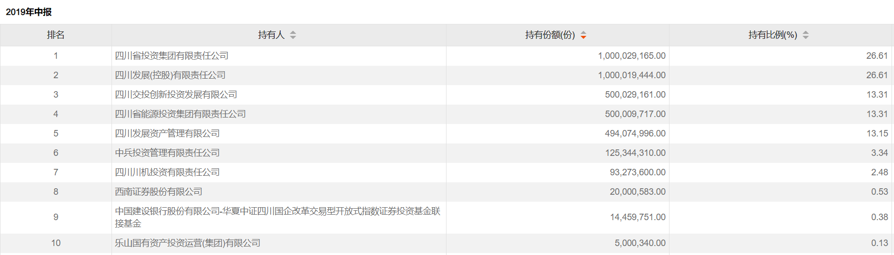

### 国企借道基金变相减持后，四川ETF终止上市

大家知道很多上市企业背后都有国企的背影，有的是入股、有的则是控股。我们国家在面对国有资产的时候总是分外敏感，所以这些股份上市后一般不太减持，即便少量减持也是需要低调又谨慎。

另外需要特别提出的是，ETF在认购的时候是可以用部分成分股去换取ETF份额的（而平时的申购需要几乎完整的成分股比例兑换），这就给一些指数成分股的大股东带去了变相减持的机会。

当然这种减持是相对中性的，因为个股换成ETF份额后通常也不会立马减持，即便后面减持也是等于将一揽子的股票卖出，这种卖出通常是相对温和的。而对于大股东来说也不必披露自己的减持计划，提升了减持过程的便利性，对应的市场情绪也更可控些（股民看到大股东减持总是会有所惊慌的）。

为什么再次说起这些呢？今天看到了华夏基金的一则信息：四川ETF(全称：华夏中证四川国企改革交易型开放式指数证券投资基金)发布公告，该基金将于11月9日终止上市，截止11月7日，该基金份额规模0.0139亿份。

是不是有小伙伴感到困惑：这ETF还有终止上市的？这个我也要解释下，很多初阶基民都误以为ETF是”永续“的，其实这个理解上是有误差的。通常来说指数是近乎永恒的，但对应的ETF产品是存在退市可能的。（为防止部分杠精，我再补充一点，为什么说指数是近乎永恒，因为当一些指数编制规则大幅度修改后，那么以前的它和现在的它很大可能就不是代表的同一事物了。）

我看到公告后的第一直觉就是，这只四川ETF大概率是当初为地方国企借道减持上市公司股份向华夏基金”定制“的，再大胆猜测下这个指数在编制选定成分股的时候也是有”外界因素“考量在内的。当然也有必要再次重申：我不认为这种操作有什么大问题，甚至比暴力减持要好得多。最后我简单贴几张图，以此来佐证我的猜想（地方国企初始认购换股规模近38亿，一年多后直接清仓式减持套现，最后又过了两年迷你规模后不得不终止上市）：

图1：四川ETF从成立到2020年二季度末清仓式减持前机构持有份额比例均在99%以上

图2：四川ETF成立后第一次中报显示前十持有人近乎清一色为四川相关国企

