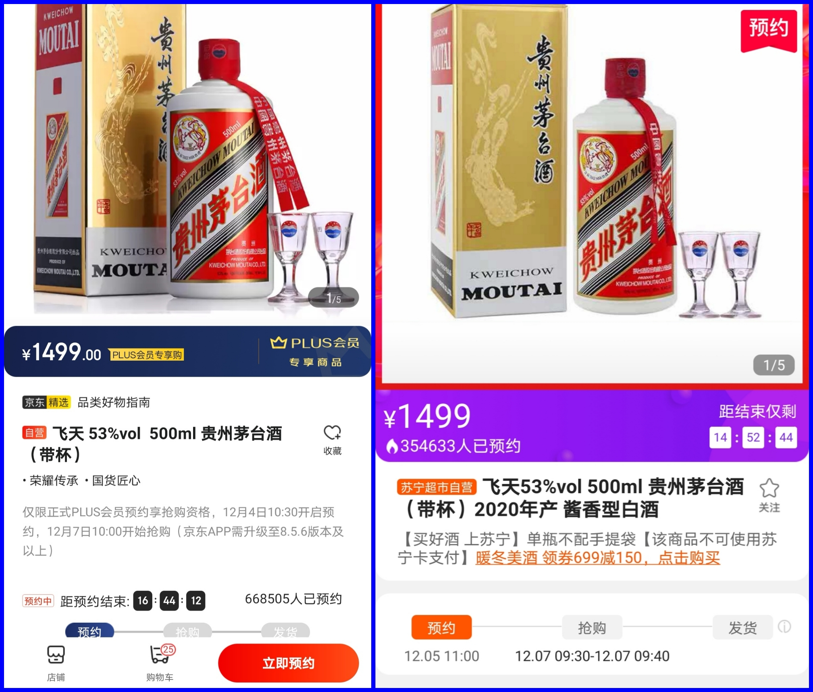

### 年关将近，你年货清单列了些什么？

快要过年了，硬核年货茅台、五粮液又得备起来了。比如我不喝酒，但这不妨碍我知道：过年送老丈人怎么也得五粮液吧。像今年这种股市行情不错的，来个贵州茅台肯定是更好的了。我们都知道53度的飞天茅台官方指导价是1499元，但绝大多数人很难以这个价格买到。生活中绝大多数商品的实际售卖价要低于指导价，而飞天茅台则是远高于指导价的。

去年开始几家大的网购平台都拿1499元的茅台来做会员促销的噱头（付费年卡会员才能预约抢购），比如我常去的京东和苏宁易购都有这样的抢购活动。可我试了3次后根本抢不到，即便你设好闹钟准点候着还是没戏。我知道有人比较幸运或者可能通过借助脚本程序抢到了，我看着每次都有大几十万的人在抢就怕怕，反正我是放弃了。这个里面利润还是很大的，1500抢到后2600轻松卖出套现，如果平台方没有数据造假的话，那肯定会吸引很多专业的黄牛去抢这些茅台酒。

别说1499元，就是1999元都大批人抢着买（拼多多双12补贴后还要2300元）。我经常买菜的一个APP双12搞活动，预充值5000元除了平时的送补贴福利外，今年额外加赠可以1999元价格买一瓶飞天茅台酒。反正我是立马充值了，即便我当时账户里还有3千多元的余额，这个买菜平台一年活动不超过2次，而且都很实在。

我注意到最近大家对白酒板块的争议变多了，有个段子我想大家最近都看到了，就是流传着一份《白酒行业2021年度策略》.pdf，点开一看就是两个字【不卖！】。当然看空的言论也很多，很多时候不同声音的背后是他们自身持仓决定了他们的言论立场，一般我正反面论点都会看看，但不参与这类辩论。**如果你要问我什么时候该撤退？我会说：当你1499元可以很轻松买到飞天茅台的时候，就是白酒行业的转折了，但现在我还看不到这一点。** 我是2012年左右入股市的，我经历的每一次白酒行业调整都是很好的上车机会，如果8年都不能说明一些问题，我不知道该怎么说服你继续持有白酒了。

老丈人送的是茅台、五粮液，那七大姑、八大姨走亲访友有啥必备产品的？对！就是牛奶。比如有小朋友的就准备些玩具，大一点的孩子可以是坚果大礼包，还有一些喝不了高度酒的老人就送箱黄酒或椰岛鹿龟酒。但是中国人送礼讲究双数，如果你最后发现少点啥，又不知道买啥时候，那么补上一箱牛奶肯定错不了。我一般会选择蒙牛的特仑苏系列和伊利的金典系列，这个老人们见了也有品牌辨识度（我老家离上海近，光明的高端系列也是被认可的）。

坦率的说，我从小农村长大，自己比较稳定的喝上鲜奶还是在县城上了初中后才有。再看看我女儿这一代孩子，对乳制品的摄入**不止是要有，而且还要高品质**。婴儿奶粉就是一个开端，我身边同学朋友基本上都是给孩子买进口的奶粉，而且现在都流行给孩子们喝到4段，我女儿就是到幼儿园中班才换成我们成人牛奶的。我们家大人喝的牛奶近两年的一个变化就是几乎都是低温巴氏奶了，常温奶自己很少买。而且我发现喝低温奶有个附加好处就是：逼着大家买后就赶紧喝掉，无形之中督促大家多喝牛奶，而常温奶经常会忘记喝。

所以我们全国人民对牛奶的需求，以及对奶制品品质的追求是很大的。再比如近两年很流行的妙可蓝多，这东西我女儿就很喜欢吃，即便有点小贵但女儿要吃就得买呀，我偶尔也拿点吃下，确实口感不错。今年5月底我还有幸去成都参加了新乳业公司的调研活动，通过参观乳制品企业的牧场和工厂，我对低温奶的市场更有信心了，也看到了中国人乳制品需求的升级之路。**如果你问我中国乳制品业什么时候撤退？我会说：我暂时看不到头，这东西是刚需啊，而且大家对品质的追求从未停止。**

从年货清单这个小视角，我们就能发现食品饮料这个行业的投资逻辑就在于“确定性”！熟悉的朋友知道我免费公开的基金组合【薪火相传】里，也是有食品饮料指数基金配置的，这就是最实在的知行合一。现在国际环境不稳定，外部经济体的生活生产还没很好的恢复，所以我们国家今年也一直在大力提倡“经济内循环”。内循环的本质就是出口转内需，拉动国内投资、刺激本土消费，那么食品饮料就是我能想到处于第一位的内需了，这就呼应了我刚说的：**食品饮料的投资逻辑在于“确定性”。**

但摆在散户投资者面前的问题是：一直缺少可场内交易的食品饮料ETF。为什么说是散户呢？因为机构投资人要买白酒会自己去买贵州茅台，但是一手就要18万多的茅台股票可以吓退95%以上的投资人。所以几百块起步的ETF是我们小散的最佳选择，比如华夏基金新推出的食品饮料ETF在12月21日 ~ 23日可以进行网上现金认购了（认购515173、交易515170），这是全市场首批食品饮料类ETF，还是蛮稀缺的。

我们看上图为中证细分食品饮料产业主题指数（000815）的前十大成分股，该指数在12月14日调整了成份股后现正好为50个，前7权重股（权重超5%）可以说都是硬核个股。有多硬核我给大家看一组直观数据（前7成份股今年以来收益、截止2020年12月20日）：**五粮液 +110.96% ，贵州茅台 +57.78% ，伊利股份 +35.13% ，海天味业 +112.82%，泸州老窖 +139.05%，洋河股份 +97.42%，山西汾酒 +270.79%，** 我就问你刺激不刺激，是不是有种让你怀疑人生？指数的头部结构也很明晰：4瓶白酒 + 1瓶牛奶 + 1壶酱油，而且个股权重不受10%的限制。食品饮料行业的龙头效应是很明显的，这就给食品饮料ETF有了更多赶超消费类基金的可能。

> 小结

明年大环境还是有很多不确定因素存在，经济的全面性复苏也很难短期内就到来，那么确定性极强的食品饮料板块我依然觉得是有机会的。如果想参与下消费板块，那么对于散户来说，门槛低、交易便利的食品饮料ETF是一个不错的选择。好了，就这样，我要去准备年货了，嘻嘻！

