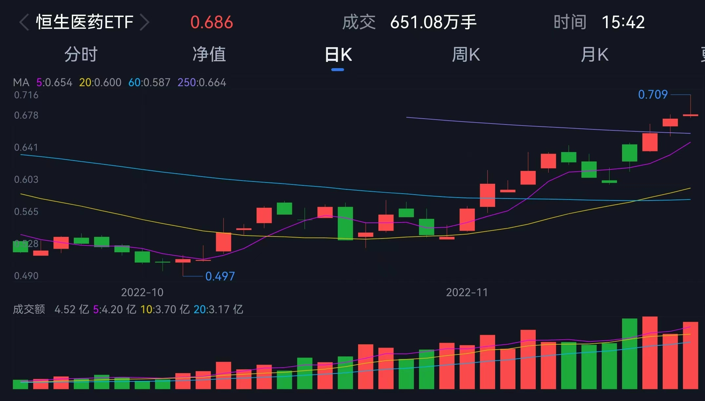

### 感觉医药又可以了

最近很多人都有在聊医药板块，其实我自己的组合下半年也有对医药类基金进行加仓，所以今天就简单聊聊我近期对医药板块的一些看法。

- 集采影响触底，下杀空间有限

其实在“集采”这事出来前，医药板块当年可是白马军团的一个典型，在抱团鼎盛时期大家貌似已经形成了一个投资共识：“在中国“喝酒吃药”行情是可以穿越牛熊的！”。

可惜这一切就这么终止于“集采”，先是医药后器械，集采所到之处真是血流成河，不管最后企业有没拿下集采任务，对应的股票肯定是“先跌为敬”。现在回头看不得不承认：医保集采是导致医药行业估值持续走低的主要原因，但我认集采政策超市场预期的风险已经基本出清了。

说直白点就是，这几年一次又一次的集采已经开始让大家习惯面对了，这种估值预期的改变也都已很好的体现在了股价里了。我也相信随着集采政策逐渐温和，现在估值已处于历史底部的医药行业进一步下杀的空间非常有限。

- 防控措施优化已成医药行业新行情催化剂

伴随着石家庄致市民信的发布，全国各地都开始落实最新的防控二十条措施，可预见的未来医院就诊秩序会进一步恢复，就诊量也会伴随着回升到疫情前（2019年全国诊疗人次达87.2亿，而2020年因口罩问题降至77.4亿人次）。

伴随着各大城市的放开，大家对于医疗资源建设、新冠疫苗接种覆盖、新冠药物器械储备和重点人群保护的需求都会进一步出现。正如石家庄的这封信里提到的【每个人都是自己健康的“第一责任人”】，后疫情时代对医疗服务的诊疗恢复、流感/新冠诊疗及药品需求提振会很凸显，在这些利好的加持下，医药板块或许将迎来更大的机会。

- 港交所新规造就全球第二大生物科技上市地

生物科技公司通常成立时间不长，更加专注于创新药物、技术的研发，所以很多非常有潜力的生物科技公司都不一定有收入和利润。但同时这些生物科技公司又很需要持续的资金支撑到首款产品的盈利，很有战略高度的港交所早在2018年4月修订主板上市规则时，就增加了《生物科技公司》上市新规：允许符合一定条件的未有收入、未有利润的生物科技公司上市。

由于港股允许符合条件但尚未盈利或无收入的生物科技公司上市，因而许多创新药企、新型生物制药企业以及其他生物科技公司都在港股完成上市。港股医疗保健行业上市公司共有179家，子行业占比前三分别是生物科技、西药、生命科学工具和服务。因为港交所对于生物科技行业的倾斜，使得登陆港交所的未盈利生物科技公司数量已达33家。此外，大市值龙头企业数量也在同步增加，目前已有16家公司市值在千亿港币以上。这也让港交所成为了仅次于美国的全球第二大生物科技类公司上市地，港交所这一优势也很好的弥补了大陆A股在相关方面的不足。

港股的生物科技对应的指数有恒生香港上巿生物科技指数（指数代码：HSHKBIO），从恒⽣⾏业分类系统的业务⼦类别中选择属于药品、⽣物技术或医疗保健设备的61只上市公司证券作为指数样本（每季度调整一次），以反映香港上市⽣物科技公司的整体表现。前十大权重股主要分布于药品、生物技术、医疗设备保健等板块，所选个股均为港股生物科技领域市值较高，流动性较好的标的。

- 恒生医药ETF，一键布局医药反弹

华夏基金的恒生医药ETF跟踪的就是上面说的恒生香港上巿生物科技指数，华夏基金作为境内最大的权益ETF管理人（总规模突破2500亿元），连续7年获评“被动投资金牛基金公司”，在ETF领域具备绝对的优势。

该产品十月份以来交易额明显提升，近20交易日均交易额已达3亿多（换手率在80%+），这除了凸显了近期医药板块的热度上来了，也表明华夏基金在ETF领域确实很在行。而产品的管理费只有0.5%/年、托管费仅0.15%/年，这对于一只QDII产品来说是相当有诚意的费率了。

最后呢我觉得如果你认同医药未来中长期的爬升逻辑，那么借助ETF产品轻松参与会是个不错的选择。

