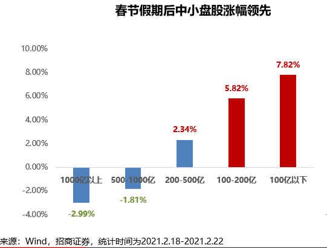
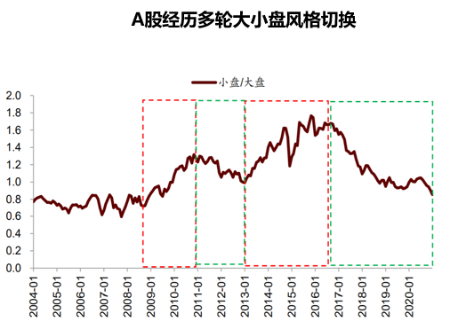
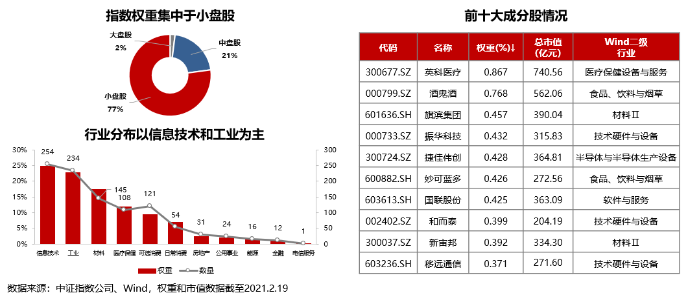

### 很多人开始讨论风格转换了，是吗？

大家有没发现，过完年后讨论“风格转换”的人越来越多了，伴随着白酒等基金重仓股的大幅回调，这种声音越来越大了。那事实真的如此吗？如果是，那我们该如何应对这次的风格转换？

近两年才入场的新朋友们可能会以为：中国股市都是大蓝筹的天下，投资嘛就是盯着机构重仓股往上怼。但是稍微老一点的股民、基民都知道，以前很长一段时间也是小盘股的天下。其实这两者情况都没有对错，就好比春夏秋冬四季变换，这就是投资世界的阴晴圆缺。一种风格的形成就是另一种风格的凋亡，**当市场内绝大多数人都对某些预期高度一致的时候，就会把对应的市场风格推演至极致**，直到大家没人再怀疑。

甚至有投资者提出：经过这么多年的洗礼，如今的A股比以前成熟很多了，那么多人借道基金参与股市投资，怎么可能还会有以前那种“小票行情”呢？关于这类观点呢我想说，美国股市够“成熟”、机构参与度够高了吧？那么你再去看看标普500和罗素2000（代表美股小盘股）近20年的走势比对，会发现还是呈现出了大盘股和小盘股的风格轮动。因此不是说市场成熟了、投资者结构优化了，就一直大盘股会比小盘股表现好。股价最终的驱动力是企业的盈利成长性，再好的企业如果被追捧的太高，溢价太过高了之后只有两个出路：要么继续高成长用时间去消耗溢价；要么股价回调并向市场均值水平回归。

上面我们在理论层面讲述了：**大小盘的风格轮换实属常态，周而复始才更符合人性。**那我们用一些数据去看看当下的A股是否真的有迹象表明开始变天了？

**1、春节后公募基金等机构的调研力度向中小市值公司倾斜**，被调研数量最多的前五大行业依次是医药生物、电子、机械设备、建筑材料和计算机。个股方面2月份被调研次数前五名的分别是爱美客、周大生、航天发展、杰瑞股份、传音控股。这个调研方向的变化预示着公募下阶段布局的趋势很可能会转向中小盘，至少不再是单纯的挤在高溢价的龙头股里。不少细分龙头和二线蓝筹得到了很多机构的关注，这些标的在未来几年里利润有望持续高速增长，并且当下估值显著低于行业平均水平，我想这些也都是机构们试图去挖掘的好股票。

**2、春节假期后中小盘股涨幅领先**，100亿以下市值公司平均涨幅7.82%，100-200亿市值公司平均涨幅5.82%，显著优于大市值公司（详见下图）。

**3、2009年开始A股经历了四轮大小盘风格**，这四次风格最短是两年，最长则是本轮大盘风格持续占优四年，每次风格持续的时间 2-2.5 年。下图可以看到红色框内为偏小盘时期，绿色框内为偏大盘期。这种兴衰更替让我想起了三国演义的开头那句：天下大势，分久必合、合久必分。所以从势能积蓄的程度上看，确实也有风格转换的动力存在。

经过上述分析我们可以认定近期市场存在大小盘风格转换的情况，并且这个趋势有进一步放大的可能。那我们普通投资者该如何应对这次的风格转换呢？我认为大家应该重视这种风格的转换，有信心的朋友可以逐渐开始配置一些中小盘资产，比如华夏基金在3月4日开始发行的**华夏中证1000ETF（159845）**，至少应该关注起来。

大盘向小盘的风格切换，那么中证1000就是一个不错的可配置指数，何况中证1000也是我们平日里观测市场风格的一个重要指数。虽然是常识，但我觉得还是有必要和大家啰嗦几句，因为真的一直有不少朋友会对几个常见宽基定位有一定的误解。**中证100**（沪深两市前100企业）；**沪深300**（沪深两市前300企业，包含中证100）；**中证500**（沪深两市排301 ~ 800的企业）；**中证800**（即沪深300+中证500）；**中证1000**（沪深两市排801 ~ 1800的企业）。需要注意的是上面提到的排名均为市值排名，因为指数编制也考虑了流动性等其他问题，故极个别成份股异常不在本文讨论范围内。另外送大家一个小贴士：上述主流宽基都无法覆盖的成份股大家也就不用看那些个股了，毕竟4千多的个股里若前1800都排不到，也就没啥看头了。

我们看下中证1000指数的市值分布，成分股以小盘股为主，权重占比达77.13%；从行业分布来看，信息技术、工业、材料和医疗保健四个Wind一级行业权重占比超76%；从成分股集中度来看，前十大成分股权重合计占比4.97%，成分股分散度较高，行业分布更为均衡。上述的这些特性让中证1000指数对应的基金产品有望成为投资于中小市值股票的良好工具，也是这次风格转换中投资者在大小盘之间进行轮动操作的可选标的。

既然提到了华夏基金的ETF产品，我顺带感叹下华夏基金在ETF方面的强劲实力。上证50ETF这种拳头产品就不多说了，反正长期雄踞市场第一。近两年华夏基金在ETF方面的布局已经到了近乎无懈可击的地步，你能想到的宽基、行业、主题、海外等指数几乎都有涉及，而且频出爆款。另外值得我敬佩的是在ETF交易的流动性上华夏做得无懈可击，你很难找到几个华夏基金里面ETF流动性不好的，华夏基金对ETF方面的布局气势今年依然强劲，【‘指’选华夏】的ETF超市口号果然名不虚传。

> 小结

A股近期有大小盘风格切换的趋势，理论上可解释、数据上有支撑。面对这种趋势的变动，我们可以通过配置**华夏中证1000ETF（159845）**来应对，有需要的朋友可以关注下。
