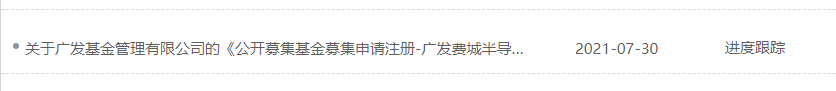
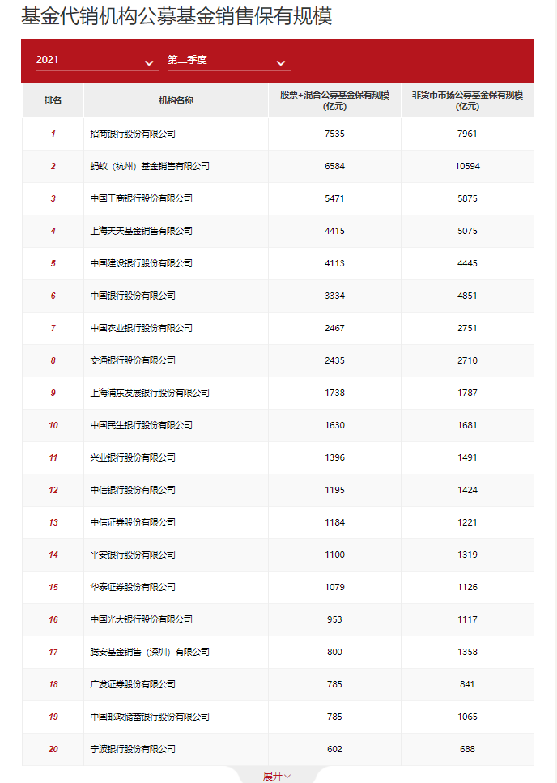

### 二季度基金代销机构规模排名已出

在说基金代销机构规模排名前先说个事：又一家基金公司申报了费城半导体ETF。

前天我还说看后面还有哪家会跟着申报费半ETF，果然没让大家等太久。**继国泰基金（22日）、嘉实基金（28日）后， 今天广发基金也申报了费城半导体ETF。**

关于这块周三的文章里已经提过了，而且那篇还说了最新的二季度基金公司非货币基金规模排序，有兴趣的可以去看看☞《又一家申报了费城半导体基金》

与基金公司规模排序不同的是，今天最新出来的数据是**基金代销机构非货币基金规模排名**，基金销售排名的激烈程度我觉得比基金公司规模排序还要强。话不多说，直接看图说话（上图为最新的前20名榜单），我看过数据后有几点小感受和大家分享下：

1、与基金公司规模排名一样，**前20名成员保持不变，只是有部分机构换了下名次。**而且你会发现20~50的排序变化要远大于1~20名，外加第二梯队的小兄弟稍微有点拉跨，想上来也没那么容易。

2、重点表扬下**天天基金，一举超过建设银行站上第4名**，并且拉开了三百多亿的距离。互联网第三方基金代销渠道超过传统线下渠道是早晚的事，这种趋势是无人可挡的，年轻人用APP点几下的事，只有中老年人还会去柜台排队买基金理财。

3、再看看老大哥**蚂蚁基金，非货币基金规模超万亿**（巧的是本季度易方达基金非货币规模也刚超万亿），只能让我不禁说一句牛X。在金融方面比较克制的腾讯，旗下的腾安基金排在17名，本季度也上升了1位。

4、互联网代销渠道阵营的小弟里排在20~50名的还有：**29名盈米、31名同花顺、32名基煜、36名蛋卷、43名京东、45名陆金所、46名好买。**他们对应的一季度排名后可以看到除了京东超过了陆金所和好买网，其余的先后顺序基本没变。虽说互联网基金代销是大势所趋，但也不是每家的体验都做得很好，比如我用过的陆金所基金就比较糟糕。**随着这个榜单的持续发布，销售机构淘汰会越来越激烈，**对于普通基民肯定也只会考虑前几名的那几家。

5、另外需要重点关注的是**华泰证券，从一季度的20名直接上升5位来到了第15名。**具体规模也从一季度的545亿飙升到二季度的1079亿，直呼优秀。还有广发证券和中国邮储虽然都是785亿，但股票+混合公募基金保有规模是精确至0.01亿元后排序的，可谓是非常胶着。