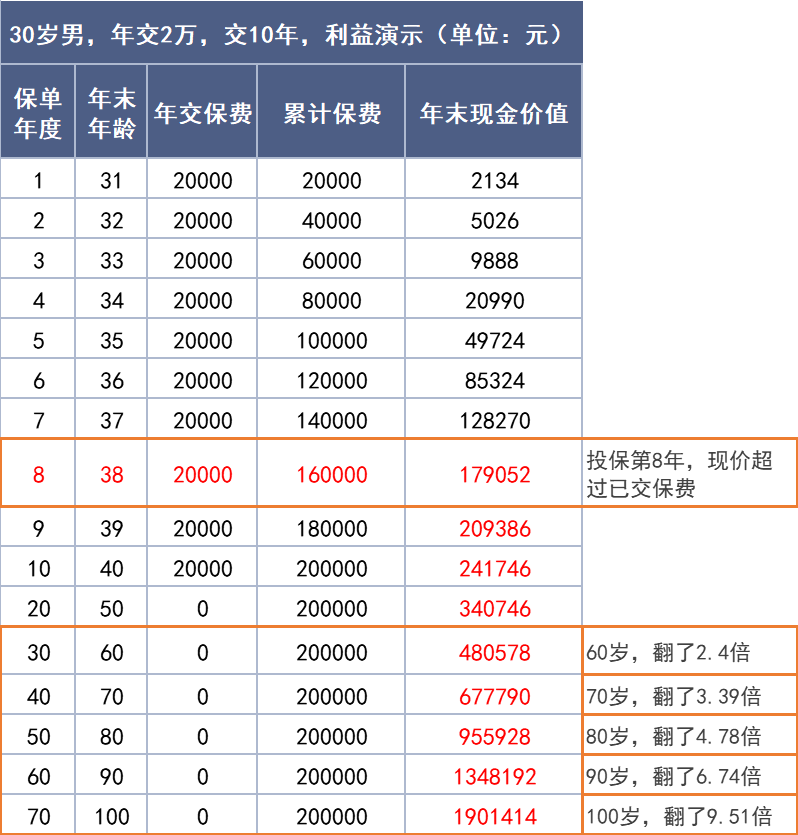
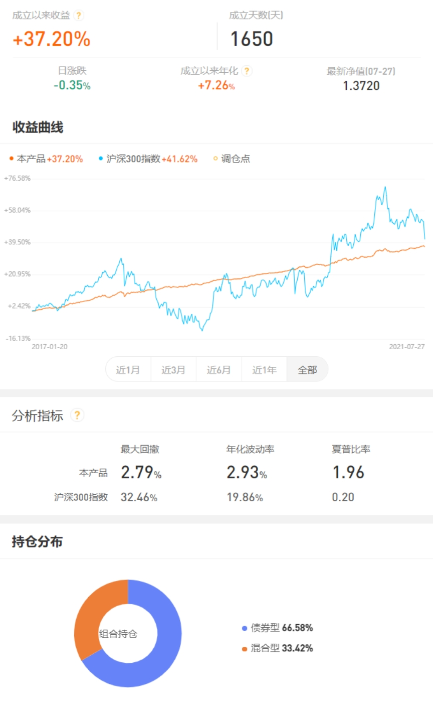
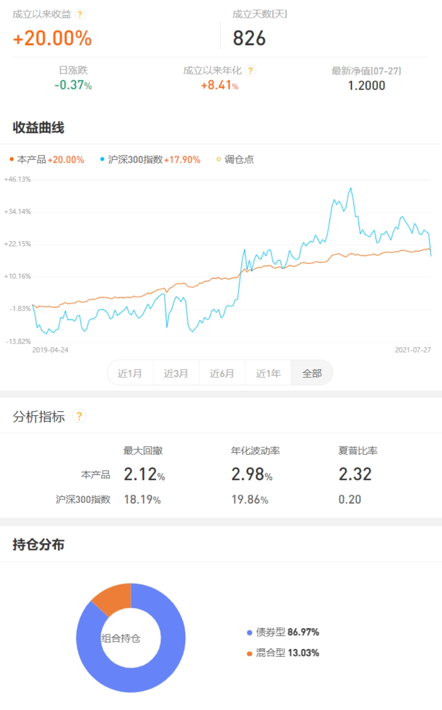

### 股市天雷滚滚，哪边可以躲个雨？

最近股市真的是泥沙俱下，上证周一跌破3500点、周二再破3400点，跌得那个叫酣畅淋漓、毫不做作。昨天还有朋友问我说，手里的基金跌得一塌糊涂，该怎么办？我说：股票基金这些权益投资有暴涨也必然有暴跌，**如果你受不了这种波动较大的产品，那可以考虑配置些稳健理财或保险产品。**

我知道很多自己炒股或者买基金的小伙伴是看不大上这类年化收益不足4%的产品的，换做平日里我对大家说可以配置点保险也不错估计会被喷，但这两天股市跌得“信仰缺失”了，你们也就能体会稳稳的年收益也是蛮香的。光这么聊可能大家没有更为详细的认知，那我就找一个保险产品例子和大家剖析下。**先声明我自己不卖这款保险哈，看后觉得还不错想要的可以自行百度后去买。**

举的例子就是这款【金满意足臻享版】，为什么是臻享版呢？因为这是慧择与弘康人寿定制的一款产品，在这之前慧择也和横琴人寿定制过【金满意足】，所以升级后的臻享版在条款内容上也对得上“臻享版”。太详细的条款我就不说了，简单说几点比较突出的吧：

**1、写入保单的高收益。** 实际收益率（IRR）高达3.49%（监管规定最高3.5%），很早期就能超过3.4%；现金价值高，10/15/20年交的第8年即可回本；有效保额3.8%复利增长。

**2、投保条件宽松。** 75岁以下都能买、健康告知特宽松（糖尿病高血压亦可投）、职业限制1~6类均可投、最低5000元即可参与。

**3、支持隔代投保。** 我们平时买保险一般只能给自己买，最多是配偶、子女和父母，但这款可以爷爷奶奶给孙子孙女（外公外婆同理）。这个作为家庭长辈资金规划是非常实用的，我们偶尔会看到有些孩子爸妈真的不行，老人们已经被啃的受不了了，那么这类隔代投保的寿险就很有优势。这笔钱能很好的保证给到孩子，即使未来孩子爸妈出现债务危机也不受影响。（唉，我又想起了村里那位深陷网络赌博泥潭的小伙伴，妻离子散后年迈父母不得不外出打工替他还债。）

综上对于想快速摆脱月光族戒掉乱花钱习惯的人、**缺少稳定且高收益投资手段的普通白领**、想提前为孩子储备教育经费的爸妈、有财富传承需求的中高净值家庭，我觉得这款产品是可以去深入了解下的。

当然作为基金自媒体，我肯定也会给大家再说几个超稳健的基金组合。现在基金投顾产品很多，投顾行业现在也是处于混沌期，很多产品需要时间去验证业绩。自媒体组建的组合更是百花齐放，但既然是给投资经验较少、风险承受能力较弱的投资者的稳健推荐，我肯定更倾向于更可靠的基金公司组合。本次推荐的有：交银的【我要稳稳的幸福】、兴全的【兴全低波动小确幸】，同样这两款是非常有业绩和口碑的“稳健理财”类基金组合，大家可以在很多主流基金代销平台上可以跟投（去对应的基金公司官网也行）。

**1、我要稳稳的幸福**：成立1650天、年化收益+7.26%、最大回撤2.79%、年化波动率2.93%，再看看上图的历史净值曲线，我只能说非常好看。

**2、兴全低波动小确幸**：成立826天、年化收益+8.41%、最大回撤2.12%、年化波动率2.98%，再看看上图的历史净值曲线，也是非常地好看。

对于这两个成立时间长久、组合运行平稳的稳健型基金组合，我是比较推荐小白投资者或者管不住手的人去储蓄式定投。这些组合就是大比例的债券基金打底，配合小仓位的权益混合基金增强收益，**在可以接受有限风险波动的情况下获得了较为稳健的收益率**。而且这两家基金公司给出的稳健组合也会经常给大家做一些月报或者市场行情解读，对于想多了解下投资的朋友也是一个不错的学习途径。

> 小结

股市风云变化，不能只想着吃药喝酒行情，也不能把所有资产都堆到新能源车、芯片制造等高估值行业上。甚至我觉得有必要**再次呼吁大家投资到股市里的钱应该是闲钱**，对于养老或者有长远计划的钱我们应该老老实实投到一些更稳健的产品上去。比如上面提到把固定收益写到合同里的增额终身寿险【金满意足臻享版】；再比如头部基金公司构建的长期稳健债券增强组合【我要稳稳的幸福】、【兴全低波动小确幸】等。希望大家不要等头顶下雨了才想起买伞，也不要等股市暴跌了才领悟稳健理财真香，我们中国文化里的未雨绸缪还是值得传承下去的。

