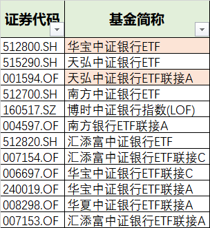
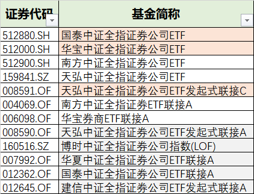
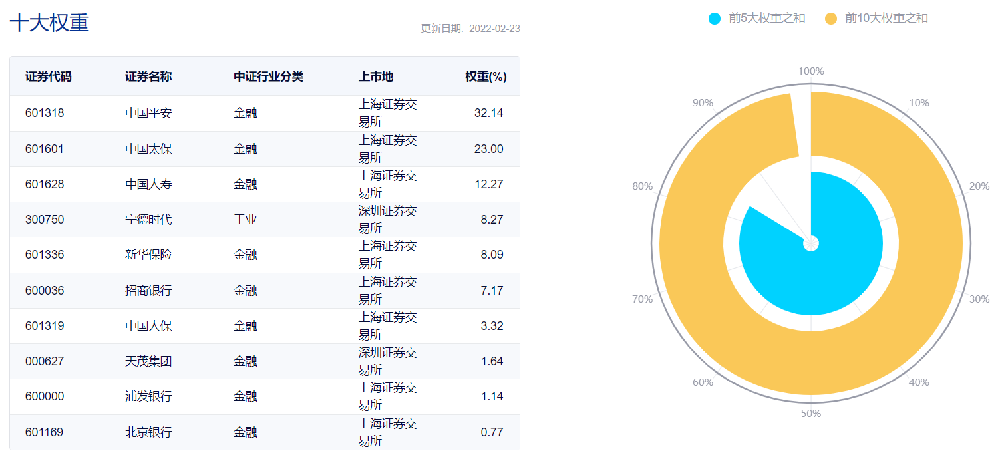
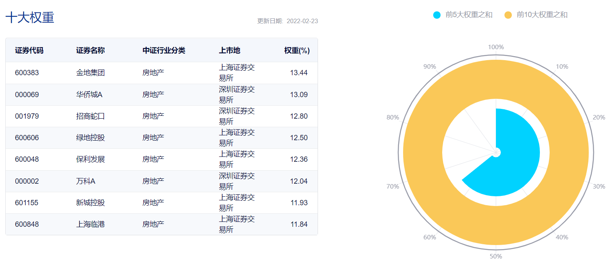
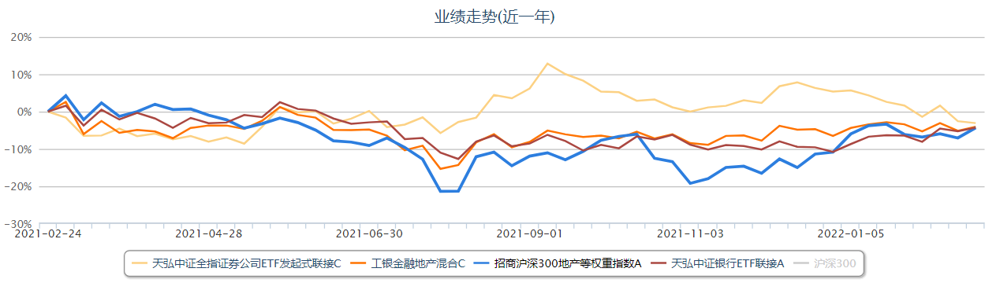

### 宁德时代跌了，你们才想起金融地产？

我知道市场上还是有不少金融地产（银行、券商、保险、地产）板块拥护者的，即便在长期阴跌之下他们依然笃定地“坚守”着。但更多投资者是看不上这些板块的，要不是因为以宁德时代为首的整个“碳中和”概念近期一泻千里，我想话题君也不一定会组织这期的活动。

这期话题君拿出来的五只产品分别是：天弘中证银行ETF联接A、易方达中证全指证券公司指数LOF、方正富邦中证保险主题指数、招商沪深300地产等权重指数C、工银金融地产混合C。我对金融地产是没有偏见的（龙头个股和指数基金均有仓位），甚至对券商这样的板块我也毫不隐藏对其的喜爱，但话题君这次给的五只产品我认为不全是最优解，详细的我们一一讲讲。

**1、银行类指数基金**

现有跟踪中证银行（399986）的指数产品一共有34只，我们初步筛选后得到12只基金。

a、剔除管理费高于0.5%的产品（招商ac、富国LOFac、华安ac、鹏华LOFac）；

b、剔除ETF类近一月区间成交额少于5亿元的产品（易方达LOFa、易方达ETF、华夏ETF、鹏华ETF、华安ETF、富国ETF）；

c、剔除场外非联接基金规模小于3亿元的产品（东财ac、中融LOF ）；

d、剔除场外C类销售服务费高于0.2%的产品（天弘联接c、南方联接ce、易方达LOFc、华夏联接c ）；

银行板块虽然比较稳健，但银行的拥护者们好像更愿意自己买银行个股，你看社区论坛上招商银行、宁波银行、平安银行都有一大堆粉丝。虽然我也认同银行板块的优质个股会明显好于指数，但如果你和我一样对银行研究不多且银行配置仓位需求不高的话，那么直接买点指数基金也未尝不可。个人建议场内优先选华宝，场外可以考虑天弘和华宝。

**2、券商类指数基金**

现有跟踪中证银行（399975）的指数产品一共有37只，我们初步筛选后得到12只基金。

a、剔除管理费高于0.5%的产品（招商LOFac、富国LOFac、华安ac、鹏华LOFac、易方达LOFac、长盛LOF）；

b、剔除ETF类近一月区间成交额少于5亿元的产品（汇添富LOFac、华夏ETF、易方达ETF、建信ETF、银华ETF、富国ETF、国联安ETF、华安ETF）；

c、剔除场外C类销售服务费高于0.25%的产品（华宝联接c、南方联接c、国泰联接c、华夏联接c、建信联接c ）；

券商板块我年初的时候写过一篇《2022年券商能否纠正估值与业绩的错配？》，总体还是抱乐观态度的，可惜年后大环境不是很友好，加上中信证券配售融资了两百多亿、东方财富转债3也在强赎后遇到了较大的卖盘压力。

有券商配置需要的朋友，我个人建议场内优先选华宝、国泰，场外可以考虑天弘。虽然我也很欣赏易方达这家公司的，但是这个券商指数产品上我真不理解话题君是如何选到易方达中证全指证券公司指数LOF这个产品的？

**3、保险类指数基金**

因为A股的保险股本来就没几只，上面考虑到系统风险等因素，导致市场上几乎没有像样的保险类指数产品。非要说有的话就是中证证券保险指数（天弘），中证800证券保险指数（鹏华）、中证证券保险领先指数（东财）、沪深300非银金融指数（易方达）。

但我们今天主要聊聊话题君提到的这个方正富邦中证保险主题指数（定制指数），该指数最近的一次被热烈讨论就是“宁德时代入选保险指数成分”。我们可以看到官方定义：中证方正富邦保险主题指数从沪深市场中选取20只保险行业与参股保险类上市公司证券作为指数样本，以反映保险主题上市公司证券的整体表现。

当时很多人吐槽一个保险指数为了蹭宁德时代的热度，硬把其拉入指数成分内，现在宁德时代跌得稀里哗啦更是被保险股爱好者们高密度吐槽。本来大家都是冲着保险股含量来的，你这么一搞就很没意思了，参股保险的可以算，但也应该考虑下该部分业务占该公司总业务收入的比例吧。

当然那天我看到群里也有小伙伴说：别吐槽啦，就这么一个含“保险”量足一点的基金，再吐槽就真没了。其实我想要是真那么喜欢保险，反正就那么几只（平安、太保、人寿、新华、人保），你买个股自己组合下算了。我自己的话没有保险类的指数产品，只有少量的保险个股作为配置。

**4、地产类指数基金**

地产类的指数还是较多的，有中证全指房地产指数（华夏、南方）、中证800地产指数（鹏华）、国证房地产行业指数（国泰）、沪深300地产等权重指数（招商）、沪深300金融地产指数（国投）、全指金融（广发）、中证金融地产指数（嘉实、长盛）...

这次话题君选择的招商沪深300地产等权重指数还是很有特点的，首先成份股只有8只，这种历史产物未来很长一段时间内都不太可能再有竞品了，而且这8只成份股是等权的。在众多地产指数里，该指数无论是集中度、还是龙头效应方面都很突出。而且去年新出的C类费率也很有诚意，加上当前规模也才7亿元左右，可以获得一定打新超额收益的。

我自己持有少量的地产龙头股，也都是去年用来替换原有的地产ETF，因为我觉得未来一段时间内地产行业的头部公司日子会稍微好过一点。那如果你自己买个股不方便，或者金额不是很多的话，我觉得这个沪深300地产等权指数还是可以的，该指数的8只成份股也不会有啥大问题。（顺带说下，这只基金几乎没有机构持仓，我猜机构要买的话组合买8只个股还是很方便的）

**5、金融地产主动类基金**

我对金融地产的主动类基金研究不多，所以简单地拉了下话题君提到的工银金融地产混合与证券、等权地产、银行的近一年业绩比对。可以发现四只产品一年下来又“聚”在一起了，工银的这只主动基金没能体现出什么超额收益，如果说回撤控制方面的话那也和银行指数没啥差距。容我粗浅地给一个结论：这只基金我是没有啥想买的欲望。

**6、小结**

最后回到题目，我觉得大家不能因为近期宁德时代这类票跌疼了，才想起金融地产板块。举个不恰当的例子：你本来就是一直喜欢小姑娘的，但不能因为心爱的小姑娘嫁人了才想起隔壁村的大姐姐。你可以喜欢大姐姐（大姐姐有很多优点，比如顾家、疼人），但不应该是你在外面吃了瘪才想起大姐姐的好。如果你心里还是念着小姑娘，即便现在和大姐姐在一起了，哪天小妹妹来找你，你又会屁颠屁颠地去追高了！

用你二大爷的一句话结尾：狗蛋，你把握不住呀！