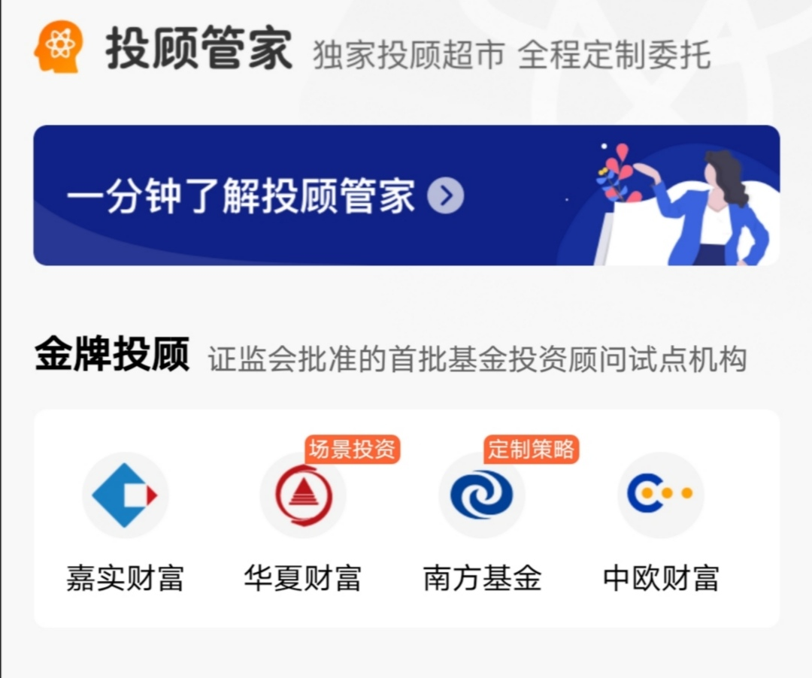
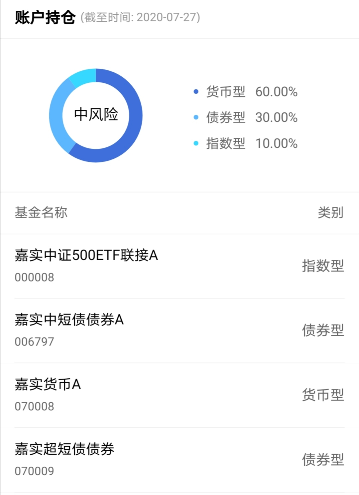
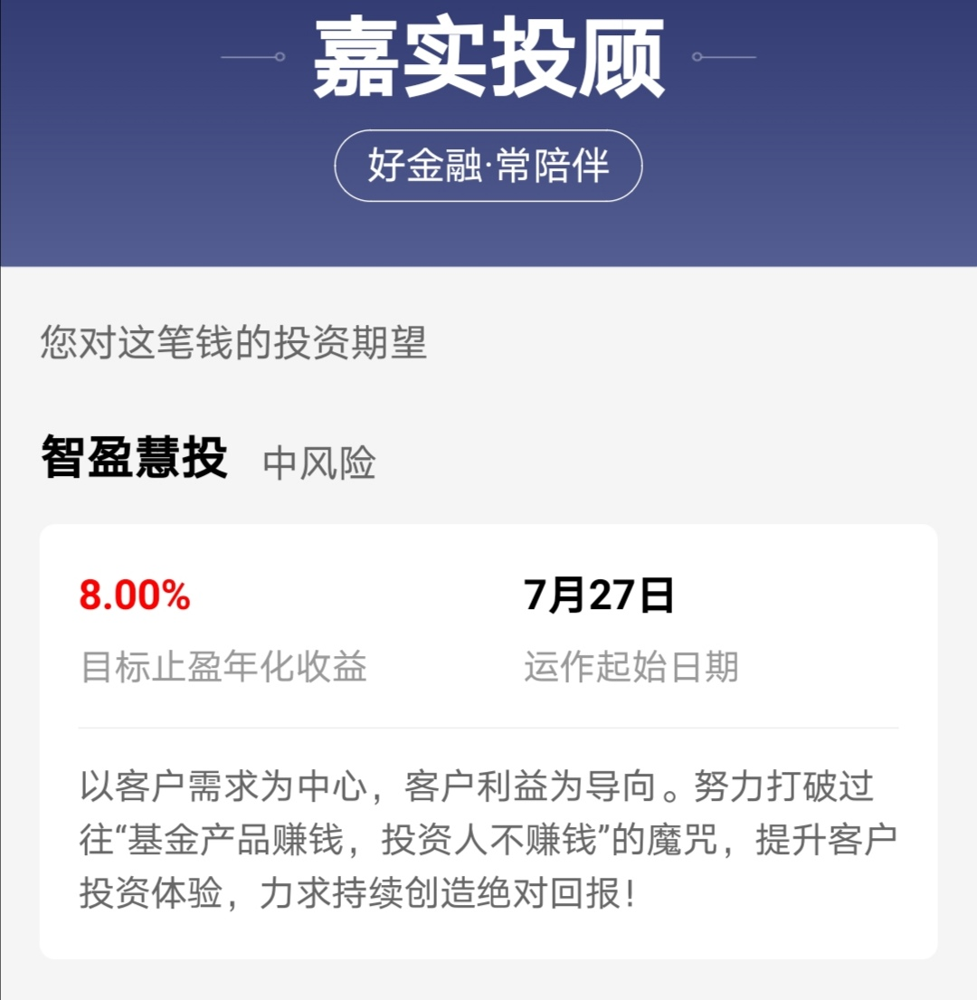
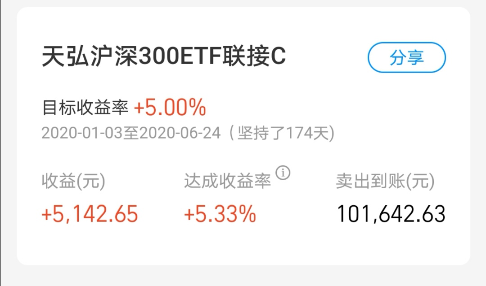
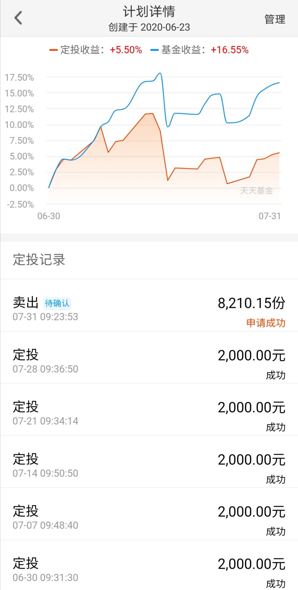
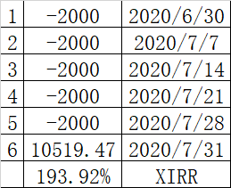
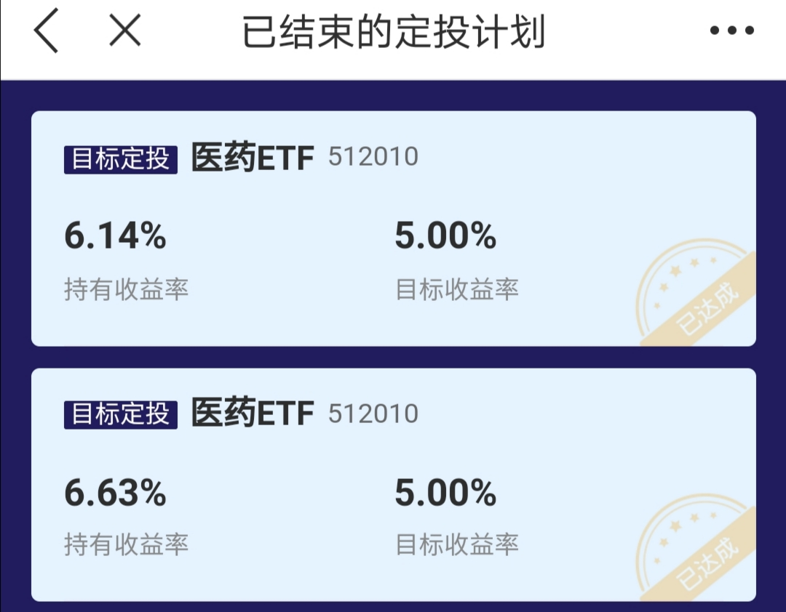

### 嘉实基金的这款投顾产品有收智商税之嫌

基金公司的子公司获得投顾牌照并开展投顾服务业务已经是旧闻了，有牌照的几乎每家我都至少买了一款，每款1000元体验下各家的优劣。蚂蚁基金与先锋领航出品的‘帮你投’之前写过了，中欧基金、华夏基金、南方基金的都还在持仓观察中。今天主要想讲下嘉实基金的一款类似‘目标投’的投顾产品，我对它的定论如本文题目：**有收智商税之嫌！**

嘉实投顾这款产品（**慧投天天第1期投顾服务**）于7月20日推出，我是21日晚上在天天基金发现后粗略的看了下产品定位和策略模式，第一感觉就是很鸡肋。但是没有参与就没发言权，所以立马买了1000元体验了一把，下面我们就罗列下这个产品鸡肋在何处？

1、这款产品基本思想就是‘目标投’，即组合收益到了一定目标就清仓止盈，这个玩法我也常作为辅助策略运用于我自己的组合内。但问题在于嘉实的这套策略很诡异：目标的设定标准是年化收益8%（主流的都使用实际收益作为标准）。年化8%是什么概念？如果2个月实际收益超过1.34%就达到了年化8%的标准，把目标设置那么低会带来不少问题。

2、为什么上面举例是2个月实际收益超过1.34%就达标可以止盈了呢？因为这款产品会锁定60天，就是说60天内即便达到了年化8%的收益也不会触发清仓指令（这个算是一个补丁，但本末倒置了，最根本的缺陷是止盈标准设定错了）。那目标设置那么低会有什么问题呢？过低的目标太容易完成，可能当天达标了，但次日卖出的时候又遇到大跌，那么不单是竹篮打水一场空，还可能会赔了夫人又折兵。

3、第一期产品的参与期是7月20日 ~ 24日，而运作起始日是7月27日。这就意味着买入后不是立马开始运作的，投资者的资金会无缘无故的被占用3 ~ 7天不等。对于一款实际收益不是很高的服务，还要产生近一周的资金占用（进一步摊薄收益率），这个是很不厚道的。

4、然后我们再看一下产品建仓后都买了写啥？看后我是挺惊讶的，如下图只有10%的中证500指数基金，剩下的是30%的债券基金、60%的货币基金。而且这个产品的目标设置的那么低，60天锁定期一过很容易就触发止盈指令，那产品还帮我们买了一堆赎回费很贵的A类基金，这是不是很坑、很过分啊！

5、即便如此简单的定投止盈策略，嘉实投顾还要额外收取0.5%/年的投顾服务费。而且在产品的封面（下图）赫然写着：**“以客户需求为中心，客户利益为导向。”**，我真的很‘佩服’嘉实基金，梁静茹也不敢给他们这么多的‘勇气’呀！

---

我愤慨是因为嘉实基金的这款服务很low，还收那么贵的服务费，还大言不惭什么‘客户利益为导向’。其实市面上有很多这样的‘目标投’服务都是免费的，而且规则的设定更合理，各个平台也都有自己的特色，下面我简单的和大家说几个我用过还不错的平台。

**1、支付宝蚂蚁财富的‘目标投’**

支付宝的这款目标投我去年还专门写过文章：[《懒人理财神器体验报告》](https://blog.ytc1989.com/#/financing/alipay-mbt) 。缺点是目前只支持天弘沪深300ETF联接C，最大特点是每天收盘前3分钟给与测算，**当日达标当日执行止盈指令，不存在T+1止盈策略的不确定性。**这款总得来说我是很满意的，也作为入门级‘目标投’的工具经常推荐给身边的小白投资人（主要是几乎人人都有支付宝），让他们在几乎不需要做什么操作的情况下稳稳的赚点小钱，而不是傻傻的把钱放余额宝。使用后大家的反馈都不错，我也就安心了，最后附上我自己历时最长的一次止盈操作（见下图）。

**2、东方财富天天基金的‘目标止盈定投’**

这款是我场外目标投暂时用的最多的工具。缺点主要有目标步伐都是5的整数倍即5%、10%、15%、20%，不够细化；止盈指令是达标后T+1才执行。优点主要有标的物极其丰富，几乎所有的场外基金都支持；支持自定义止盈锁定期，可以有效避免过快的完成止盈，因为频繁的赎回会导致摩擦成本过大。

这个我可以推荐几个自己用下来感觉不错的目标投场外标的：华宝消费龙头（009329）、天弘食品饮料（001632）、嘉实主要消费（009180）、华宝科技龙头（007874）、国联安半导体（007301）、华宝券商联接（007531）、易方达300医药（007883）、华安创50（160424）【仅供参考】

同样也选一个最近达标的记录贴一下（如下图一），是嘉实中证主要消费ETF联接C，正好一个月就达标，实际收益为5.5%，经过XIRR计算下真实的年化收益居然达到了惊人的193.92%(如下图二，当然需要说明下：个例不代表所有目标都是如此迅速达标的，仅供参考)

**3、华宝证券的‘目标定投机器人’**

这款是我最近才开始用的场内目标投工具。缺点主要有标的物只有内置的几个ETF（其实也有场外标的）；止盈指令是达标后T+1才执行。优点主要有对于海外ETF（比如中概互联、纳斯达克指数等）不存在外汇额度不够而基金限购的情况；交易效率比场外的要高很多，且费用也低很多（**场外7天1.5%惩罚性赎回费是一个硬伤**）。

附图如下：

---

> 小结

目标投是一种很适合小白投资者的省力投资策略，而且现在可选的平台和工具有很多（其实很多基金公司自有APP也是有类似的功能的，本文限于篇幅不再罗列），而且我相信这类工具会越来越丰富、越来越完善。但是本文提到的嘉实基金的这款投顾服务真的很坑，我建议如果对目标投有兴趣的可以尝试下我上面说到的几个平台工具。

最后强调下：目标投不是什么高深的策略，所以盈利情况总得来说只能算中规中矩。但我个人觉得很适合小白投资者，如果你是一棵老韭菜、又或是想着高收益，那么可以自行探究别的策略。